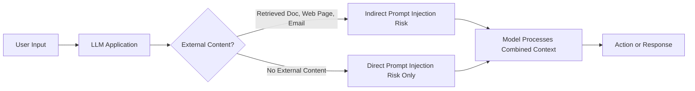

# AI Cybersecurity Playbook

## Defending LLMs, Agents, RAG, and AI-Enabled Security Operations

**NESHBOY SOC Professional Library**

*Companion volume to SIGNAL TO ACTION: The Complete SOC Playbook Handbook*

---

## Preface: Why This Book Exists

[MANAGEMENT] Two years ago, the systems your SOC was chartered to defend were more or less enumerable. You had a CMDB, a network diagram, a list of SaaS tenants, and an EDR agent count. You could argue about whether that inventory was complete, but everyone agreed on what kind of thing belonged on it: servers, endpoints, identities, cloud accounts, network segments. That assumption quietly stopped being true. Somewhere in your environment right now there is a chatbot wired into your CRM, a coding assistant with a token that can read your source repositories, a "copilot" plugged into your ticketing system with standing write access, and very possibly an agent framework someone in another department stood up over a weekend to automate a workflow nobody asked security to review. None of that shows up on the old inventory, and almost none of it behaves like the systems your detection content was built for.

This book exists because that gap between what SOC teams are asked to defend and what SOC training material actually covers has become large enough to matter operationally. Most existing security operations material — including the sister volume in this library, *SIGNAL TO ACTION* — assumes the thing under attack is a conventional host, network, or identity boundary. That material remains correct and necessary; nothing in this book replaces it. But large language models, the agents built on top of them, and the retrieval pipelines that feed them context introduce a genuinely new attack surface with its own failure modes: prompt injection instead of buffer overflows, tool-call abuse instead of privilege escalation via a stolen token, hallucinated or poisoned retrieval instead of a tampered config file. Some of these map cleanly onto concepts your team already has (an over-privileged service account is an over-privileged service account whether a human or a model is driving it). Others do not map cleanly at all, and treating them as if they do is how organizations end up with detection coverage that looks reassuring on a dashboard and catches nothing in practice.

[ANALYST] If you triage alerts for a living, the practical version of this problem is simpler and more immediate: you are going to start seeing alerts that reference an LLM, an "agent," a vector database, or a RAG pipeline, and your current runbooks will not tell you what to do with them. This book is written to close exactly that gap — not by turning you into a machine learning researcher, but by giving you the same kind of pattern recognition for AI-system alerts that you already have for phishing, lateral movement, or C2 beaconing.

The other reason this book exists is more constructive: AI is not only a new thing to defend, it is also a new tool the SOC itself can use — for triage assistance, for detection-content drafting, for summarizing incidents, for helping an under-staffed team punch above its weight. That capability comes with its own governance and detection questions (what does it mean when your triage assistant itself gets prompt-injected by the alert it's summarizing?), so this book treats "AI as attack surface" and "AI as SOC tool" as two sides of the same coin rather than two separate topics.

## Who This Book Is For

| Reader | What this book gives you |
|---|---|
| SOC Analyst (L1) | A working vocabulary for AI-related alerts, and clear escalation criteria so you're not guessing whether an odd chatbot transcript is noise or an incident. |
| SOC Analyst (L2/L3) | Detection logic patterns, investigation playbooks for prompt injection and agent-abuse cases, and enough architecture background to read a RAG pipeline diagram without a data scientist translating it for you. |
| Detection Engineer | Illustrative query logic you can adapt to your own SIEM/XDR schema, guidance on what log sources actually need to exist before a detection is possible, and a framework for thinking about AI-specific false-positive drivers. |
| Incident Responder | Containment and eradication guidance specific to compromised or manipulated AI systems — what "isolate the host" becomes when the "host" is a hosted model endpoint with no host to isolate. |
| SOC Manager | Staffing, tooling, and workflow-integration guidance for standing up AI-aware detection and response without a green-field budget. |
| CISO / Security Leadership | Risk framing tied to recognized frameworks (OWASP Top 10 for LLM Applications, MITRE ATLAS, NIST AI RMF) that you can use in board and audit conversations, plus governance patterns for AI deployments your organization didn't formally approve but is running anyway. |

No prior machine learning background is assumed anywhere in this book. Where a concept from ML is load-bearing for a security decision — what a token actually is, why embeddings make similarity search possible, why a model "hallucinating" is a predictable behavior rather than a bug — it is explained at the point of use, in the amount of depth a security practitioner needs and no more.

## How to Use This Book

This book follows the tagged-paragraph convention established in *SIGNAL TO ACTION*, because the underlying problem is the same one that book was written to solve: a single incident or control decision genuinely reads differently depending on which chair you're sitting in, and collapsing those perspectives into one generic voice serves nobody well. Throughout this book, paragraphs are tagged to signal whose vantage point is being written from:

- **[ANALYST]** — the perspective of the person triaging the alert or working the queue. Focused on "what do I do right now," what a screen or log line actually looks like, and how to tell signal from noise under time pressure.
- **[ENGINEER]** — the perspective of the person building or tuning detections, integrating log sources, or standing up the pipeline that makes an alert possible in the first place. Focused on data sources, query logic, and the mechanics of why a detection works or doesn't.
- **[MANAGEMENT]** — the perspective of a SOC manager or team lead responsible for staffing, workflow, tooling decisions, and translating incidents upward. Focused on process, resourcing, and organizational tradeoffs.
- **[STAKEHOLDER]** — the perspective of the executive, business owner, or risk-committee audience who needs to understand impact and decisions without the operational detail. Focused on business risk, exposure, and what's being asked of them.

A given section will often carry two or three of these in sequence, because a single incident genuinely does read differently from each seat — an analyst wants to know what the alert looked like at 2 a.m.; a CISO wants to know what regulatory exposure it created. Read all the tags in a section if you're new to a topic; if you're returning to a chapter as a reference, the tag lets you jump straight to the perspective relevant to your role.

Diagrams throughout the book use Mermaid syntax rendered as code blocks. Where a workflow, architecture, or attack sequence is easier to follow visually than in prose, you'll find one of these immediately after the relevant explanation. A short example of the convention:

Detection query examples in later chapters are presented as **illustrative query logic** — pseudocode or SIEM-style syntax intended to show the shape of a detection, not a copy-paste rule validated against a production environment. You will need to adapt field names, index structures, and thresholds to your own platform and data.

## A Note on Evidence in This Book

This section exists because AI security content has a well-earned reputation for overstating what's actually been tested, and this book is making a deliberate choice not to do that. Specifically:

**Every diagram in this book is an original Mermaid diagram**, built for this book, and is not a screenshot, mockup, or derivative of any vendor's actual product interface. Where a diagram is labeled as illustrating a concept — an attack flow, a pipeline architecture, a decision tree — that label means exactly what it says: it is a drawing of an idea, not a reproduction of something you'd see on a real screen.

**No screenshots of any commercial security product appear anywhere in this book.** There are no images represented as Splunk, Microsoft Sentinel, IBM QRadar, CrowdStrike Falcon, or any other named commercial platform, because this book was written without licensed access to those products, and presenting borrowed or recreated interface elements as if they came from a real deployment would be dishonest regardless of how accurate the recreation looked. Where a screen or console view would genuinely help explain a concept, this book uses a plain-text mockup block or a Mermaid diagram, explicitly labeled as illustrative and not a real product interface. If you are looking for platform-specific screenshots to match against your own tooling, they are not here by design, not by oversight.

**Where this book shows lab command output and marks it REAL, that output was actually produced** — executed against a genuine local Ollama installation running an open-weight model on the author's own hardware, with the commands and output transcribed as they occurred. That labeling is deliberately narrow: it applies only to output explicitly marked REAL, and it means what it says — this was not written to look real, it is a genuine transcript. Anywhere output is constructed for illustration rather than captured from an actual run, it is labeled as a composite or illustrative example instead, and you should not assume it reflects the exact behavior of any specific model version.

**Incidents, company names, usernames, IP addresses, and log entries used as examples are synthetic** unless a paragraph explicitly names a real, publicly reported incident (for example, the 2023 reporting on employees pasting source code into ChatGPT, or the documented prompt-injection stunt against a Chevrolet dealership's chatbot). Where this book discusses real, well-established frameworks and research — OWASP's Top 10 for LLM Applications, MITRE ATLAS, the NIST AI Risk Management Framework, Greshake et al.'s work on indirect prompt injection, or the widely reported "Sydney" jailbreak coverage around early Bing Chat — those references are to genuinely real, publicly documented work. This book does not invent citations, paper titles, or incidents and present them as real; where an example is constructed for teaching purposes, it is labeled as such rather than dressed up as a case study that didn't happen.

The reasoning behind all three commitments is the same: a book that teaches SOC teams to distrust hallucinated, fabricated, or manipulated AI output has no credibility if it fabricates its own evidence to make a chapter more convincing. Where this book can't show you something real, it tells you so, and shows you a clearly labeled illustration instead.

---

*This is a working reference volume. Chapters are organized to be read independently as well as sequentially — an incident responder pulled into an active case involving a compromised RAG pipeline should be able to open the relevant chapter directly rather than reading the book front to back. Cross-references between chapters are noted inline where one topic depends on groundwork laid elsewhere.*
