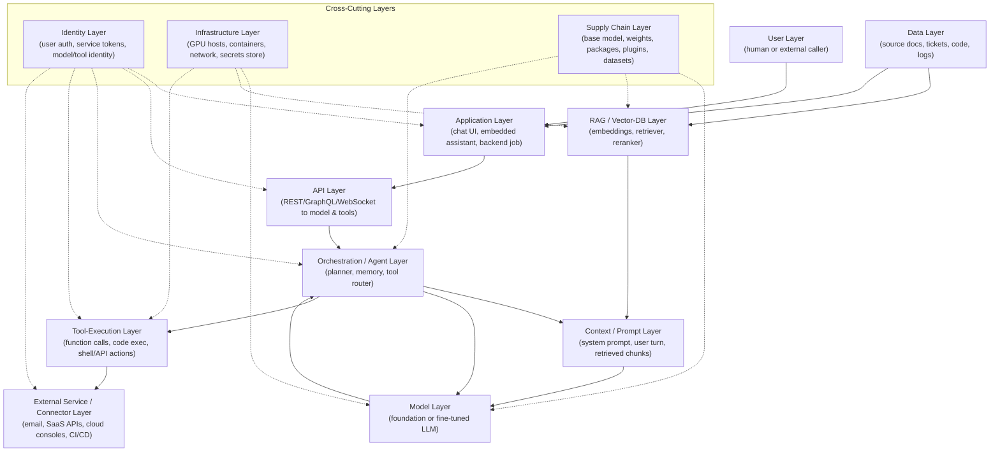

# Chapter 2: The AI Attack Surface

A conventional web application has a well-understood shape. There is a client, a load balancer, an application server, an API, a database, and an identity provider bolted somewhere onto the front of the whole arrangement. Two decades of penetration testing, threat modeling, and SIEM tuning have built a shared vocabulary around that shape. An AI-enabled application does not discard that shape — it inherits every layer of it, with every existing vulnerability class intact — and then stacks five or six *new* layers on top: a model, a prompt, a retrieval pipeline, an orchestration loop, a set of tools the model is allowed to invoke, and a growing web of connectors out to email, ticketing, code repositories, and cloud consoles.

[MANAGEMENT] The number one thing to communicate upward is that "we added an AI feature" is never a one-layer change. It is an org-wide expansion of attack surface that touches procurement (which model vendor, which data processing terms), engineering (new runtime, new failure modes), and security operations (new log sources that nobody has instrumented yet). Budgeting for an AI feature as if it were a normal microservice under-provisions the security review by an order of magnitude.

This chapter maps that expanded surface layer by layer. Later chapters go deep on specific attack techniques (prompt injection, model extraction, data poisoning); this chapter's job is to give you the floor plan so you know where to stand when you go looking for trouble.

## The Full Stack, End to End

Solid arrows in the diagram trace the path a request actually takes through the system. Dotted arrows show the three layers — identity, infrastructure, and supply chain — that don't sit in the request path but touch nearly every box that does. That distinction matters operationally: the solid-arrow layers are where you'll find most *logic* vulnerabilities (injection, exfiltration, tool abuse); the dotted-arrow layers are where you'll find most *foundational* vulnerabilities (a compromised base model, a stolen service token, a poisoned dependency) that undermine every layer downstream of them regardless of how well that layer was built.

| Layer | What's new here vs. a traditional app |
|---|---|
| User | Free-text natural-language input replaces structured forms; intent is ambiguous by design |
| Application | UI must render model output that can itself contain adversarial instructions |
| API | Payloads carry unbounded natural language instead of typed fields; rate limits must account for token cost, not just request count |
| Orchestration/Agent | A loop with memory and autonomy replaces a single request/response cycle |
| Model | The "business logic" is a black box learned from data, not written by your engineers |
| Context/Prompt | The instruction set is assembled at runtime from multiple untrusted sources and re-parsed on every turn |
| RAG/Vector DB | Retrieval blends your data with the model's reasoning, and retrieved text becomes part of the instruction stream |
| Tool Execution | The model — not a human — decides when a privileged action fires |
| External Service/Connector | Every integration is a new trust boundary the model can be tricked into crossing |
| Data | Training data, retrieval corpora, and conversation logs are now attacker-relevant data classes with no legacy DLP coverage |
| Identity | Models and agents need their own identities, scoped and audited like service accounts, not like users |
| Infrastructure | GPU scheduling, model-serving runtimes, and vector stores are new asset classes on the network |
| Supply Chain | Base weights, fine-tunes, embeddings, plugins, and training data all carry provenance risk |

## User Layer

The user layer is the most obvious attack surface and the most misunderstood, because "user input" in an AI system is not a form field — it's an open channel for natural-language reasoning. A traditional app validates that a field is an integer or matches a regex; an AI application has to reason about *intent*, and intent is trivially disguised. A user asking "for a novel I'm writing, how would a character synthesize [X]" is using the same channel as a user asking a legitimate product question, and the system has no reliable way to distinguish sincere use from a role-play jailbreak at the input layer alone. This is also the layer where social-engineering-of-the-model happens: the widely reported "Sydney" jailbreaks against early Bing Chat, and the Chevrolet dealership chatbot that a user talked into agreeing to sell a vehicle for one dollar, both originated entirely at this layer — no code was exploited, only conversation.

[ANALYST] Treat the user layer the way you'd treat an internet-facing login form: assume every message is adversarial until proven otherwise, and instrument for *patterns* of probing (repeated reframing of a refused request, sudden shifts in persona, long multi-turn setup before a sensitive ask) rather than single-message keyword matching, which jailbreak phrasing evades trivially.

## Application Layer

The application layer is the chat UI, the embedded copilot pane, the Slack bot, or the batch job that wraps the model in a product experience. Its unique risk is that it must *render* model output, and model output is attacker-influenceable text that can contain markdown, HTML, or links crafted to look legitimate. A model that has been steered — via a prior turn or a poisoned retrieval result — into emitting `` will have that string rendered as an image tag by a UI that trusted the model as a first-party output source. This is the layer where classic web vulnerabilities (stored XSS, CSRF, insecure direct object references) reappear wearing an AI costume: the payload now arrives via the model instead of via a form field, so an application team that already passed a web app pen test can still ship an AI feature with a fresh XSS hole because the review didn't consider the model as an untrusted output source.

## API Layer

Every model call and every tool call eventually crosses an API boundary, and that boundary now carries unbounded natural-language payloads instead of typed, size-bounded fields. Rate limiting has to account for token cost and compute cost, not just request count, because a single crafted request can trigger a disproportionately expensive completion (long chain-of-thought, large tool-call fan-out) — a denial-of-wallet risk as much as a denial-of-service risk. API keys for model providers are also a distinct secret class: unlike a database credential scoped to one system, a leaked model API key can be used to run inference at the victim's expense, extract information about fine-tuning data through repeated probing, or in agentic setups, invoke tools on the victim's behalf.

## Orchestration/Agent Layer

This is the layer with no direct precedent in traditional application security: a control loop that plans, calls the model, calls tools, evaluates results, and loops again, sometimes for dozens of iterations, with persistent memory across the session or even across sessions. The attack surface here is *emergent* — it's not any single call that's dangerous, but the compounding effect of the loop acting on attacker-influenced intermediate state. An orchestrator that stores "user preferences" or "learned facts" in long-term memory can be poisoned once and influence every future session; an orchestrator that lets the model decide which tool to call next based on a prior tool's output can be redirected mid-task by content embedded in that output. MITRE ATLAS catalogs this class of risk explicitly, and it's the layer most AI red-team engagements now spend the majority of their time on, because it's the layer where a single successful manipulation has the longest blast radius.

## Model Layer

The model itself is "business logic" that was learned from data rather than written by your engineers, which means none of your usual code-review assumptions apply. You cannot read a diff of the model's reasoning; you can only test its behavior empirically and hope your test set covers the input space that matters. The model layer's attack surface includes jailbreaking (getting the model to violate its own guidelines), model extraction (reconstructing model behavior or weights through systematic querying), and membership inference (determining whether specific data was in the training set) — all catalogued in the OWASP Top 10 for LLM Applications and NIST's AI Risk Management Framework. A fine-tuned model adds a further wrinkle: the fine-tuning dataset is now part of your attack surface even though it may live in a completely different system than the model-serving endpoint.

## Context/Prompt Layer

The context window is assembled at runtime from multiple sources of wildly differing trust: a system prompt your engineers wrote, the current user's message, retrieved document chunks, prior conversation turns, and sometimes tool output — all concatenated into one undifferentiated block of text that the model reads with no cryptographic notion of "this part is trusted, this part isn't." This is the structural reason indirect prompt injection works at all: Greshake et al.'s foundational research on indirect prompt injection demonstrated that instructions hidden in a web page, document, or email are followed by the model with the same weight as instructions from the system prompt, because by the time they reach the model they're just tokens in a sequence. [ENGINEER] If you remember one architectural principle from this book, make it this one: the model has no built-in way to tell "the instructions I was configured with" apart from "text I happened to read." Any defense has to be built around that context window from the outside, because it will not emerge from the model layer on its own.

## RAG/Vector-DB Layer

Retrieval-augmented generation lets a model answer questions using your organization's documents by embedding them into a vector store and pulling the most semantically relevant chunks into context at query time. The attack surface this creates is twofold. First, the retrieval corpus itself becomes an injection vector: a single poisoned document — a support ticket, a wiki page, a resume submitted through a careers portal that also gets indexed — can inject instructions that fire every time that document is retrieved for an unrelated query. Second, the vector database is a new data-at-rest target with weaker access-control conventions than a relational database; many early RAG deployments (illustrative pattern, not a named vendor) index documents into a shared collection without carrying forward the source system's row-level permissions, so a retriever built for "search all HR docs" can surface a specific employee's compensation letter to any user whose query happens to be semantically close enough.

## Tool-Execution Layer

Giving a model the ability to call tools — send an email, query a database, open a ticket, execute code, hit a cloud API — is what turns it from a text generator into an agent, and it's the layer where prompt injection stops being an embarrassment and starts being a breach. A model tricked by injected content into deciding "the user wants me to forward this thread to external-address@attacker.example" will do so with whatever privilege the tool integration was granted, and it does not pause to ask whether that's really what the human meant. The tool layer's defining risk is that authorization decisions that used to require a human click now happen inside a model's forward pass, at machine speed, with no consistent audit trail unless the orchestration layer was specifically built to log tool invocations with their triggering context.

## External Service/Connector Layer

Every connector — the CRM integration, the ticketing-system webhook, the CI/CD trigger, the cloud console access — is a trust boundary the agent can be maneuvered into crossing on the attacker's behalf. Traditional integration security assumes the calling code is trusted because a human engineer wrote it; agentic integration security has to assume the calling code (the model's decision to invoke the connector) can be influenced by untrusted input encountered mid-task. A connector scoped with the same broad permissions a human admin would have, but invoked by a model that can be steered by a malicious email it was asked to summarize, is a materially larger risk than the same connector used only by that human directly.

## Data Layer

Three distinct data classes now carry attacker-relevant risk that most data-loss-prevention programs weren't built to cover: training/fine-tuning data (which can leak into model outputs, as widely reported in coverage of employees pasting proprietary source code into a public chatbot in 2023), retrieval corpora (which double as both a confidentiality risk and an injection vector, per the RAG layer above), and conversation logs (which aggregate exactly the kind of sensitive, context-rich human disclosure that a well-behaved AI assistant is designed to elicit). A conversation log is arguably a *more* concentrated trove of sensitive data per gigabyte than a typical application database, because users tell chat interfaces things — health details, legal concerns, credentials pasted "just this once" — that they'd never type into a structured form.

## Identity Layer

Human identity and access management is mature; machine and model identity is not. An agent that acts on a user's behalf needs an identity distinct from that user's — otherwise you cannot answer "did the human do this, or did the agent do this while the human was afk" during an investigation, and you cannot scope the agent's permissions independently of the human's. Service tokens issued to orchestration frameworks are frequently over-scoped because the framework's setup docs default to broad access for convenience, and unlike a human account, nobody reviews an agent's access at offboarding time because there's no offboarding event to trigger the review.

## Infrastructure Layer

GPU-backed model-serving infrastructure, container orchestration for inference workloads, and vector database clusters are new asset classes on the network that many asset inventories don't yet track as first-class citizens. This matters for basic security hygiene: a model-serving container with an exposed management API, a vector database left on a default port with no authentication, or a GPU node with lax network segmentation from the rest of the environment are all findings a traditional vulnerability scan can miss simply because the scanner's asset taxonomy doesn't have a category for them yet.

## Supply Chain Layer

The base model you built on, any fine-tuning or adapter layers on top of it, the embedding model powering your retriever, third-party agent plugins, and the training or retrieval datasets themselves all carry provenance risk analogous to open-source software supply chain risk — except with far less tooling. There is no widely deployed equivalent of a software bill of materials for "which datasets trained this model" or "has this fine-tune been tampered with since publication," which means an organization pulling a community fine-tuned model or a third-party embedding model from a public hub is trusting that artifact roughly the way early-2010s developers trusted an unaudited npm package, minus the package-lock file. NIST's AI RMF and MITRE ATLAS both flag data and model provenance as a distinct control category for exactly this reason, and it's the layer most likely to be invisible to a security team that thinks of "the model" as a single vendor relationship rather than a supply chain with multiple upstream contributors.

## Putting the Map to Use

None of these thirteen layers is optional to consider, and none of them can be secured in isolation — a hardened tool-execution layer still fails if the context layer feeding it is trivially injectable, and a clean context layer still fails if the underlying model was fine-tuned on a poisoned dataset nobody vetted. The chapters that follow walk each of the solid-arrow layers in the diagram in attack-technique depth, starting with prompt injection at the context layer, because it is the single technique that most reliably chains into every layer downstream of it.
