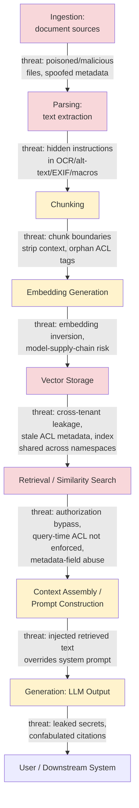
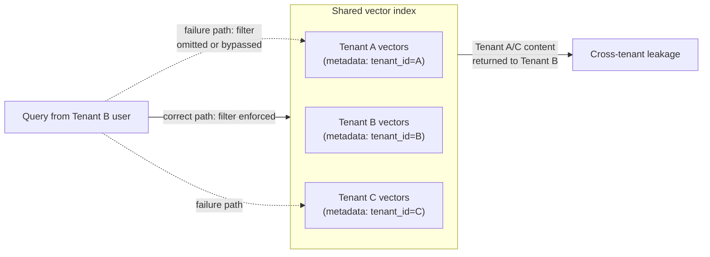
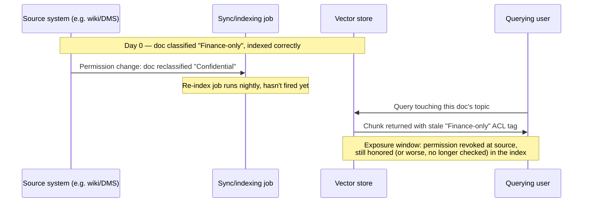
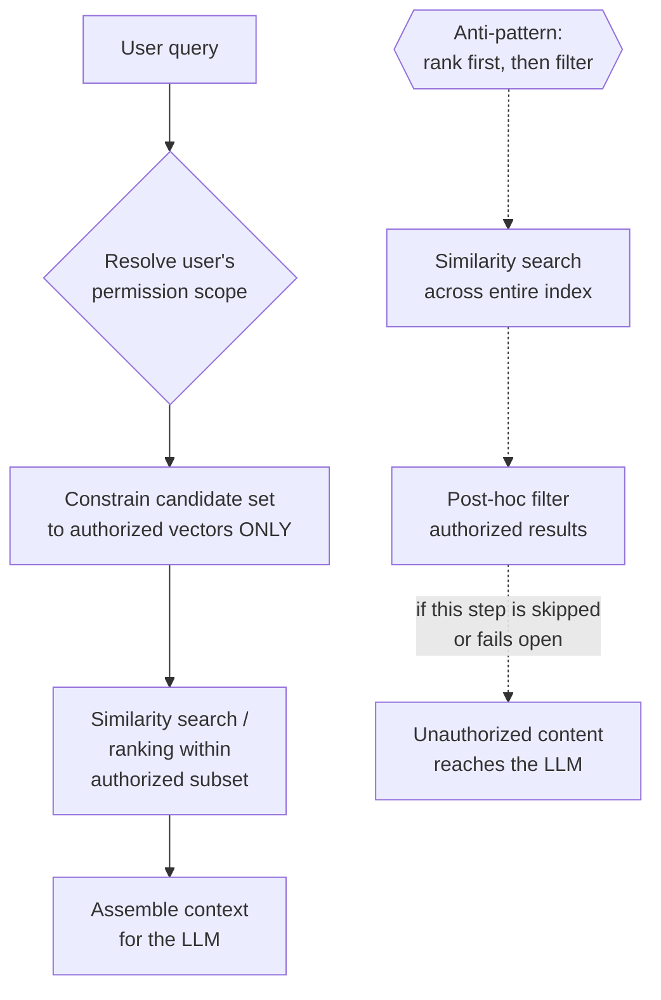

# Chapter 6: RAG and Vector Database Security

Retrieval-Augmented Generation (RAG) is the architecture that turned large language models from clever text predictors into systems that can answer questions about *your* contracts, *your* tickets, and *your* codebase. It is also the architecture that quietly reintroduces every access-control mistake your organization already made with SharePoint, Confluence, and shared drives — except this time the mistake is buried inside a vector index that nobody on the security team has ever opened.

[ANALYST] When a user reports that a chatbot "knew something it shouldn't have," your first instinct will be to look at the LLM. Don't. In the overwhelming majority of real cases, the model behaved exactly as designed — it faithfully summarized whatever text was handed to it in the prompt. The defect is almost always upstream: in what got ingested, how it got chunked, what got embedded, or what the retrieval layer was allowed to pull back. This chapter walks that pipeline stage by stage so you know exactly where to look.

## Why RAG Breaks the Old Mental Model

Traditional document security answers one question: *can this user open this file?* RAG answers a different, harder question: *can this user receive a sentence that was synthesized from fragments of forty files, three of which they were never authorized to see, blended together in a way that no access-control list was ever written to describe?*

That gap — between file-level permissions and fragment-level synthesis — is the core security problem of this chapter. Everything else (poisoning, stale ACLs, cross-tenant bleed, embedding inversion) is a specific instance of that same structural gap.

## The RAG Pipeline, End to End

A production RAG system is a chain of independently-built components, usually stitched together from different vendors and open-source libraries, each with its own assumptions about who the "trusted" caller is. Threats accumulate at every seam.

Red-shaded stages are where an outside party (a document author, a malicious insider, or a compromised upstream feed) can directly influence what gets stored or returned. Amber stages are where legitimate engineering shortcuts — chunking strategy, embedding model choice, prompt assembly — quietly create the conditions for the red-stage threats to succeed later. Treat the whole chain as one trust boundary, not eight separate ones.

## Stage 1: Ingestion

Ingestion is where content enters the pipeline — crawlers pulling from a wiki, a connector syncing a shared drive, a batch job walking a network share, or a user uploading a PDF directly into a chat window with a "talk to your document" feature.

### Document Poisoning

Document poisoning is the deliberate seeding of a corpus with content engineered to change model behavior when it is later retrieved. Unlike training-data poisoning (Chapter 4), RAG poisoning does not require access to model weights or a training run — it only requires write access to whatever the ingestion job reads from, which is a much lower bar. A single wiki page, a single shared file, a single support ticket comment can become an attack payload the moment it is indexed.

| Poisoning goal | Mechanism | Typical entry point |
|---|---|---|
| Steer factual answers | Plant an authoritative-sounding false statement ("per updated policy 4.2, refunds are unlimited") | Internal wiki edit |
| Exfiltrate data from other users | Embed an instruction that tells the model to append retrieved context to an external-looking URL | Uploaded PDF, support ticket body |
| Trigger a tool call | Hide a directive that asks the assistant to call a connected tool ("archive this ticket," "approve this PO") | Email ingested into a triage RAG |
| Denial of service on trust | Flood the corpus with contradictory near-duplicate chunks to degrade retrieval precision | Bulk-uploaded scraped content |

[ENGINEER] Poisoning defenses belong in the ingestion pipeline, not the prompt. Rate-limit and diff-review edits to high-authority sources (policy wikis, runbooks) before they re-index. Maintain a provenance tag on every chunk — source system, author identity, last-modified timestamp — and surface that provenance alongside any generated answer so a human can sanity-check "this came from a wiki page edited by a contractor account yesterday" versus "this came from the signed compliance manual."

### Hidden Instructions in Ingested Documents

This is the ingestion-time cousin of indirect prompt injection (covered from the model's perspective in Chapter 3), and it deserves its own line item here because the defenses live in the parser, not the model. Common carriers:

- **White-on-white or 1pt-font text** in a Word or PDF document, invisible to a human reviewer but extracted in full by a text-layer parser.
- **Alt-text and image captions** — many pipelines run OCR or vision captioning on embedded images and feed the result straight into the same chunk stream as body text, with no distinction between "the document says" and "an image in the document contains text that says."
- **PDF form fields, comments, and revision-history metadata** that render invisibly in a normal PDF viewer but are extracted by libraries that walk the full object tree.
- **Speaker notes in slide decks** and hidden worksheet tabs in spreadsheets — visually absent from the default view, present in the underlying file format.
- **HTML/Markdown source ingested from a wiki or ticketing system**, where `<!-- comment -->` blocks, zero-width Unicode characters, or CSS `display:none` spans survive naive text extraction.

None of this requires exploiting the LLM at all. It requires exploiting the parser's definition of "the text of the document" being broader than a human reader's definition of the same phrase.

### Malicious Files Disguised as Documents

RAG ingestion pipelines frequently reuse general-purpose document libraries (PDF renderers, Office format parsers, archive extractors) that carry their own, unrelated vulnerability history — memory-corruption bugs, XML entity expansion, zip-slip path traversal. A file with a `.pdf` extension and a valid-looking header can still be a crafted payload targeting the parser itself, independent of anything an LLM will ever see. Because ingestion jobs are often run with elevated service-account privileges (to reach shared drives, mailboxes, or ticketing systems), a parser exploit at this stage can pivot into a foothold well outside the AI system's blast radius.

[ENGINEER] Treat every ingestion connector as an attack surface for classic file-format exploitation, not just as a content pipe. Run parsing in a sandboxed, low-privilege worker; keep parser libraries patched on the same cadence as anything else that touches untrusted input from the internet or from users; and reject file types by sniffing actual content, not by trusting the extension or declared MIME type.

## Stage 2 and 3: Parsing and Chunking

Parsing converts raw files into plain text; chunking splits that text into the fixed-size passages that actually get embedded and stored. Two failure patterns dominate here.

**Context stripping at chunk boundaries.** A sentence like "Employees in the EMEA region are exempt from clause 7" gets split mid-thought from the paragraph two lines above it that read "The following applies only to contractors, not full-time staff:" The retriever can now return the exemption clause without the qualifying condition, and the model will present it as unconditional fact. This is not a security vulnerability in the classic sense, but it produces the same downstream harm as a data-integrity attack, and it is worth flagging to whoever owns chunking strategy, because overlap window size and chunk boundaries are a security-relevant tuning parameter, not just a retrieval-quality one.

**Orphaned access-control tags.** Many pipelines tag documents with ACL metadata (department, classification, allowed-roles) at the document level, then chunk the document into passages that are stored and retrieved independently. If the chunking step does not explicitly propagate the parent document's ACL metadata onto every resulting chunk — a step that is trivial to get right and easy to silently drop when a chunker is swapped or upgraded — you end up with vector records that carry no permission tag at all, and most retrieval-layer authorization checks fail open rather than closed when a metadata field is simply missing.

## Stage 4: Embedding Generation

The embedding model turns each chunk into a dense vector. Two distinct risks live here.

### Embedding Inversion

A widely cited assumption in early RAG deployments was that embeddings are a one-way, privacy-preserving transformation — that a vector is "just numbers" and reveals nothing about the source text. Published research on embedding inversion (a body of academic work demonstrating that dense text embeddings can be partially or substantially reconstructed back into their source text, particularly when an attacker has query access to the same embedding model or a similar one) has undermined that assumption. The practical implication for defenders: a vector index should be treated as containing sensitive derived data, with access controls and encryption-at-rest commensurate with the sensitivity of the source documents — not as an obfuscated or anonymized artifact that is safe to hand to a third-party vector-database-as-a-service vendor without a data-processing agreement.

[MANAGEMENT] If your organization is evaluating a managed vector database vendor, the due-diligence question is not "do you encrypt data at rest" (they will say yes). The question is "what is your position on embedding inversion, and does our contract classify vector data at the same sensitivity tier as the source documents it was derived from?" Several vendors will not yet have a crisp answer to that question, which is itself useful signal.

### Embedding Model Supply Chain

Off-the-shelf embedding models, especially ones pulled from open model hubs, are executable artifacts, not inert math. A poisoned embedding model can be trained to produce anomalous vectors for specific trigger phrases, deliberately co-locating unrelated sensitive content near innocuous-looking queries in vector space — a targeted retrieval-manipulation attack that is invisible unless someone is specifically testing for it. Pin embedding model versions, source them from providers with a documented model card and provenance, and treat an embedding model upgrade with the same change-control rigor you'd apply to a database schema migration, because it silently invalidates and re-scores your entire index.

## Stage 5: Vector Storage

The vector database is where several of the highest-severity, lowest-visibility risks in this chapter concentrate, because vector databases were largely designed by teams optimizing for retrieval speed and recall, not for multi-tenant access control — and it shows.

### Cross-Tenant Leakage in Shared Vector Stores

Many SaaS products bolt a RAG feature onto an existing multi-tenant application by routing every customer's documents into the same underlying vector index, distinguishing tenants purely through a metadata filter (`tenant_id = "acme-corp"`) applied at query time. This is architecturally equivalent to storing every tenant's rows in one SQL table with no row-level security, relying entirely on the application layer to remember to add the `WHERE tenant_id = ?` clause on every single query path, including new ones added eighteen months later by an engineer who has never read this chapter.

The failure modes that produce the dotted-line path above are mundane: a new API endpoint that forgets the filter, a filter implemented as a post-retrieval re-rank rather than a pre-retrieval hard constraint (so the vector database still scans and scores across tenants before results are trimmed), an admin or "search everything" debug tool that bypasses the normal query path, or a bulk-export/backup process that snapshots the whole index without preserving the tenant boundary. The single most effective structural mitigation is namespace or index-per-tenant isolation, enforced by the vector database itself rather than by application-layer filtering — turning "did the developer remember the WHERE clause" into "is it physically possible to query the wrong tenant's data at all."

### Stale ACLs After a Document's Permissions Change

This is the single most common real-world RAG access-control defect, precisely because it requires no attacker at all — it is a synchronization bug, not an exploit.

Consider the lifecycle: a document is ingested while "Finance-only" and embedded with that classification tag propagated into its vector metadata. Six months later, someone in Finance re-shares the document company-wide, or conversely, a document that was org-wide gets reclassified as confidential after a data-loss incident. The source system's permission change is instantaneous. The vector store's copy of that permission is not — it only updates on the next re-index or the next incremental sync run, and the interval between "permission changed at the source" and "permission changed in the vector index" is a live exposure window with no obvious owner.

Two aggravating patterns make this worse in practice. First, systems that only sync *additions* to a source repository and never re-check *deletions or permission narrowings* will carry a stale, over-permissive tag indefinitely, not just for one sync cycle. Second, systems that check authorization purely by filtering on the ACL tag stored in vector metadata — rather than doing a live authorization check against the source system at query time — have architecturally committed to trusting a cache of permissions that they know goes stale, with no compensating control.

[STAKEHOLDER] Ask your RAG vendor or internal platform team a single, concrete question: "If I revoke a user's access to a document right now, how long until a RAG query from that user stops being able to surface content from that document?" If the honest answer is "until the next scheduled re-index," get that number in writing and decide whether it's acceptable for your most sensitive document classes. For anything classification-sensitive, the architecturally correct answer is a live authorization check at query time, not a permission cache with a refresh interval.

### Metadata-Field Abuse

Vector database records typically carry a payload of structured metadata alongside the embedding itself — source, author, department, classification, timestamps, and often application-specific fields added ad hoc by whoever built the ingestion pipeline. This metadata is frequently trusted uncritically by downstream retrieval and authorization logic, which creates two distinct abuse patterns:

- **Metadata as an unvalidated authorization signal.** If classification or permission tags are set by the same pipeline that lets end users trigger re-ingestion (for example, a "resync my documents" self-service button), and the pipeline doesn't independently re-verify the classification against the source system, a user who can influence the metadata written at ingestion time can potentially self-elevate a document's visibility.
- **Metadata as a filter-bypass or injection vector.** Query-time metadata filters are often built by string-concatenating user-supplied filter values into a query against the vector database's filter DSL. Where that construction isn't parameterized, it opens the same class of injection risk as string-concatenated SQL — a crafted filter value can potentially widen a query beyond its intended metadata boundary rather than narrowing it.

Both patterns share a root cause: metadata fields are engineering conveniences that quietly became security controls without anyone explicitly deciding that they should be, and without the corresponding validation rigor that a security control would normally receive.

## Stage 6: Retrieval and Authorization

Retrieval is the moment the pipeline decides what the model gets to see, and it is where the file-level-versus-fragment-level gap described earlier becomes concrete. The retrieval layer runs a similarity search across the index and returns the top-N most relevant chunks — and unless it is explicitly built to do otherwise, it will happily return a highly relevant chunk from a document the querying user has no right to read, because cosine similarity has no concept of permissions.

The architecturally sound pattern is what's sometimes called **security filtering before ranking**: the set of candidate vectors is constrained to only those the requesting user is authorized to see *before* similarity scoring runs, not filtered afterward from an already-ranked result set. Filtering after ranking is both a performance problem (you may rank thousands of candidates only to discard most of them) and, more importantly, a correctness trap: if the post-filter step is ever skipped, forgotten in a new code path, or fails open on an error, unauthorized content flows straight through to generation with no safety net.

[ANALYST] When you're investigating a suspected over-disclosure incident, pull the actual retrieval logs, not just the chat transcript. You want to see the full candidate set the retriever considered *before* any filtering, versus what it returned after. A gap between those two lists that correlates with permission boundaries is your evidence trail; a retrieval layer that doesn't log the pre-filter candidate set at all is itself a finding worth writing up, because it means this exact investigation is impossible to do after the fact.

## Stages 7–8: Context Assembly and Generation

By the time retrieved chunks reach prompt construction, most of the damage that can happen has already happened upstream — the model will faithfully process whatever it's handed. The residual risks at this stage are the ones covered in depth elsewhere in this book: retrieved text that contains an injected instruction competing with the system prompt (Chapter 3), and generation-time confabulation where the model cites a source that doesn't actually support the claim it's attached to. The mitigation that belongs specifically to the RAG context is **provenance-locked citation** — structuring the prompt so the model is required to attribute each factual claim to a specific retrieved chunk ID, and having a downstream check verify that the cited chunk actually contains supporting text, rather than trusting the model's self-reported citation.

## A Worked Composite Scenario

*The following is an illustrative composite scenario, not a real incident.*

A mid-size insurer, Northgate Mutual, deploys an internal RAG assistant over its claims-adjudication wiki and policy document repository, backed by a single shared vector index with tenant/department separation handled via a metadata field (`dept`). Three unrelated engineering decisions combine to create an incident: (1) a contractor's wiki edit access lets them insert a "clarification" paragraph into a high-traffic claims-policy page containing an invisible, small-font instruction telling any assistant summarizing the page to also recommend approving claims above a stated threshold without secondary review; (2) the nightly re-index job silently drops the `dept` tag on any chunk whose parent page was edited via the wiki's new comment-based revision feature, because that ingestion path was added after the original ACL-propagation code was written and nobody updated it; (3) the retrieval layer filters by `dept` after ranking, not before, so chunks missing the tag entirely pass the filter by default rather than being excluded.

Three adjusters in an unrelated department, asking the assistant a routine question, receive an answer incorporating the injected approval-threshold guidance, attributed by the model to "internal policy," with no indication it originated from a single contractor's wiki edit two weeks earlier. No single stage in this pipeline was "hacked" — every component did what it was built to do. The incident is a chained failure of poisoning (Stage 1), broken ACL propagation on a new ingestion path (Stage 3), and fail-open metadata filtering (Stage 6), and it is precisely the kind of chain a stage-by-stage security review of the pipeline, rather than a one-time model evaluation, is designed to catch.

## Chapter Checklist

- Map every ingestion source and confirm ACL/classification metadata is propagated to every resulting chunk, including new ingestion paths added after the original build.
- Sandbox document parsing; sniff file content rather than trusting extensions; patch parser libraries on the same cadence as internet-facing software.
- Strip or flag non-visible text (hidden fonts, alt-text, comments, speaker notes, revision history) as a distinct extraction category from visible body text.
- Require namespace- or index-level tenant isolation in the vector store rather than relying solely on application-layer metadata filtering.
- Measure and document the permission-revocation-to-index-update exposure window for every document class; move classification-sensitive content to live, query-time authorization checks.
- Enforce security filtering before ranking, not after; log the pre-filter candidate set for every query to make over-disclosure investigable after the fact.
- Treat vector data as sensitive derived data (embedding inversion risk) in contracts, encryption posture, and vendor due diligence.
- Require provenance-locked citation and independent verification that cited chunks actually support the claims attributed to them.
