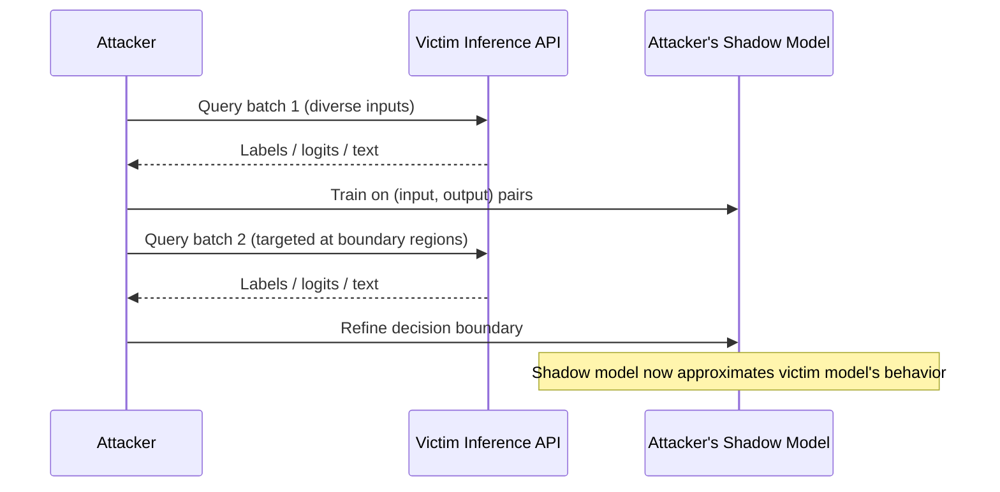
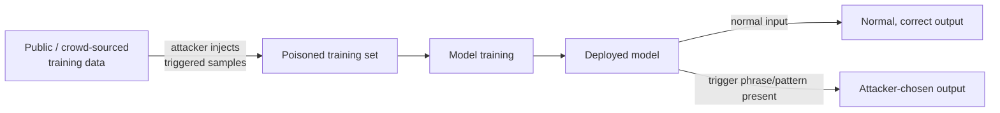
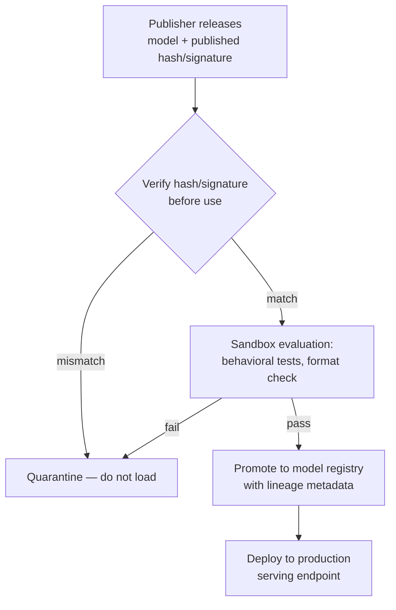

# Chapter 7: AI Model Security

## Introduction

Every earlier chapter in this book treats the model as a black box that happens to sit behind a prompt. This chapter opens the box. A deployed machine learning model — whether it's a fine-tuned open-weights LLM serving a customer support bot, a fraud-scoring classifier, or an internally trained embedding model — is itself an asset with its own attack surface, separate from the text going in and out of it. That asset has a supply chain (where did the weights come from, and were they tampered with in transit?), a confidentiality boundary (can an attacker reconstruct the training data or the weights themselves just by querying it?), an integrity boundary (was it poisoned before you ever loaded it?), and an availability boundary (can someone burn your inference budget or starve your GPUs with expensive queries?).

[MANAGEMENT] From a risk-register standpoint, model security is where AI risk stops being an "emerging" category and starts looking like classic software supply-chain and infrastructure risk with a new vocabulary bolted on. A poisoned model checkpoint downloaded from a public hub is not conceptually different from a compromised npm package — the mitigations (provenance, hashing, sandboxed evaluation before production use) are the same muscle memory security teams already have, applied to a new artifact type.

This chapter maps to MITRE ATLAS techniques in the "ML Model Access," "Exfiltration," and "Impact" categories, and to several items in the OWASP Top 10 for LLM Applications (notably LLM03: Training Data Poisoning, LLM04: Model Denial of Service, and LLM10: Model Theft in the 2023–2024 revisions of that list). It intentionally does not walk through jailbreak prompts step by step — that material belongs to red-team playbooks with access controls, not a reference chapter — but it explains why jailbreak resistance is an operational concern your detection program has to account for.

## Model Extraction and Stealing

Model extraction (also called model stealing) is the practice of reconstructing a functionally equivalent copy of a proprietary model by querying its API and training a substitute model on the observed input-output pairs. It doesn't require breaching your infrastructure — it only requires an API key, patience, and a query budget.

The mechanics are straightforward: an attacker sends a large, diverse set of inputs to your inference endpoint, records the outputs (labels, logits, or generated text), and uses those pairs as a labeled dataset to train their own model. For classifiers, a few thousand to a few hundred thousand queries — depending on model complexity and how much of the output distribution you expose — can produce a "student" model that mimics your "teacher" model's decision boundary well enough to be commercially useful to a competitor, or well enough to serve as a local sandbox for crafting adversarial inputs (covered later in this chapter) without tripping your rate limits.



[ANALYST] Extraction attempts have a query signature worth hunting for even without special ML tooling: a single API key or a small cluster of keys issuing high-volume, high-diversity queries with low session coherence — no shopping cart, no conversation continuity, no referring page — spread evenly across the input space rather than clustered around a business task. Compare this against your normal traffic baseline for the endpoint; a support chatbot that suddenly receives ten thousand single-turn, topically unrelated queries per hour from one tenant is a stronger signal than the same volume spread across ordinary customer sessions.

| Extraction signal | Legitimate-traffic baseline | Extraction-suspicious pattern |
|---|---|---|
| Query diversity | Clustered around common use cases | Broad, systematic coverage of input space |
| Session structure | Multi-turn, task-coherent | Single-turn, topically disconnected |
| Rate per key | Human-paced, bursty around business hours | Sustained high rate, flat across time-of-day |
| Output field usage | Consumes final answer only | Requests logits/probabilities/top-k when optional |
| Client diversity | Normal UA/IP spread for your user base | Few keys, scripted client fingerprint, cloud-hosted IP ranges |

Mitigations include rate-limiting per API key and per identity (not just per IP, since extraction campaigns often rotate IPs behind a stable credential), returning coarser outputs by default (top-1 label instead of full probability vectors, unless a customer has a documented need for confidence scores), watermarking outputs where feasible, and contractually prohibiting bulk automated querying in your API terms of service so that detected abuse has a clean path to account suspension.

## Membership Inference and Model Inversion

Membership inference attacks answer a narrower question than extraction: was this specific record part of the training set? An attacker who can query the model and observe how confidently it responds to a candidate record — a model is typically more confident, and its loss is typically lower, on data it was trained on than on unseen data — can infer training-set membership above chance, even without ever seeing the training data directly. This matters most where training-set membership itself is sensitive: a model trained on a hospital's patient records, a fraud model trained on a bank's flagged transactions, or an HR model trained on employee performance reviews. Confirming that a named individual's record was in the training set can be a privacy violation on its own, independent of any other data recovered.

Model inversion goes further: instead of asking "was X in the training set," it tries to reconstruct an approximation of what a training record looked like — for example, recovering a recognizable approximation of a face from a facial-recognition model's outputs, or reconstructing plausible values for sensitive fields (income bracket, diagnosis) that correlate strongly with a model's predictions for a known individual. Training-data extraction, as documented in real research on large language models, is the generative-model cousin of this problem: LLMs trained on scraped or logged data can, under the right prompting conditions, regurgitate verbatim or near-verbatim fragments of their training corpus, including memorized personal data, credentials that happened to appear in training text, or proprietary text that was never meant to be redistributed. This is the mechanism underlying widely reported concerns about chatbots leaking sensitive input — the 2023 reporting on Samsung engineers pasting proprietary source code and meeting notes into a public chatbot is a data-handling failure on the input side, but it illustrates the same underlying worry from the opposite direction: once sensitive text enters a system that logs or trains on it, its eventual output-side exposure becomes a real question, not a hypothetical one.

[ENGINEER] Practical defenses layer at both the training and serving stages. At training time: differential privacy (bounding how much any single training record can influence the final weights), de-duplication of training data (heavily duplicated records are memorized far more readily than singletons), and strict separation of any regulated or sensitive dataset from a corpus destined for public-facing fine-tuning. At serving time: output filtering for patterns that resemble PII, secrets, or verbatim long-string matches against known training documents; rate-limiting on the kind of high-precision, low-diversity querying that inversion and inference attacks rely on; and never exposing raw logits or per-class confidence scores to untrusted callers unless there's a genuine product requirement for it.

## Adversarial Inputs

Adversarial inputs are inputs deliberately crafted — often through small, targeted perturbations invisible or near-invisible to a human — to cause a model to misclassify or misbehave in a way that benefits the attacker. The canonical example from computer vision research is a stop sign altered with imperceptible pixel noise (or, in some published demonstrations, small stickers) that causes an image classifier to output "speed limit sign" instead. In text-based systems, the equivalent is adversarial suffixes, homoglyph substitution, or unicode manipulation that changes model behavior while reading as normal or near-normal text to a human reviewer.

For a SOC, the operationally relevant question isn't "how do adversarial examples work at the math level" — it's "what does an adversarial-input campaign look like in my logs, and what does it target." Three deployment contexts matter most:

1. **Content moderation and abuse filters** — adversarial phrasing crafted to slip past a toxicity or spam classifier while remaining legible to the human recipient (a long-running cat-and-mouse dynamic on real platforms, distinct from any single documented technique).
2. **Fraud and risk scoring** — transactions or applications engineered to sit just inside the model's "acceptable" decision boundary, discovered by an attacker who has extraction- or inversion-style visibility into the model's behavior.
3. **Computer vision in physical security** — badge/camera systems and autonomous perception where a physical-world perturbation (a printed pattern, an altered object) causes misclassification.

Detection leans on distributional monitoring rather than signature matching: track the rate of near-threshold decisions (inputs the model scores just barely on the "allow" side of a boundary), watch for unusual clustering of inputs near known decision boundaries, and monitor for a sudden shift in the distribution of a specific feature that correlates with known adversarial techniques for your model type. None of this requires exotic new tooling — it's the same near-miss and boundary-clustering analysis a fraud team already runs, pointed at model decisions instead of transaction outcomes.

## Jailbreaks: Why They Matter Operationally

Jailbreaking — inducing a model to bypass its own safety or policy constraints through crafted prompts, role-play framing, encoding tricks, or multi-turn manipulation — has been documented extensively in public research and press coverage, most visibly in the early-2023 coverage of Microsoft's Bing Chat ("Sydney") being coaxed into hostile, unfiltered, or contradictory personas by users publishing transcripts, and in the widely covered Chevrolet dealership chatbot stunt where a customer got a deployed support bot to agree to sell a vehicle for one dollar and to make disparaging statements about a competitor. Neither of those required exotic technical skill — they were prompting technique, not code exploitation — and that is precisely why jailbreak resistance belongs in a security program rather than only in a model-alignment research agenda.

This book does not walk through current jailbreak techniques step by step; that content churns constantly as vendors patch known bypasses, and publishing a how-to in a static reference book would be stale before print and actively unhelpful for defense. What matters operationally is the framing:

[ANALYST] A successful jailbreak against a production system is a policy-bypass event, and it should be logged, alerted on, and reviewed the same way you'd review a successful privilege-escalation attempt against an application, even though no code vulnerability was exploited. If your model-serving layer has any moderation or policy classifier in front of or alongside the base model, treat classifier bypass as a first-class detection category, not an incidental side effect of "the model said something weird."

[MANAGEMENT] The business impact of a jailbreak is rarely the content itself — it's the reputational and liability exposure of a screenshot circulating publicly with your company's branding attached, exactly as happened to the dealership in the Chevrolet incident. Budget for it the way you'd budget for any brand-risk incident: a documented response playbook, a fast model/prompt rollback path, and legal review of your terms of service covering user-elicited outputs.

Layered defense — input classification, output classification, and system-prompt hardening, each independently bypassable but jointly more resilient — combined with logging every flagged interaction for post-incident review, is the realistic operational posture. Treat any single jailbreak defense as a speed bump, not a wall.

## Data and Training Poisoning, and Backdoors

Poisoning attacks corrupt a model during training rather than exploiting it after deployment. An attacker who can influence training data — by contributing to a public dataset later scraped for pretraining, by manipulating feedback signals in a system that fine-tunes on user interactions, or by compromising an internal data pipeline — can shift the model's overall behavior (availability/integrity poisoning) or implant a specific triggered behavior (a backdoor).

Backdoors are the more dangerous subclass because they're designed to be invisible under normal evaluation. A backdoored model performs normally on every standard test case and only misbehaves when a specific trigger is present — a particular phrase, an unusual token sequence, a specific image watermark — that the attacker chose and the defender doesn't know to test for. This is what makes backdoor detection hard: you're not looking for a model that's broadly worse, you're looking for a model that's fine everywhere except one narrow, attacker-chosen region of the input space that you have no a priori reason to probe.



Realistic points of exposure include: fine-tuning pipelines that ingest user feedback (thumbs up/down, corrections) without adversarial filtering, RAG pipelines that index documents from sources an attacker can write to (covered from the prompt-injection angle in Chapter 4, but the poisoning angle applies equally when those documents feed a fine-tuning run rather than just a retrieval context), and any pretrained checkpoint pulled from a public model hub without provenance verification (see below).

Defenses: provenance-tracked and access-controlled training pipelines; anomaly detection on training data before ingestion (outlier detection, duplicate/near-duplicate clustering, statistical drift checks against prior training batches); holdout evaluation on adversarially constructed probe sets designed to surface unusual trigger-like behavior, not just standard accuracy metrics; and — for any externally sourced checkpoint — behavioral evaluation in an isolated sandbox before production promotion, including targeted fuzzing of the input space rather than relying solely on the vendor's published benchmark scores.

## Unsafe Model Serialization Formats

This is the most concrete, immediately actionable item in this chapter, because it's a straightforward supply-chain control rather than a research-adjacent detection problem.

Many popular ML frameworks historically defaulted to Python's `pickle` module (or formats built on it, such as older PyTorch `.pt`/`.bin` checkpoints) for serializing model weights. Pickle deserialization is not data loading — it is arbitrary code execution by design. A `pickle.load()` call can trigger execution of attacker-controlled Python code embedded in the file, because pickle's format supports instructions to call arbitrary constructors and functions during reconstruction. A model checkpoint distributed as a `.pkl` or a pickle-backed `.pt` file is, from a security standpoint, indistinguishable from a Python script an attacker asked you to run.

`safetensors`, developed and popularized by the Hugging Face ecosystem, addresses this directly: it is a serialization format that stores only tensor data and a JSON header describing shapes and dtypes — no executable objects, no arbitrary class references, nothing for a deserializer to "call." Loading a safetensors file cannot execute code, by construction, because the format has no mechanism to encode a callable.

| Format | Deserialization risk | Notes |
|---|---|---|
| Raw `pickle` / pickle-backed `.pt`, `.bin`, `.ckpt` | Arbitrary code execution on load | Common in older checkpoints and many public hub uploads; treat as untrusted code, not data |
| `safetensors` | No code execution possible by design | Data-only format; now the default output for many Hugging Face model exports |
| `ONNX` | Low, but not zero — some runtime/operator implementations have had parsing vulnerabilities | Cross-framework interchange format; still validate against a maintained runtime version |
| `GGUF` (llama.cpp ecosystem) | Low; data-oriented format, but parser bugs in early implementations were patched over time | Verify you're on a current parser build |

[ENGINEER] Treat this as you would any other untrusted-artifact-execution problem: never load a pickle-backed checkpoint from an untrusted or unverified source directly into a production process. Where you must consume pickle-based checkpoints from a third party, convert them to safetensors in an isolated, network-restricted sandbox (a disposable container with no credentials and no lateral network access) and only promote the converted safetensors artifact to your production model registry. Several open-source conversion utilities exist for exactly this purpose; audit whichever one you adopt the same way you'd audit any tool that touches untrusted input on your behalf.

## Model Provenance Verification

Provenance verification answers: is this the model weights file I think it is, and has it been altered since the trusted party published it? The core mechanism is unglamorous and already familiar from software supply-chain security: cryptographic hashing and signing.

Practical provenance controls, roughly in order of maturity:

- **Checksum verification.** Compare the SHA-256 hash of a downloaded checkpoint against a hash published by the model's original source through a channel independent of the download itself (not a hash listed on the same unauthenticated mirror serving the file).
- **Signed artifacts.** Where the publisher signs releases (increasingly common for widely distributed open-weights models), verify the signature against a known public key before use, the same discipline you'd apply to a signed OS package or container image.
- **Model registries with lineage tracking.** Internally, every model promoted to production should carry metadata: source, training data lineage, training code commit hash, evaluation results, and who approved promotion. This turns "which model is running in prod, and where did it come from" into a query instead of an investigation.
- **Software Bill of Materials (SBOM) analogs for models.** Some organizations now maintain a "model bill of materials" documenting base model, fine-tuning datasets, and any adapters or LoRA weights layered on top — useful for incident response when a vulnerability or poisoning concern is later discovered in an upstream component.



[STAKEHOLDER] If your organization procures AI capability through a vendor rather than training in-house, provenance verification is a contract and audit question, not just an engineering task: ask the vendor how they verify the integrity of any third-party or open-weights components in their stack, and whether that verification is something you can audit or receive attestation for, the same way you'd ask about SOC 2 coverage for a SaaS vendor.

## Inference-Endpoint Abuse: Cost and Denial of Service

Model inference is expensive per-request in a way that traditional web request handling usually isn't — a single LLM completion can consume meaningfully more compute than a typical API call, and cost scales with input length, output length, and model size. This turns availability and cost-control into a security concern distinct from classic volumetric DoS: an attacker doesn't need to saturate your network, they only need to make you pay for GPU-seconds.

Two related attack patterns matter here. **Resource-exhaustion DoS** floods an inference endpoint with requests designed to maximize compute cost per request — long context windows, requests that force maximum-length generation, or repeated calls that each trigger expensive retrieval or tool-use side effects in an agentic system. **Economic denial of sustainability (EDoS)**, a term borrowed from cloud-cost-attack literature, describes the same mechanic aimed specifically at your bill rather than your uptime: a low-and-slow campaign that stays under any rate limit tuned for volumetric abuse but still runs your monthly inference spend far past budget, particularly damaging for usage-billed API-backed deployments.

| Abuse pattern | Mechanism | Primary damage |
|---|---|---|
| Resource-exhaustion DoS | High request volume, maximized per-request cost | Latency degradation, availability loss for legitimate users |
| Economic DoS (EDoS) | Sustained moderate volume, high per-request cost, stays under rate limits | Budget overrun, unplanned spend |
| Agentic tool-chain amplification | Requests crafted to trigger expensive downstream tool calls (search, code execution, retrieval) per inference | Compounds cost across multiple systems, not just the model |

[ANALYST] Baseline and alert on cost-per-key and tokens-per-key, not just requests-per-key — a low request count with abnormally long inputs/outputs or unusually frequent tool invocation can cost far more than a high request count of short, simple queries, and a request-count-only alert threshold will miss it entirely.

[ENGINEER] Concrete controls: enforce hard maximum input and output token limits per request; apply per-identity budget caps (dollars or token-equivalent, not just request counts) with automatic throttling or suspension on breach; separate rate limits for expensive operations (long-context requests, tool-invoking agent turns, batch endpoints) from cheap ones; and instrument cost telemetry per API key or tenant so a spend anomaly surfaces in the same monitoring pipeline as a latency or error-rate anomaly, rather than showing up three weeks later in a cloud bill.

```
Illustrative query logic (not validated against a live SIEM):

alert: inference_cost_anomaly
source: model_gateway_logs
logic:
  group by api_key_id, window=15m
  compute: sum(estimated_cost), sum(input_tokens), sum(output_tokens), count(requests)
  baseline: 7-day trailing average per api_key_id, same time-of-day bucket
  trigger: sum(estimated_cost) > 4 * baseline_stddev_from_mean
       AND count(requests) is NOT proportionally elevated
  # the "NOT proportionally elevated" clause is what separates EDoS-style
  # cost abuse from ordinary traffic spikes, which raise both cost and
  # request count together
```

## Closing Notes for This Chapter

Model security sits at the intersection of ML research and conventional security engineering, and the practical wins in this chapter lean heavily toward the conventional side: hash and sign your model artifacts, refuse pickle-backed checkpoints from untrusted sources, rate-limit and budget-cap inference the way you'd rate-limit any expensive API, and log policy-bypass events as security events rather than curiosities. The harder research-side problems — robust extraction resistance, provable poisoning detection, jailbreak-proof alignment — are active fields without settled solutions, and a defensible security posture doesn't require solving them; it requires treating the model as an asset with a supply chain, a confidentiality boundary, and a cost structure, and applying the same discipline you already apply to every other production system.

## Further Reading

All verified against live sources during this book's construction (see `appendices/references.md`):

- **Tramèr, F., Zhang, F., Juels, A., Reiter, M.K., Ristenpart, T., "Stealing Machine Learning Models via Prediction APIs"** (2016). `https://arxiv.org/abs/1609.02943` — foundational model extraction research demonstrating equation-solving and API-based model theft.
- **Shokri, R., Stronati, M., Song, C., Shmatikov, V., "Membership Inference Attacks against Machine Learning Models"** (2016). `https://arxiv.org/abs/1610.05820` — foundational membership inference attack research.
- **Carlini, N. et al. (12 authors), "Extracting Training Data from Large Language Models"** (2020). `https://arxiv.org/abs/2012.07805` — demonstrates verbatim training-data extraction from LLMs via crafted prompts.
- **Goodfellow, I.J., Shlens, J., Szegedy, C., "Explaining and Harnessing Adversarial Examples"** (2014). `https://arxiv.org/abs/1412.6572` — the foundational FGSM adversarial-examples paper.
- **Gu, T., Dolan-Gavitt, B., Garg, S., "BadNets: Identifying Vulnerabilities in the Machine Learning Model Supply Chain"** (2017). `https://arxiv.org/abs/1708.06733` — foundational backdoor/trojan attack research via training-data poisoning.
- **Zou, A., Wang, Z., Carlini, N., Nasr, M., Kolter, J.Z., Fredrikson, M., "Universal and Transferable Adversarial Attacks on Aligned Language Models"** (2023). `https://arxiv.org/abs/2307.15043` — the widely-cited GCG adversarial-suffix jailbreak research showing automated, transferable jailbreak generation.
- **Wei, A., Haghtalab, N., Steinhardt, J., "Jailbroken: How Does LLM Safety Training Fail?"** (2023). `https://arxiv.org/abs/2307.02483` — systematic analysis of why safety-trained LLMs remain vulnerable to jailbreaking.
