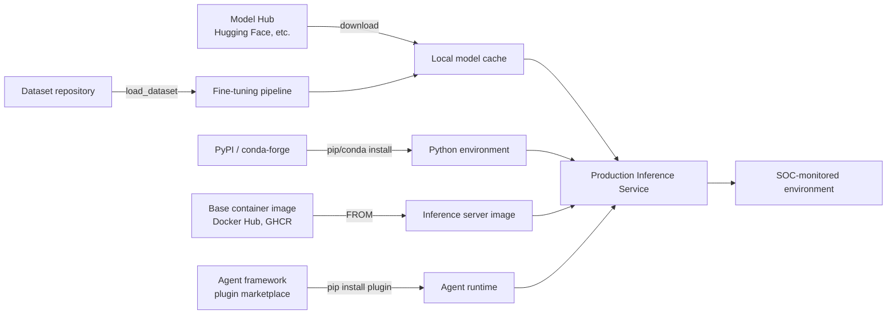
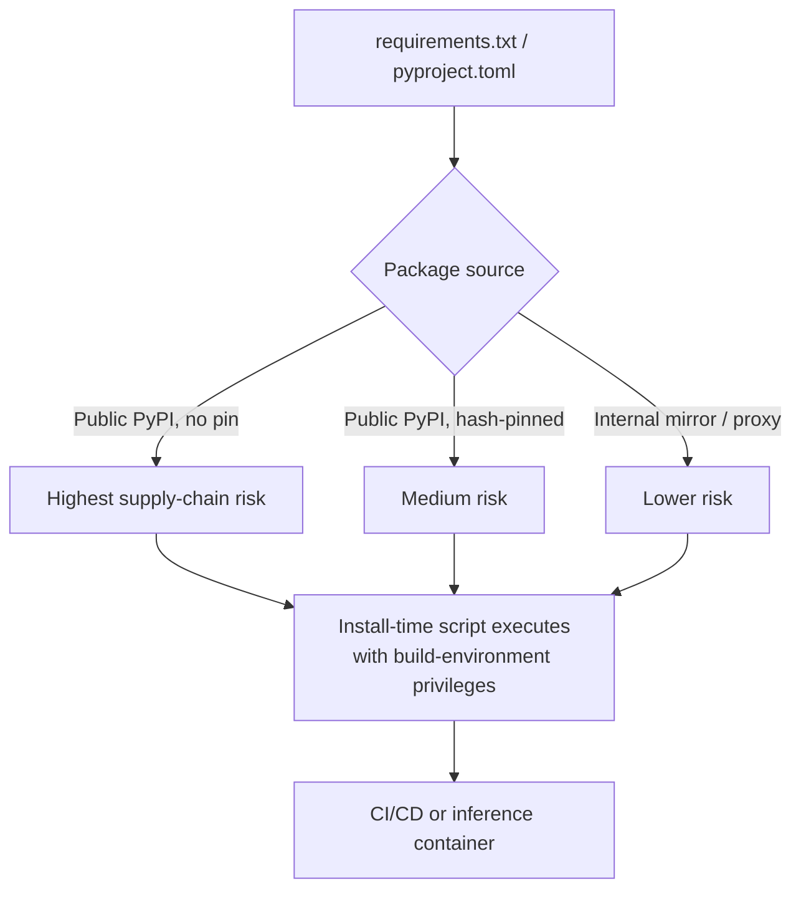
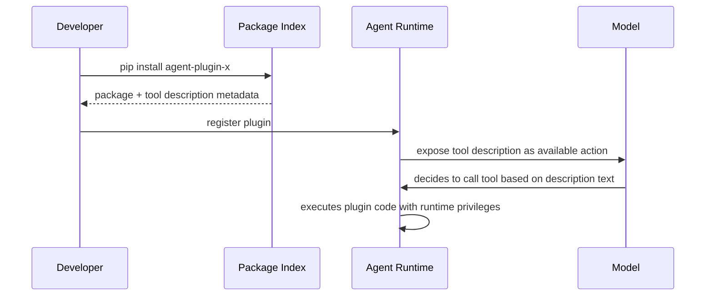

# Chapter 8: AI Supply Chain Security

Every AI system a SOC is asked to defend is an assembly of parts the organization did not build: a base model pulled from a public hub, a tokenizer and configuration file bundled alongside it, a stack of Python packages that changes weekly, a container image built from someone else's Dockerfile, an agent framework with a plugin marketplace, and training or fine-tuning data of uncertain lineage. Traditional software supply chain security (SBOMs, package signing, build provenance) grew up around source code and compiled binaries. AI supply chains add new artifact types -- model weights, tokenizers, embeddings, datasets -- that don't fit neatly into existing tooling, and a culture of "just download it and run it" that predates most security review processes catching up.

This chapter treats the AI supply chain as its own attack surface, distinct from the runtime prompt-injection and jailbreak risks covered elsewhere in this book. The question here isn't "can an attacker manipulate what the model does at inference time" -- it's "can an attacker compromise the artifact before it ever runs a single inference."

## The AI Supply Chain, End to End

Five distinct supplier relationships feed the box a SOC ultimately has to defend: the model hub, the package index, the container registry, the dataset source, and the plugin/agent-framework ecosystem. Each has different trust assumptions, different verification tooling (some, little, or none), and different attacker economics. The rest of this chapter walks each one in turn, then closes with a provenance-validation checklist an ML platform team and a SOC can operationally share.

## Model Hubs: Trust by Default, Verification by Exception

Hugging Face Hub is the dominant example, but the same pattern applies to any registry where a "model card" (a README-style description) sits next to downloadable weights: Civitai for image-generation checkpoints, ONNX Model Zoo, TensorFlow Hub, and increasingly internal model registries that mirror external ones without adding controls. The defining risk is that the download-and-load workflow was designed by ML researchers for research velocity, not by security teams for adversarial resistance. `from_pretrained("some-org/some-model")` will silently pull an arbitrary number of files -- weights, config, tokenizer, and in many cases *executable Python code* -- from a namespace anyone can register.

### Model file formats and their risk profile

| Format | Typical extension | Execution risk | Notes |
|---|---|---|---|
| Pickle (PyTorch legacy) | `.pt`, `.pth`, `.bin` | High -- arbitrary code execution on load | Python's `pickle` module executes `__reduce__` methods during deserialization; a maliciously crafted pickle can run any code the attacker wants the moment `torch.load()` is called, before the model does anything |
| Safetensors | `.safetensors` | Low | Purpose-built format that stores only tensor data and a JSON header, with no executable content; increasingly the default and increasingly required by hub-side scanning |
| ONNX | `.onnx` | Low-to-medium | Mostly a static graph format, but custom operators and some runtime extensions have had code-execution CVEs |
| GGUF / GGML | `.gguf` | Low | Similar design goal to safetensors -- data plus metadata, not code |
| Joblib / cloudpickle | `.joblib`, `.pkl` | High | Same underlying `pickle` mechanism as PyTorch legacy format; common in classical ML (scikit-learn) model sharing |
| Custom `modeling_*.py` / "trust_remote_code" repos | `.py` | High -- by design | Some hub repos ship custom Python that hub tooling explicitly executes on load if the caller opts in |

[ANALYST] When you see an alert for an unexpected outbound connection, unfamiliar child process, or unexplained file write originating from a Python process that has `torch`, `transformers`, or `pickle` in its command line or loaded-module list, don't assume it's "just the model doing inference." Pickle-based deserialization attacks execute during the *load* step, often seconds after the process starts and well before any prompt has been sent. Check whether the process had recently downloaded a new model file, and pull the model's origin (hub namespace, commit hash) from the ML team's manifest before closing the alert as benign.

The `trust_remote_code=True` flag deserves specific attention because it's not a vulnerability -- it's a feature that some model repos require, and it does exactly what it says: it tells the loading library to execute Python files shipped in that repo as part of loading the model. That's appropriate for models with genuinely novel architectures that need custom forward-pass logic. It's also a completely generic remote-code-execution primitive if an attacker can get a target to run `from_pretrained(..., trust_remote_code=True)` against a repo they control, or against a legitimate-looking clone of a popular repo under a similar name.

### Illustrative example: a poisoned checkpoint

Consider a composite, illustrative scenario built for this book, not a reported incident: an internal ML engineer at a fictional retailer, Meridian Outfitters, needs a sentiment-classification model for support-ticket triage and searches a model hub for "sentiment-analysis-distilbert." Three results come back with nearly identical names -- one from the well-known maintainer, two from unfamiliar accounts created the same week, each with copy-pasted model cards and inflated download counts. The engineer picks the second result because it loads fastest in a quick benchmark. The checkpoint is stored in legacy pickle format; on load, it executes a `__reduce__` payload that drops a small script into the container's startup directory and exfiltrates environment variables -- which, in this fictional pipeline, happen to include a cloud storage key. Nothing about the model's actual sentiment-classification output is wrong; the classifier works fine, which is exactly why the compromise would go unnoticed for weeks. This pattern -- functional model, malicious side effect at load time -- is the model-hub equivalent of a trojanized npm package, and it's the scenario provenance controls in this chapter exist to prevent.

## Python and ML Dependency Risk

The ML ecosystem's dependency tree is unusually deep and unusually fast-moving. A single `requirements.txt` for a modern inference service commonly pulls in `torch`, `transformers`, `accelerate`, `sentencepiece`, `numpy`, half a dozen CUDA-adjacent binary packages, and an agent framework, each of which has its own transitive tree. That surface area, combined with a research culture that favors `pip install <package-i-saw-in-a-tutorial>` over vetted internal mirrors, makes this fertile ground for two well-established attack patterns applied to an AI-specific package list.

**Typosquatting.** Attackers register package names that are one character off from popular ML libraries -- variations on `torch`, `tensorflow`, or well-known helper packages -- and publish a package that either behaves identically (to avoid suspicion) while exfiltrating data, or that fails obviously but only after the install-time script has already run. Because ML tutorials, blog posts, and copy-pasted Stack Overflow answers are the primary way many practitioners learn package names, a single typo repeated across enough tutorial content becomes durably exploitable.

**Malicious packages masquerading as utilities.** A second pattern is publishing a plausible-sounding *new* package -- "an easy dataset loader," "a Hugging Face cache helper," "an evaluation-metrics shortcut" -- that does real, useful work and also runs a malicious payload in its `setup.py` or on first import. Because these aren't impersonating a known name, they're harder to catch with typosquat-detection tooling and rely on genuine-sounding functionality plus a small download count that never rings alarm bells.

[ENGINEER] Pin every dependency by hash, not just version, in any environment that will run in production -- `pip install --require-hashes` with a fully resolved `requirements.txt` (or the equivalent lockfile behavior in `poetry`/`uv`) turns "give me whatever the latest compatible release is" into "give me exactly the bytes I reviewed." Version pinning alone (`torch==2.3.1`) does not stop an attacker who compromises a maintainer account and republishes a malicious release under an already-approved version number -- this has happened to non-ML packages in the broader Python ecosystem and there is no reason to assume ML packages are exempt. Route installs through an internal package proxy/mirror that caches approved versions, so a compromise upstream doesn't automatically reach your build pipeline the next time CI runs.

[MANAGEMENT] The honest budget conversation here is that dependency pinning and an internal mirror are cheap compared to almost anything else in this book, and they close off an entire attacker approach vector -- but they only work if someone owns the unglamorous job of periodically bumping pinned versions to pick up real security patches. A frozen lockfile that never gets revisited just relocates the risk from "supply chain compromise" to "known-vulnerable dependency running in production indefinitely." Fund the maintenance, not just the initial pin.

## Container Images for Inference Servers

Most production LLM and ML inference stacks run in containers built `FROM` a base image maintained by someone else -- a CUDA runtime image, a vendor-published inference-server image (Triton, TGI, vLLM-style servers, or similar), or a community image pinned by tag rather than digest. Three risks compound here that are worth calling out because they're specific to this stack:

- **Tag mutability.** A base image referenced by tag (`:latest`, `:cuda12.1`) can change contents without the tag itself changing, meaning your "reviewed and approved" base image today can silently become a different set of bytes tomorrow. Pin by digest (`@sha256:...`) for anything that reaches production.
- **Bundled model weights inside the image.** Some inference-server images ship with a default or example model baked in for convenience. If that default model is never explicitly overridden, a production deployment can end up serving an unreviewed model that nobody on the team selected -- which is a provenance failure even though no attacker was involved.
- **GPU driver and CUDA library sprawl.** These images tend to be large, multi-gigabyte, and built by vendors on a different patch cadence than your OS team's. Vulnerability scanning tools that skip huge layers for performance reasons, or that don't understand CUDA-specific packages, can leave real CVEs in these layers unscanned by default.

[ANALYST] When triaging a container-registry vulnerability scan finding on an inference-server image, resist the urge to dismiss anything that isn't in the "AI" part of the stack. The CUDA runtime, the base OS layer, and any bundled web framework serving the inference API are ordinary container attack surface, and a compromise there gets an attacker just as close to model weights and API keys as a model-specific vulnerability would.

## Agent Frameworks and Plugin Marketplaces

Agentic AI systems introduce a supply chain layer that didn't meaningfully exist for classic ML inference: a plugin or "tool" ecosystem, often installed with a single command, that grants the agent framework access to external actions -- web browsing, code execution, file system access, ticketing-system integration. These plugins are frequently thin wrappers distributed as ordinary Python packages, which means they inherit every risk already described for PyPI packages, plus an additional one specific to agents: a plugin can define the *tool description* the LLM reads to decide when and how to call it. A malicious or compromised plugin can ship a tool description containing hidden instructions aimed at the model itself -- not the developer -- nudging the agent toward exfiltrating data or invoking other tools in an attacker-chosen sequence. This is a supply chain variant of the indirect prompt injection risk documented by Greshake et al. and covered elsewhere in this book, but delivered through the install step rather than through runtime content.

[ENGINEER] Treat every agent-framework plugin as untrusted code with a side channel into the model's decision-making, not merely as a library. Review the tool description text a plugin registers, not just its Python source -- a plugin can be functionally benign and still poison agent behavior purely through the natural-language description the model reads. Sandbox plugin execution with the same rigor you'd apply to a CI runner executing third-party code: least-privilege service accounts, no ambient cloud credentials in the plugin's execution context, and network egress restricted to what the plugin's stated function actually requires.

## Dataset Provenance

Training and fine-tuning data carry supply chain risk that's easy to overlook because a dataset doesn't "execute" the way a package or model file does. The risk instead is integrity and lineage: a fine-tuning dataset pulled from a public repository can be poisoned to bias model behavior in ways that only surface at inference time, far removed from the ingestion step -- backdoor triggers that cause misclassification only on a specific token sequence, or subtle bias injection that skews outputs on a target category without an obvious accuracy drop in aggregate evaluation. Detecting this after the fact is far harder than preventing it at ingestion, because a poisoned dataset can pass ordinary quality checks (label balance, schema validation) while still encoding the attacker's objective.

Practical dataset provenance controls worth establishing regardless of scale:

- Record the exact source (repository, commit hash or dataset version, download date) for every dataset used in training or fine-tuning, in the same way you'd record a software dependency version.
- Prefer datasets with published, versioned releases over ones pulled from a mutable "latest" branch or a live-scraped source that can change between download and use.
- Run automated statistical drift checks between a newly downloaded dataset version and the previously used version -- large unexplained shifts in label distribution or feature statistics warrant manual review before the new version enters a training run.
- For any dataset sourced from user-contributed or crowdsourced platforms, budget time for manual sampling review; automated content filters catch obvious abuse but miss subtler poisoning aimed at a specific downstream task.

[STAKEHOLDER] If your organization fine-tunes models on customer data, internal documents, or any data with confidentiality obligations, dataset provenance is also a data-handling and contractual question, not just a security one -- know where training data physically lives, who can access it, and whether your data processing agreements with customers permit using their data for model training at all. A supply chain failure here can be a breach notification and a regulatory finding simultaneously, not just a technical incident.

## Practical Provenance Validation

None of the risks above require exotic tooling to mitigate -- they require making verification a mandatory gate rather than an optional step a busy engineer skips under deadline pressure. The following checklist reflects the minimum bar this book recommends before any externally sourced model, dataset, or package set reaches a production or customer-facing environment.

| Control | Applies to | What it catches |
|---|---|---|
| Cryptographic hash verification against a known-good value published by the source | Model weights, datasets | Tampering in transit or at rest, mismatched/incomplete downloads |
| Prefer safetensors/GGUF over pickle-based formats; if pickle is unavoidable, scan before load | Model weights | Arbitrary code execution during model load |
| Pin dependencies by hash, not just version; route through an internal mirror | Python/ML packages | Typosquatting, compromised-maintainer republishing, dependency confusion |
| Pin container base images by digest, not tag | Inference server images | Silent base-image drift, tag reuse attacks |
| Review model cards for maintainer identity, repo age, download-count plausibility, and any `trust_remote_code` requirement | Model hub artifacts | Impersonation of well-known models, disguised custom-code execution |
| Record dataset source, version, and retrieval date in a provenance log | Training/fine-tuning data | Untraceable data lineage, inability to reproduce or audit a training run |
| Sandbox and least-privilege any agent-framework plugin; review its tool-description text | Agent plugins | Runtime code abuse and prompt-injection-via-tool-description |
| Use available signing/attestation where the ecosystem supports it (e.g., Sigstore-signed packages, signed container images) | Packages, containers | Confirms an artifact came from the claimed publisher and hasn't been altered post-signing |

None of these controls are unique to AI systems in mechanism -- hash verification, dependency pinning, and image-digest pinning are standard software supply chain practice. What's specific to AI is the set of artifact types (model weights, tokenizers, datasets) that many existing supply chain tools don't yet recognize, and the trust culture around model hubs that treats "it's on Hugging Face" as roughly equivalent to "it's been reviewed," which it is not. Closing that gap is less about new technology and more about extending an organization's existing supply chain discipline to artifact types it hasn't gotten around to covering yet.

[MANAGEMENT] When you're asked to sign off on an AI initiative's timeline, the single highest-leverage question to ask the ML platform team is whether model and dataset provenance checks are a *gate* in the deployment pipeline or a *guideline* engineers are trusted to follow. Guidelines get skipped under deadline pressure precisely when supply chain risk is highest -- during a rushed launch, when someone downloads "whatever works" from a hub search rather than the specific artifact the team vetted last quarter.

## Further Reading

Verified against a live source during this book's construction (see `appendices/references.md`):

- **Cohen, D. (JFrog Security Research), "Data Scientists Targeted by Malicious Hugging Face ML Models with Silent Backdoor"** (February 27, 2024). `https://jfrog.com/blog/data-scientists-targeted-by-malicious-hugging-face-ml-models-with-silent-backdoor/` — documents approximately 100 real malicious pickle-based PyTorch models found uploaded to the Hugging Face Hub, including reverse-shell backdoors, demonstrating a genuine (not hypothetical) ML supply-chain attack.
