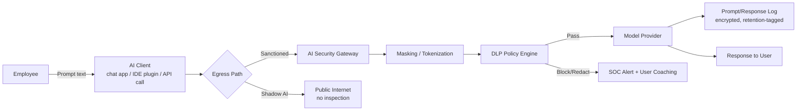
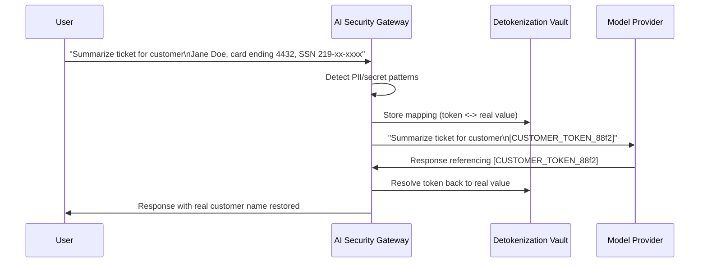

# Chapter 9: AI Data Security

Every AI feature your organization adopts is, underneath the marketing language, a new data pipeline. Text goes in, text comes out, and somewhere in the middle it may be logged, cached, used for model improvement, or replicated across a hosted provider's data centers. The questions that matter are the ones that have always mattered for data protection — where does it go, who can see it, how long does it live, what happens if it leaks — but AI systems answer them differently than the databases and file shares SOC teams are used to defending. A prompt is not a record in a table with a defined schema; it is free text an employee can fill with anything from a product roadmap to a customer's Social Security number to a live database password, transmitted and possibly stored exactly as typed.

This chapter treats prompts and completions as a data class in their own right and walks through the controls — masking, DLP, encryption, retention, and residency architecture — needed to keep that data class from becoming the organization's next breach headline.

## Why Prompt Data Is Different

[ANALYST] A normal DLP alert is a file upload, an email, or a USB write — a discrete event with a clear sender, recipient, and payload boundary. Prompt traffic breaks those assumptions: a single chat session can span hours, mix a dozen topics, and route through a browser extension, a desktop app, and an API client in the same afternoon. The "exfiltration" isn't always a discrete upload — it can be an employee incrementally describing a confidential system across successive follow-up questions, none individually alarming.

Three properties make AI data flows a distinct risk category rather than "email with extra steps":

- **Text is the API.** Anything a user can type can be sent, including secrets like API keys, private keys, and connection strings that would trip a pattern-based DLP rule in a file attachment but slip past reviewers who see them as "just text" in a chat box.
- **The destination is outside the security perimeter by design.** Hosted LLM providers are, from a network perspective, indistinguishable from any other cloud SaaS egress point unless traffic is specifically inspected and routed.
- **Retention behavior varies by product tier and is easy to get wrong.** The same vendor may retain prompts for abuse monitoring on a free tier, offer zero-retention on an enterprise contract, and use a different policy again for an embedded feature that calls that vendor's API under the hood.



## Secrets and Credentials Pasted into Prompts

The single most common AI data-loss event reported by SOC teams in 2025–2026 is mundane: an engineer debugging a failing script pastes the entire error output, including an embedded database password or a cloud access key, into a chatbot to ask "why is this failing?" It's the same error class as pasting a password into a support ticket, except AI chat interfaces make it easier, since the natural workflow is pasting large, unfiltered blobs of logs and stack traces for the model to interpret.

[ENGINEER] I've watched this happen with `.env` files more than anything else. Someone can't figure out why a local environment isn't picking up a variable, so they paste the whole file into a chat window for a second opinion, and now a still-valid AWS secret access key is sitting in a third party's prompt history. The fix isn't "tell people not to do it" — that never worked for Slack either — it's catching the pattern in transit before it leaves the network.

Common secret shapes that should be treated as a standing detection library, not a one-off regex:

| Secret Type | Pattern Marker | Detection Note |
|---|---|---|
| Cloud provider access keys | Fixed-length alphanumeric prefix | High confidence, low false positives |
| Private keys / certificates | `-----BEGIN ... PRIVATE KEY-----` block | Hard block |
| Database connection strings | `://user:password@host:port/db` | Also trigger credential rotation |
| Session tokens / JWTs | Three base64 segments, period-separated | Tune with entropy scoring |
| Internal API tokens | Org-specific issued prefixes | Needs an internal token-format registry |

```
# Illustrative query logic — not validated against a live SIEM or DLP console.
# Conceptual detection for secret-shaped content in outbound AI-gateway traffic.

source = ai_gateway_egress_logs
where destination_category == "llm_provider"
and (
    body matches regex "-----BEGIN [A-Z ]*PRIVATE KEY-----"
    or body matches regex "[A-Za-z0-9/+=]{40}"  and shannon_entropy(match) > 4.0
    or body matches regex "://[^:]+:[^@]+@"
)
| extend risk = "credential_in_prompt"
| extend action = "block_and_alert"
```

The remediation path matters as much as the detection: a blocked prompt containing a live credential should trigger the same response as any other credential exposure — rotate it, don't just close the alert. Treat "secret pasted into an AI tool" on the same severity ladder as "secret pushed to a public GitHub repo" — functionally, it's the same failure with a different transport.

## Source Code Exposure to AI Coding Assistants

[STAKEHOLDER] Engineering leadership tends to frame this as a productivity trade-off — "our developers are faster with AI code completion, what's the actual risk?" The honest answer: the risk is rarely the suggestion itself, it's the surrounding context window. Coding assistants send substantial surrounding code, sometimes entire files or repositories, to generate relevant suggestions. If the backend is a hosted model without a contractual zero-retention or no-training guarantee, source code, embedded credentials, and architecture comments are all leaving the building.

Key exposure points to inventory:

- **IDE plugins** that stream open-file or open-project context to a hosted completion endpoint.
- **Chat-based "explain this code" workflows** where an engineer pastes proprietary logic into a general chatbot rather than an approved, contractually-governed assistant.
- **Automated code review bots** that post entire diffs, including internal system names, to an external API for summarization.
- **CI/CD integrations** that call an LLM mid-build, sending logs or infrastructure-as-code files that describe production in detail.

The mitigation is not to ban AI coding tools — that battle is largely already lost to shadow IT, and the productivity case is real — but to narrow the field to tools with contractual data-handling guarantees and instrument the ones actually in use.

[MANAGEMENT] The negotiating lever here is procurement, not policy memos. Any AI coding assistant brought in under an enterprise agreement should have a written commitment covering no training on submitted code, a defined retention window for abuse-monitoring logs (days, not indefinite), and the right to audit or request deletion. If a vendor can't produce that in writing, that's the answer to "should we approve this tool," not a caveat to work around.

## PII and Regulated Data in AI Workflows

AI features get bolted onto customer-facing products faster than data governance teams can review them: a support chatbot summarizing tickets, a sales assistant drafting emails from account history, a healthcare intake tool pre-filling forms from a conversation. Each can involve regulated data — PII, PHI, payment card data, or jurisdiction-specific categories like EU special-category data — flowing into a prompt.

The core question a SOC or privacy team needs answered for every AI integration: is the regulated data **necessary** for the feature to function or included incidentally because the surrounding record was passed in wholesale; is it **minimized** before reaching the model versus sent as a raw, complete record; is it **retained** by the AI provider beyond the immediate transaction, and under what legal basis; and is it **subject to the same subject-access and deletion rights** as the source system it came from — a support chatbot's prompt log is still part of that customer's record for erasure-request purposes under regulations like GDPR.

A common failure mode is "successful" data minimization at the application layer, undone when a support engineer manually copies a full customer record into a general chatbot to draft a response, bypassing whatever field-level controls the product enforces. It's the same shadow-AI pattern as the coding-assistant problem, applied to customer data instead of source code, and it needs the same fix: an approved tool with contractual guarantees, plus gateway-level enforcement, rather than reliance on individual judgment.

## Retention and Logging of Prompts and Responses

Every organization needs an explicit answer to "how long do we keep prompt and response logs, and why," because two pressures apply at once. Security and IR want enough retention to reconstruct an investigation — did a compromised account exfiltrate anything through the AI assistant, did an employee send customer data somewhere it shouldn't go. Privacy and legal want the opposite: minimal retention, since every stored prompt is a discoverable record in litigation and a liability in a future breach.

A workable middle ground separates the *purpose* of each log stream and applies a different retention clock to each:

| Log Purpose | Typical Retention | Access Control | Notes |
|---|---|---|---|
| Security/abuse monitoring (gateway-side) | 30–90 days | SOC + designated reviewers | Mask/tokenize before storage |
| Model-provider abuse monitoring (vendor-side) | Vendor-defined, often 30 days unless zero-retention contracted | Vendor internal only | Negotiate down or to zero for regulated workloads |
| Compliance/audit trail | Set by regulation, often years | Compliance + legal, tightly scoped | Store metadata/hashes, not raw content, where possible |
| Product-quality/training feedback | Opt-in, explicit consent | Data science, contractually bounded | Highest long-term exposure if unbounded |

[MANAGEMENT] The retention conversation is where "we'll just log everything forever in case we need it" needs to be actively resisted. Indefinite prompt retention converts every AI interaction the company has ever had into a single high-value target, and does nothing for security a well-scoped 90-day log doesn't already do. If an investigation genuinely needs older data, that should be an exception process with sign-off, not a default setting.

## Masking and Tokenization Strategies

The most effective control against both accidental secret exposure and unnecessary PII transmission is intercepting and transforming the prompt before it leaves the trust boundary, rather than relying on the model or the user to self-censor.



Two techniques dominate, and they are not interchangeable:

**Masking (irreversible redaction)** replaces sensitive spans with a generic placeholder (`[SSN_REDACTED]`) and never restores the original value. This is appropriate when the model doesn't actually need the real value to do its job — summarizing a ticket doesn't require the literal SSN, just the fact that one was mentioned.

**Tokenization (reversible substitution)** replaces the sensitive value with a token mapped back to the original by a trusted component that never leaves the organization's control — typically the gateway itself or a dedicated vault. This preserves the model's ability to reason consistently about "this customer" across a multi-turn conversation without ever exposing the raw value to the provider.

[ENGINEER] Tokenization costs more engineering effort than masking — a mapping store, collision handling, re-injecting real values without breaking formatting — but it's the only approach that supports multi-turn workflows where the model keeps referring back to "the customer" coherently. Masking alone tends to degrade output quality past single-turn Q&A, which is why teams that try masking first often end up building tokenization within a year.

Both techniques need to run **before** the request crosses into the model provider's infrastructure — a gateway or client-side interceptor, not a post-hoc scan of provider-side logs, since by the time those logs exist, the exposure has already happened.

## DLP Approaches Adapted for AI Traffic

Traditional DLP tooling was built around email, file transfer, and web upload channels with well-understood MIME types and clear sender/recipient metadata. AI traffic needs the same policy engine reoriented around a few AI-specific realities:

- **Inspect at the API/gateway layer, not just the browser.** A browser-extension DLP control misses API calls from IDE plugins, CI pipelines, and backend services — often the majority of enterprise AI traffic once pilots mature.
- **Score conversations, not just messages.** A user asking "what's a good password policy" is benign. The same user, twenty turns later, describing their actual production password policy in specific detail is not. Session-level scoring catches slow-drip disclosure that message-level scanning misses.
- **Treat the response, not just the prompt, as a DLP surface.** A model can be manipulated (see the prompt injection discussion elsewhere in this book) into echoing back sensitive data it retrieved from a connected tool, even if the original user prompt contained nothing sensitive.
- **Expect encoding evasion.** Users and attackers routing data through an AI channel will base64-encode, use synonyms, or ask the model to "translate" content specifically to slip past keyword-based DLP — the same evasion seen in web DLP, applied to a new channel.

In practice this looks like a session-level counter: track sensitive-dictionary hits per user per session, and alert when the rate for a given session runs well above that user's historical baseline rather than waiting for a single message to cross a fixed threshold.

## Encryption in Transit and at Rest for AI Pipelines

AI pipelines aren't exempt from baseline cryptographic hygiene, but they add a few extra hops: client-to-gateway, gateway-to-provider, any vector store holding embeddings, and the log/telemetry store capturing prompts and responses.

- **Transit:** TLS 1.2+ (preferably 1.3) on every leg, including gateway-to-provider calls teams sometimes assume are "internal enough" to skip inspection — they aren't; the model provider is an external party regardless of how the API is wrapped.
- **At rest — logs:** Encrypt with keys the organization controls (customer-managed where supported), not solely the vendor's default, so a vendor-side breach doesn't automatically expose readable content.
- **At rest — embeddings:** Embeddings are often left unencrypted as "just numbers," but can be partially inverted to reconstruct source text under certain conditions. Give a vector store holding sensitive embeddings the same access controls as the source documents.
- **Key management for tokenization vaults:** The detokenization mapping store is a high-value target — compromising it defeats the tokenization control — and should sit behind its own hardware- or KMS-backed key, separate from general application keys.

## Data Residency for Hosted Models

[STAKEHOLDER] Legal and compliance teams will ask, correctly, "which country is our data actually processed in," and the honest answer is often more complicated than a single region name. A hosted model call can involve a load balancer in one region, inference on GPU capacity in another, and logging replicated to a third for the provider's own reliability engineering — and that chain can change as the provider scales, without necessarily triggering a customer-visible notice unless the contract requires one.

Practical residency controls to negotiate and verify, not just assume:

- **Regional endpoint commitments** — many providers now offer contractually bound regional processing (for example, EU-only inference endpoints); confirm this covers logging and abuse-monitoring paths, not just the primary inference call.
- **Subprocessor disclosure** — request the subprocessor list and locations, since a provider's infrastructure may run on a hyperscaler in a different jurisdiction than advertised.
- **Data transfer mechanism** for any cross-border flow — standard contractual clauses or equivalent, verified as current, not assumed from a prior audit cycle.
- **Fallback/failover routing** — confirm whether a regional outage silently fails traffic over to a different region, quietly violating a residency commitment precisely when no one is watching.

Residency requirements should be an enforceable gateway routing rule, not just a contractual promise — a regionally pinned gateway that refuses to route a flagged data category to a non-compliant endpoint survives even if a vendor's practice quietly drifts from what was contracted.

## Bringing It Together

AI data security is not a single product purchase; it is the same data-protection discipline SOC and privacy teams already run — classify, minimize, mask, log with purpose, encrypt, control where data physically goes — applied to a channel unusually easy for end users to fill with unstructured, unvetted content. Organizations that get this right treat the AI gateway as a mandatory chokepoint with the same seriousness as an email or web proxy, instrument it for both secrets and PII, negotiate retention and residency terms in writing rather than assume defaults are acceptable, and build tokenization and DLP tooling before the first major incident forces the issue.
