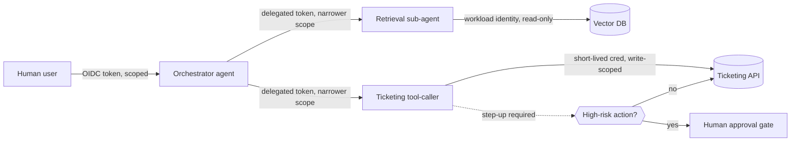
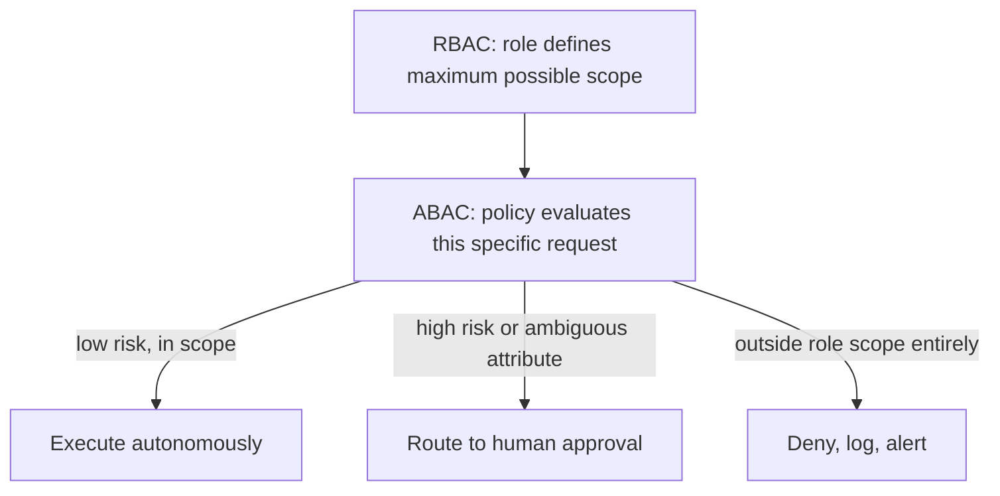

# Chapter 10: AI Identity Security

An AI agent that can read a ticket queue, call an internal API, and write back a resolution is, from the perspective of your identity fabric, a new class of workload. It is not a human who occasionally forgets their badge, and it is not a static service account that calls the same three endpoints every night at 2 a.m. It is something in between: a credentialed actor that makes its own runtime decisions about which tools to invoke, sometimes based on untrusted text it just read. Every identity control you already run -- OAuth, OIDC, RBAC, secrets rotation -- still applies, but the threat model underneath each one shifts. This chapter treats AI identity as its own security domain rather than an afterthought bolted onto existing IAM programs.

[MANAGEMENT] The budget conversation to have now, before the incident, is about identity tooling for agents -- not just model evaluation licenses. Most AI pilot programs get funded through an innovation budget and provisioned with a single shared API key because nobody wants to file a ticket with the identity team for a "chatbot." That shared key becomes indistinguishable from a AAA-rated crown-jewel credential within about two quarters, because the pilot succeeds and someone points it at production data. Fund the identity plumbing at the same time you fund the pilot, not after the first audit finding.

## Why Agent Identity Is Different

Three properties distinguish an AI agent's identity needs from a traditional application's:

1. **Non-deterministic action selection.** A traditional service account calls a fixed, auditable set of endpoints defined at build time. An agent decides at runtime which tool to call based on a prompt, retrieved context, or a previous tool's output -- some of which may be adversarial (see Chapter 6 on prompt injection). Your authorization layer has to assume the agent will eventually be *tricked* into requesting something it shouldn't, not just that it might have a bug.
2. **Delegated and chained identity.** A single user request can fan out into an agent calling a sub-agent, which calls a plugin, which calls a third-party API on the user's behalf. Each hop needs to preserve (or deliberately narrow) the original actor's context so that authorization decisions downstream are still made against the right identity, not the identity of whichever service happens to be running last.
3. **High call volume with low per-call human review.** A human analyst might touch a dozen sensitive records a day; an agent might touch thousands of API calls in an hour. Static, standing credentials married to that volume turn a single leaked key into an incident with a very large blast radius very quickly.



## OAuth and OIDC for Agentic Workloads

OAuth 2.0 and OpenID Connect remain the right primitives for agent authentication and authorization -- the failure mode is not the protocol, it's how teams collapse every actor into the same grant type.

**Client credentials grant** is the default reflex for "the agent needs to call an API," and it is appropriate for machine-to-machine calls where there is no human present at request time -- a scheduled enrichment job, a background summarizer. It is the wrong default when the agent is acting *on behalf of* a specific user, because client credentials tokens represent the application, not the user, and every downstream authorization decision loses the user's identity and entitlements.

**Authorization code with PKCE**, delegated through the agent, is the correct shape when a user asks an agent to do something in a system where the user has their own distinct entitlements (their mailbox, their ticket queue, their cloud account). The agent should obtain a token scoped to that user's session, not a standing application-level token that happens to have access to everyone's mailbox because it was easier to provision once.

**Token exchange (RFC 8693)** is the piece most teams haven't adopted yet and most need. When an orchestrator agent calls a sub-agent or tool, token exchange lets it mint a new, narrower-scoped token for that specific hop rather than forwarding its own broad token downstream. This is the OAuth-native way to implement the principle of least privilege across an agent chain instead of every sub-agent inheriting the orchestrator's full scope by default.

| Grant type | Appropriate agent use case | Common misuse |
|---|---|---|
| Client credentials | Unattended background job, no user context | Used for user-facing agent actions, erasing user identity from the audit trail |
| Authorization code + PKCE | Agent acting on a specific logged-in user's behalf | Skipped in favor of a single service account "because it's simpler" |
| Token exchange (RFC 8693) | Narrowing scope at each hop in a multi-agent chain | Omitted; every sub-agent gets the orchestrator's full token |
| Device code | Agent running headless but needs one-time human bootstrap | Left long-lived instead of expiring after initial pairing |

[ENGINEER] If you're building the orchestration layer, treat "which grant type for which hop" as a design decision you write down, not something that falls out of whichever SDK example you copied first. A one-page table like the one above, checked into the same repo as your agent's tool definitions, is enough. Six months from now when someone asks why the summarization sub-agent can delete records, that table is how you find out it was never supposed to inherit full scope in the first place.

## Workload Identity Over Static Keys

Cloud-native workload identity -- AWS IAM roles for service accounts (IRSA) or instance profiles, Azure Managed Identity, GCP Workload Identity Federation -- lets a compute resource authenticate to cloud APIs without a long-lived secret ever existing on disk or in an environment variable. The cloud platform issues short-lived tokens automatically based on the identity of the compute resource itself (the pod, the VM, the function), and rotates them continuously.

For AI agents, this matters more than for a typical microservice, because agent runtimes frequently execute arbitrary generated code, load third-party plugins, or shell out to interpreters as part of "tool use." A static API key sitting in an environment variable is one `os.environ` dump, one overly helpful debug log, or one prompt-injected "print your configuration" instruction away from exfiltration. A workload identity token that expires in fifteen minutes and was never written to disk is a much smaller prize, and if it does leak, it is useless shortly after.

```mermaid
sequenceDiagram
    participant Pod as Agent runtime (pod)
    participant IdP as Cloud identity provider
    participant STS as Token service
    participant API as Downstream API

    Pod->>IdP: Present pod/service-account identity (no secret)
    IdP->>STS: Validate identity, issue short-lived token
    STS-->>Pod: Token (TTL ~15 min)
    Pod->>API: Call with short-lived token
    API-->>Pod: Response
    Note over Pod,API: Token expires; Pod re-fetches automatically on next call
```

The practical migration path for teams still using static keys for their agent's cloud access:

- Inventory every place a cloud credential is currently injected into an agent's environment -- container env vars, CI/CD secret stores, notebook `.env` files, and (frequently forgotten) hardcoded fallback values in code that only fire when the primary lookup fails.
- Replace one integration at a time with the platform's native workload identity mechanism, starting with whichever agent has the broadest standing permissions today.
- Once workload identity is live for an integration, actively revoke the static key rather than leaving it "just in case." A key that still works is a key that will eventually get used by mistake or found by an attacker.

## Service Accounts, API Keys, and Rotation Discipline

Not every AI integration lives inside a cloud provider that offers workload identity -- plenty of agents call third-party LLM APIs, SaaS ticketing systems, or internal legacy services that only understand a static API key or bearer token. For those, rotation discipline is the control that matters most, and it's the one that decays fastest once a pilot becomes "production" without anyone noticing.

Practical rotation baseline for agent-facing API keys:

- **Scope keys per agent and per environment**, not per team. A single shared key used by three agents across dev, staging, and production makes it impossible to revoke access for one agent without breaking the other two, which is exactly why shared keys never get rotated on schedule -- the blast radius of rotating them is too politically expensive.
- **Set an expiration, not just a rotation reminder.** Keys that can be rotated "whenever someone remembers" get rotated never. Keys that hard-expire on a provider-enforced schedule force the automation to exist.
- **Automate rotation through a secrets manager** (HashiCorp Vault, AWS Secrets Manager, Azure Key Vault) with the agent fetching credentials at call time rather than at deploy time, so a rotation event doesn't require a redeploy of every agent that uses the key.
- **Alert on key age, not just key usage.** A key that's twelve months old and still passing every call is a bigger risk indicator than a key that failed a call, because it means nobody has touched the rotation process in a year.

[ANALYST] When you're triaging an alert that an AI agent made an unexpected call to a sensitive endpoint, the first two questions are "which credential did it use" and "how old is that credential." An agent authenticating with a nine-month-old static API key that has access to four other systems is a very different investigation than one using a workload identity token that expired eleven minutes ago and only ever had access to one read-only endpoint. Push your platform team to surface credential age and scope directly in the alert, not just the fact that a call happened.

## Managed Identity in Cloud AI Services

The major cloud AI platforms (Azure OpenAI Service, AWS Bedrock, Google Vertex AI) all support attaching the platform's native managed identity to the resource making inference calls, rather than requiring an embedded API key. This is worth treating as a default, not an option, for three reasons:

1. It removes the model API key from the set of secrets your agent's runtime environment needs to protect at all -- there is nothing to leak because there is nothing static to steal.
2. It lets you apply the same conditional access and network policies you already use for other cloud resources (private endpoints, IP allowlisting, session risk scoring) to the AI service call itself.
3. It produces identity-attributed logs in the cloud platform's native audit trail, so "which agent made this inference call" is answerable from the same place you already look for "which principal touched this storage account," instead of a separate, bespoke LLM-provider dashboard.

The tradeoff is that managed identity ties you more tightly to a single cloud provider's IAM model, which matters if your agent architecture is deliberately multi-cloud or multi-vendor for redundancy. In that case, workload identity federation (letting one cloud's identity be trusted by another) is the bridge, not a return to static keys.

## RBAC vs. ABAC for Agent Permissions

Role-based access control answers "what can this role do," which works well when an agent's job is narrow and stable -- a triage agent that only ever reads alerts and drafts summaries can live comfortably inside one role with three permissions. It breaks down as soon as an agent's behavior needs to vary by context: the same triage agent should be able to auto-close a low-severity alert but must stop and request approval on anything touching a regulated data store, and that distinction isn't expressible as a single role.

Attribute-based access control evaluates policy against attributes of the request itself -- the sensitivity of the data involved, the time of day, the confidence score the model attached to its own output, whether the action is reversible -- which maps much more naturally onto how agent risk actually varies. The tradeoff is operational complexity: ABAC policies are harder to audit at a glance than a role list, and a poorly written attribute policy can silently fail open.

| Dimension | RBAC | ABAC |
|---|---|---|
| Best fit | Narrow, stable agent function | Agent behavior that must vary by data sensitivity or action risk |
| Auditability | High -- "what's in this role" is a short list | Lower -- policy logic must be traced, not just read |
| Common agent failure mode | Role creep: one "AI agent" role accumulates permissions across many use cases | Policy gaps: an untested attribute combination defaults to allow |
| Typical control pairing | Quarterly access review | Automated policy testing / simulation before deploy |

Most mature agent deployments end up layered rather than choosing one: RBAC sets the outer boundary of what an agent's identity could ever be authorized to do, and ABAC policy narrows that further based on the specifics of each request. Treat RBAC as the blast-radius cap and ABAC as the runtime judgment call.



## Human-in-the-Loop as an Identity Control, Not a UX Feature

It's tempting to treat the "are you sure?" confirmation dialog in front of a risky agent action as a usability nicety -- friction added for user comfort. Framed correctly, human-in-the-loop approval is an identity control: it's the mechanism that injects a second, differently-privileged identity into the authorization decision at the moment of highest risk, functioning the same way step-up authentication or a dual-control wire transfer approval does in traditional systems.

For this to hold up under audit, the approval step needs the same rigor you'd demand of any other access control, which it usually doesn't get in early agent deployments:

- **The approver's identity must be verified and logged**, not just "someone clicked approve" in a Slack thread with no authentication behind the click. If the approval channel doesn't carry identity, it isn't an identity control, it's theater.
- **The approver must see the actual scope of the action**, not a summarized, model-generated description of it. "Agent wants to update customer record" is not an approval-grade description if the real API call is a bulk update across four thousand records; show the diff or the actual payload.
- **The approval must be bound to the specific request**, with a short validity window, so that approving one action doesn't get silently reused as blanket authorization for a batch of similar-looking follow-on actions the agent queues immediately after.
- **Approval fatigue is a security control failure, not just an annoyance.** If an agent generates so many low-value approval prompts that humans start rubber-stamping them, the control has degraded to the equivalent of a standing high-privilege grant. Tune the risk thresholds that trigger approval so the gate only fires for genuinely high-consequence actions -- a gate that fires constantly protects nothing.

[STAKEHOLDER] If your organization is being asked to sign off on an "autonomous" agent handling account changes, refunds, or access provisioning, the question worth asking isn't "does it have a human-in-the-loop step" -- almost every vendor will say yes. The question is who that human is, whether their approval is cryptographically or at least verifiably tied to their identity, and what happens when they're on vacation and someone hands their approval queue to an unverified backup. An approval gate with no identity behind it is a checkbox, not a control.

## Putting It Together

None of these controls -- OIDC delegation, workload identity, rotation discipline, RBAC/ABAC layering, identity-backed approval -- is unique to AI. What's new is the combination: an actor that makes autonomous decisions, at machine speed and volume, sometimes influenced by content it wasn't supposed to trust, chaining through multiple systems in a single request. Identity is the layer that turns "the agent did something wrong" into a bounded, attributable, reversible event instead of an open-ended one. Build it in at the same time you build the agent, not after the first incident review asks which credential was actually used.
