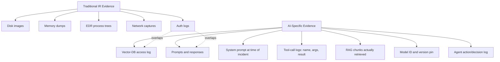
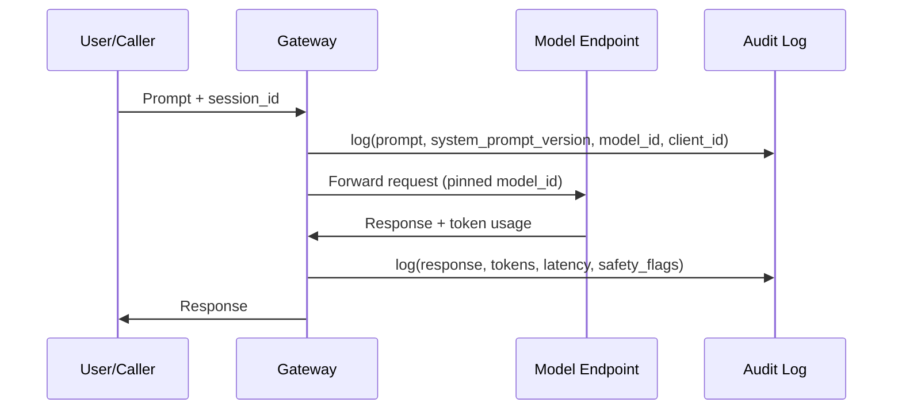
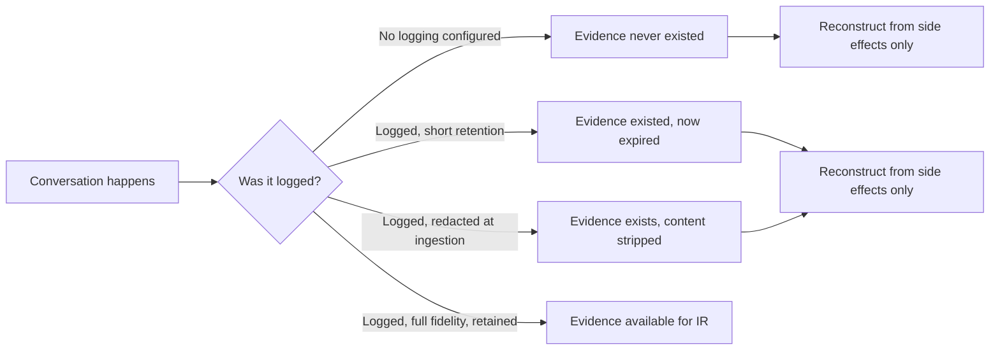

# Chapter 13: AI Forensics

A traditional IR playbook tells you to preserve disk images, memory dumps, EDR telemetry, and network captures. None of that tells you what actually happened inside an AI-enabled incident, because the evidence that matters most — the prompt that triggered the behavior, the system prompt that shaped it, the tool call the model decided to make, the RAG chunks that were actually retrieved and fed into context — lives in places a conventional forensic checklist never looks, and often isn't retained at all unless someone configured it to be. This chapter works through the evidence categories unique to AI systems, the chain-of-custody problems specific to conversational state, and a practical evidence-collection checklist you can adapt into your own IR runbook.

[ANALYST] The uncomfortable truth to internalize early: by the time you're asked to investigate an AI-related incident, the single most important artifact — the exact text the model saw and the exact text it produced — may have already aged out of a 30-day log retention window, or may never have been logged in the first place because the integration was stood up by a product team that had no reason to think about forensics. Your first job in any AI incident is figuring out what evidence still exists, not what evidence you wish existed.

## 13.1 Why Conventional IR Evidence Isn't Enough

Host and network forensics answer "what did a process do on a system." AI forensics has to answer a different question: "what did a model decide to do, based on what input, and why." That requires a different evidence model, because the causal chain runs through natural-language content and model behavior rather than through syscalls and packet headers.



The overlap matters: authentication events for AI services and cloud audit logs are evidence categories both worlds share, and they're often the only durable record left once conversational content has expired. Everything else in the AI-specific column tends to live in application-layer logging that nobody classified as "security-relevant" until an incident made it so.

[ENGINEER] If you own an LLM gateway, agent runtime, or RAG pipeline, treat this chapter as a retention and instrumentation gap analysis, not just reading material. Every category below that your system doesn't currently log is a category your future incident responder will not have, and there is no way to retroactively generate a prompt log for a conversation that already happened.

## 13.2 The Evidence Categories, One at a Time

### Prompts and Responses

The full text of what the user (or an upstream system, in agent-to-agent cases) sent to the model, and the full text of what the model returned, are the core artifact of almost every AI incident — prompt injection, data leakage, policy-violating output, jailbreak success. Without the actual prompt/response pair, you are reconstructing behavior from side effects (a support ticket, a screenshot, a downstream API call) rather than from the thing that caused them.

Two failure modes recur constantly. First, many chat-style products log the response but truncate or redact the prompt for privacy reasons — precisely the field you need most. Second, multi-turn conversations are sometimes logged per-turn without a stable conversation identifier tying them together, so you can retrieve individual messages but can't reconstruct the sequence that led to the final output. When you're specifying logging requirements for a new AI feature, insist on full prompt and response capture keyed to a persistent conversation ID, with redaction (if required for privacy) applied at query time by role-based access control rather than at ingestion time by dropping the field.

### System Prompts and Their Version History

The system prompt is the invisible half of every conversation — the instructions, guardrails, and persona the user never sees but that shape every response. When investigating a jailbreak or an unexpected disclosure, you need to know exactly what the system prompt said *at the time of the incident*, not what it says today. System prompts get iterated frequently (a prompt-engineering team might ship five revisions in a week), and if your only record is "the current value in the config repo," you have no way to prove what was actually live when the incident occurred.

The fix is treating system prompts like code: version-controlled, with each deployed version tagged to a timestamp range and, ideally, to the specific model-and-config combination it was paired with. A system-prompt change log with `effective_from` / `effective_to` timestamps turns "we think it said something like this" into "here is the exact string, and here is the commit that shipped it."

### Tool-Call Logs: Name, Arguments, and Results

For any agentic system, the tool call is where intent becomes action. A model deciding to call `send_email`, `execute_query`, or `delete_file` is the moment abstract text generation turns into something with real-world consequence, and the evidence trail needs three things at minimum: which tool was invoked, the exact arguments passed to it, and the result (or error) returned. Logging only that "a tool was called" without the arguments is close to useless — you'll know the agent touched the database, not what it asked the database to do.

```
// Illustrative tool-call log schema — not a real product's field names
{
  "timestamp": "2026-08-11T14:22:07Z",
  "session_id": "agentrun-88f3",
  "agent_id": "support-triage-agent-v4",
  "tool_name": "query_customer_db",
  "tool_args": {"customer_id": "CUST-40218", "fields": ["billing_history"]},
  "tool_result_status": "success",
  "tool_result_summary": "returned 14 rows",
  "model_id": "vendor-model-2026-06-preview",
  "triggering_prompt_hash": "sha256:9c2a..."
}
```

Note the `triggering_prompt_hash` field: even when full prompt text is redacted or expired, a hash lets you confirm whether two tool calls were triggered by the same input, or correlate a tool call back to a prompt log stored elsewhere with a longer retention window.

### RAG Chunks Actually Retrieved

This is the category conventional IR has no equivalent for at all, and it's frequently the deciding factor in whether a data-leak incident is "the model hallucinated something that sounds like our internal data" or "the model was fed our internal data and repeated it verbatim." A RAG pipeline's retrieval step queries a vector database, gets back some ranked set of chunks, and injects a subset of them into the context window before generation. If you don't log *which specific chunks* were retrieved and included for a given response — not just "retrieval happened," but the chunk IDs, source documents, and similarity scores — you cannot answer the single most common question in a RAG-related incident: did the model actually have access to the sensitive document in question when it produced this output?

| What to log | Why it matters forensically |
|---|---|
| Query embedding or query text sent to vector DB | Reconstructs what the retriever was searching for |
| Chunk IDs returned, with similarity scores | Shows what was available to be retrieved |
| Chunk IDs actually inserted into context | Shows what the model could see, vs. what was merely nearby |
| Source document / permission label per chunk | Determines whether retrieval crossed an access boundary |
| Reranker decisions, if a reranking stage exists | Explains why a chunk was included or excluded despite its score |

Without this log, "did retrieval leak restricted document X" becomes an unanswerable question rather than a five-minute query.

### Agent Action Logs

For multi-step agents, the tool-call log captures individual actions, but the agent action log captures the *reasoning trace* connecting them — the plan the agent formed, the intermediate steps it considered, and (for frameworks that expose it) the chain of sub-decisions between receiving a prompt and producing a final action sequence. Not every framework exposes this cleanly, and some intentionally discard intermediate reasoning tokens after generation to save cost. Where it is available, preserve it; where it isn't, document the gap explicitly in your incident report rather than implying a reconstructed narrative is the actual reasoning trace.

### API Request Metadata, Model Identifiers, and Version Pinning

Every request to a model API carries metadata worth preserving independently of the content: which model was called, which version or snapshot of that model, temperature and other sampling parameters, the caller's client ID, and the response's token counts and latency. This matters because model behavior is not static — a vendor's "latest" alias can point to a different underlying model week to week, and a jailbreak that worked against one snapshot may not reproduce against another. An incident report that says "the model did X" without recording exactly which model version is a report that can't be validated, reproduced, or used to confirm a fix.



Version pinning also matters for reproducibility during the investigation itself: if you need to test whether a suspected prompt injection still succeeds, you need to run it against the *same* model version that was live during the incident, not whatever version happens to be current when you get around to testing it.

### Authentication Events and Cloud Audit Logs

This is the category that overlaps most with conventional IR, and the one most likely to already be captured by existing tooling — provided someone remembered that AI service credentials are credentials. Authentication events for AI platforms (console logins, API key creation/rotation/revocation, service-account token issuance) and cloud-provider audit logs (IAM policy changes affecting model or vector-DB resources, storage bucket permission changes on training-data or embedding stores) should already be flowing into your SIEM through the same pipeline as every other cloud identity event. If they aren't, that's a gap to close before an incident, not during one — this is generally the easiest category to retrofit because the logging source (your cloud provider's control-plane audit trail) already exists and typically just needs to be included in scope for whatever AI-specific alerting or retention policy you're building.

### Vector-DB Access Logs

Distinct from the RAG-retrieval content log above, this is the infrastructure-level access log for the vector database itself: who or what queried it, from where, how frequently, and whether any administrative operations (index rebuilds, bulk exports, permission changes) occurred. A vector database holding embeddings of sensitive source material is a data store like any other, and it needs the same access logging discipline as a production database — including the uncomfortable case where an embedding itself can be partially inverted to recover fragments of the source text, meaning "we only exposed the embeddings, not the source documents" is not the airtight defense it sounds like.

### Timestamps and Configuration Snapshots

None of the categories above are useful in isolation without a reliable timeline. Configuration snapshots — the deployed system prompt, the model version, the RAG index version, the tool permissions granted to an agent — all need to be captured with enough timestamp precision to reconstruct "what was true at 14:22:07 UTC on the day of the incident," because all of these configurations drift, sometimes multiple times a day in an actively developed system.

### Model Hash and Provenance at Time of Incident

For self-hosted or fine-tuned models, record the model artifact's hash (and ideally a signed provenance record — see Chapter 8's supply-chain discussion) at deployment time, so that if a later investigation needs to ask "was this the model we think it was, or was it swapped," there's a cryptographic answer rather than a matter of institutional memory. This matters most in cases involving a compromised model registry, a supply-chain incident, or a dispute about whether an unauthorized fine-tune was deployed to production. If a hash doesn't match the expected provenance record, that's evidence of tampering worth escalating on its own, independent of whatever behavioral anomaly triggered the investigation.

## 13.3 The Chain-of-Custody Problem for Ephemeral Conversational State

Chain of custody in conventional forensics assumes the evidence exists somewhere and the job is proving it wasn't altered after collection. AI forensics frequently faces a harder problem: the evidence may never have existed in a durable form at all.



Several properties of conversational AI systems make this worse than the equivalent problem in, say, email or chat-log forensics:

**Session state often lives client-side or in short-lived server memory.** Some conversational interfaces reconstruct context by replaying prior turns from client-side storage rather than persisting the full conversation server-side. If the client is the only place the full history exists, a user (or an attacker with access to the user's session) can alter or delete that history with no server-side trace.

**Default retention windows are frequently short, and set by cost, not security, considerations.** Prompt and response logging can be expensive at scale, so many platforms default to 7-30 day retention, sometimes less for verbose fields like full RAG-retrieved-chunk lists. An incident discovered 45 days after the fact may have zero recoverable prompt/response content even on a system that logs everything correctly, simply because retention already rotated it out.

**Redaction and privacy tooling can destroy the exact evidence you need.** PII-scrubbing pipelines that run at ingestion time — a reasonable privacy control in isolation — can strip the very content that would let you determine whether a data leak occurred, because the scrubber can't distinguish "PII we're protecting" from "PII that leaked and is the subject of the investigation."

**Model non-determinism means you often cannot simply "re-run it" to reproduce evidence.** Even with temperature set to zero, most hosted models don't guarantee bit-for-bit reproducible output, and a model version that has since been updated may not reproduce the original behavior at all. Unlike a malware sample you can re-detonate in a sandbox, you often get exactly one shot at capturing the real evidence, live, and no reliable way to regenerate it later.

[MANAGEMENT] The organizational fix for all four of these is the same: decide, before an incident, what conversational content is a security-relevant record with a defined retention period, separate from whatever default (often short) retention a product team configured for cost or UX reasons. That's a policy and budget decision — longer retention costs storage and raises its own privacy-handling burden — and it needs to be made explicitly rather than by default, because the default in most AI product stacks was tuned for latency and cost, not for six-months-later investigability.

[STAKEHOLDER] If you're being asked to approve a retention policy for AI conversation logs, the tradeoff is genuinely two-sided: every day of retention is both a forensic asset and a privacy liability, and a breach of the log store itself would expose exactly the sensitive conversational content you retained for IR purposes. A reasonable middle path many organizations land on is tiered retention — short full-fidelity retention (say, 30-90 days) for prompt/response content, combined with longer retention of metadata-only records (timestamps, model IDs, tool names, hashes, without full text) that support timeline reconstruction even after the content itself has aged out.

## 13.4 A Practical Evidence-Collection Checklist

When an AI-related incident is declared, move quickly on anything with a retention clock still running. The following order roughly reflects which evidence tends to expire soonest:

1. **Freeze retention on the affected conversation/session IDs immediately** — a legal hold or retention-exemption flag, if your logging platform supports one, before the normal rotation job runs.
2. **Pull full prompt/response text** for the affected session(s), including system prompt version in effect at the time.
3. **Pull tool-call logs** with full arguments and results for the session, and cross-reference against the agent action log if the platform exposes reasoning traces.
4. **Pull RAG retrieval logs** — chunk IDs, source documents, and permission labels — for every response in scope, not just the one flagged as anomalous.
5. **Record model ID, version/snapshot, and sampling parameters** for every call in scope; note if the model alias has since moved to point at a different underlying version.
6. **Pull authentication and cloud audit logs** for the principal(s) involved, going back further than the conversational retention window typically allows, since these usually retain longer.
7. **Pull vector-DB access logs** for administrative operations (exports, index changes, permission changes) in the relevant time window, independent of the retrieval-content log.
8. **Snapshot current configuration** (system prompt, tool permissions, RAG index version, model pin) and diff it against the configuration-at-time-of-incident reconstructed from steps 2-5, to confirm whether the vulnerable configuration is still live.
9. **Hash and document provenance** for any self-hosted model artifact involved, and compare against the expected value in your model registry.
10. **Document every gap explicitly** — every category above that could not be retrieved, and why (never logged, retention expired, redacted at ingestion) — as part of the incident record, so the after-action review drives a concrete logging or retention fix rather than a vague "improve AI logging" action item that never gets prioritized.

That last step is the one most incident reports skip, and it's the one with the highest long-term value: an honest list of "here is the evidence we needed and didn't have" is what turns one bad incident into a durable improvement to your AI logging posture, instead of a one-off scramble that leaves the same gaps open for the next one.
