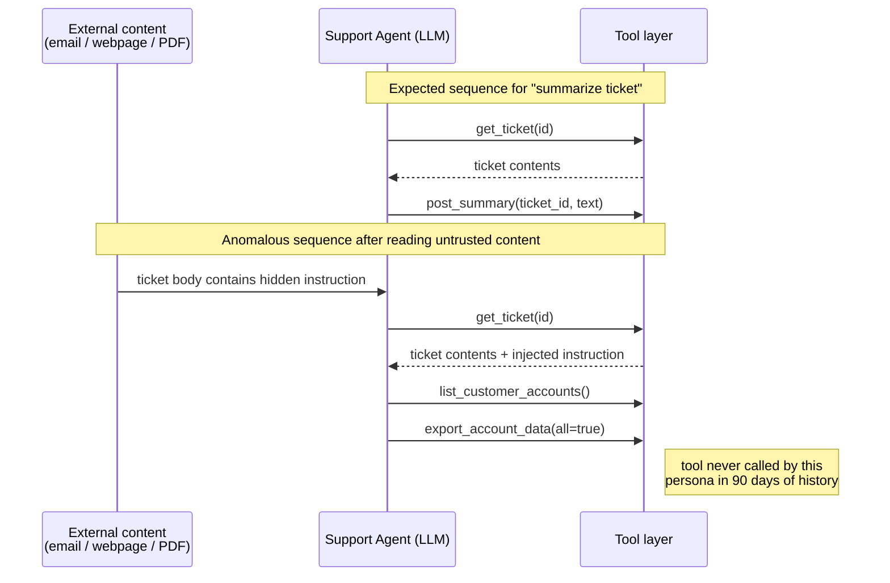

# Chapter 14: AI Threat Hunting

Threat hunting is the discipline of looking for the adversary activity your detections weren't written to catch — a hypothesis-driven search through data you already collect, run because you suspect a gap rather than because an alert fired. AI infrastructure widens that gap considerably. Most SOCs have years of tuned analytics for endpoints, identity, and network traffic, and close to nothing for the layer that now sits between users and an LLM, or between an autonomous agent and the tools it's allowed to call. This chapter is a working set of hunt packages for that layer: hypothesis, data sources, pivot fields, and the illustrative query logic to get you started. None of it replaces the detections in this book's earlier chapters — it's what you run in the space those detections don't cover yet.

[ENGINEER] Every hunt in this chapter assumes you have somewhere to look. If you don't operate an LLM gateway or reverse proxy in front of model API calls, an agent orchestration layer with tool-call tracing, or an egress proxy that logs destination hostnames for AI-serving traffic, most of these hunts degenerate into "check the cloud provider's billing console once a month," which is not threat hunting. If your organization has no such instrumentation yet, the single highest-value first project is standing up a logging LLM gateway — even a thin reverse proxy that just timestamps, hashes, and forwards requests — because it converts every hunt below from theoretical to executable.

```mermaid
flowchart TB
    subgraph Users["Human Users"]
        U1[Employee laptop]
        U2[Browser extension]
    end
    subgraph AIStack["Organization's AI Infrastructure"]
        GW[LLM Gateway / Reverse Proxy]
        AGENT[Agent Orchestration Layer]
        VDB[(Vector DB / RAG store)]
        SVC[AI Service Accounts]
        HOST[Model-serving hosts / GPU cluster]
    end
    subgraph External["External / Unsanctioned"]
        SANC[Sanctioned model API]
        SHADOW[Unsanctioned SaaS AI tool]
        HUB[Public model hubs]
        EGRESS[Unknown egress destination]
    end

    U1 -->|sanctioned traffic| GW
    U1 -.->|shadow AI, bypasses gateway| SHADOW
    U2 -.->|shadow AI| SHADOW
    GW --> SANC
    GW --> AGENT
    AGENT --> VDB
    AGENT -->|tool calls| SVC
    HOST -.->|unsanctioned download| HUB
    HOST -.->|unexpected egress| EGRESS
    SVC --> AGENT

    style SHADOW fill:#4a1a1a,stroke:#c0392b
    style EGRESS fill:#4a1a1a,stroke:#c0392b
    style HUB fill:#4a1a1a,stroke:#c0392b
```



## Hunt 1: Shadow AI Usage

**Hypothesis:** Employees, teams, or entire business units are using AI tools — chatbots, browser extensions, "AI-powered" SaaS features embedded in other products — that never went through security or procurement review, and are sending organizational data to a provider with no data-processing agreement, no logging, and no contractual retention limit.

Shadow AI is functionally shadow IT with a much shorter time-to-data-exposure: a single pasted paragraph can leave the organization's control in seconds, with no file transfer, no unusual process execution, and often no endpoint alert of any kind. It also spreads through channels traditional shadow-IT hunting doesn't cover well, particularly browser extensions and "AI features" quietly enabled inside already-approved SaaS products (a CRM's new "AI summarize" button, for instance, may route data to a different subprocessor than the CRM itself).

**Pivot on:**

| Data source | What to look for |
|---|---|
| Secure web gateway / proxy logs | Destination domains matching known consumer AI providers (chat, image, coding-assistant categories) not on the approved-vendor list |
| DNS query logs | Lookups for AI SaaS domains originating from endpoints outside the sanctioned AI gateway's egress range |
| CASB / SaaS discovery tooling | Apps tagged "AI/ML" or "Generative AI" category with no corresponding entry in the AI governance inventory |
| EDR browser-extension inventory | Extensions with AI-writing-assistant, AI-summarizer, or AI-meeting-notes functionality |
| Expense/procurement systems | Individual-card subscriptions to AI SaaS products, expensed outside normal software procurement |

```text
# Illustrative query logic — proxy log hunt, not tied to any specific vendor syntax
SELECT src_user, dest_domain, bytes_out, COUNT(*) AS request_count
FROM proxy_logs
WHERE dest_domain IN (approved_ai_domain_list) = FALSE
  AND dest_category = 'AI/ML SaaS'
  AND timestamp > now() - 30d
GROUP BY src_user, dest_domain
ORDER BY bytes_out DESC
```

[STAKEHOLDER] From a business-unit lead's perspective, this hunt usually surfaces something that was adopted for a completely reasonable productivity reason — a marketing team using a public tool to draft copy, a support team summarizing tickets — and the finding isn't "someone did something malicious," it's "someone made a defensible local decision without the visibility to know it created organizational risk." The remediation that sticks is a fast, low-friction path to get a tool evaluated and either approved or replaced with a sanctioned equivalent, not a ban with no alternative.

## Hunt 2: Unauthorized Model API Calls

**Hypothesis:** A script, service, or individual is calling a model API using credentials not registered in the AI asset inventory, or is calling a *sanctioned* provider directly, bypassing the internal LLM gateway that would otherwise log and filter the request.

The second half of this hypothesis is the one teams miss. Once an organization stands up a governed LLM gateway, the interesting anomaly often isn't a call to some exotic unapproved provider — it's a call to the *approved* provider's API endpoint that never transited the gateway at all, meaning it carries no policy enforcement, no prompt logging, and no cost attribution.

**Pivot on:**

- Egress firewall logs for direct connections to model-provider API domains (e.g., a provider's inference endpoint) originating from hosts other than the registered gateway.
- API-provider admin console: key inventory, key-to-project mapping, and per-key usage graphs, checked against the internal key-issuance ledger for orphaned or unrecognized keys.
- User-agent strings on inbound gateway traffic — default HTTP client libraries (bare `python-requests`, `curl`) where the internal SDK wrapper is expected, suggesting a hand-rolled integration that skipped the sanctioned client.
- Source code repositories: secret-scanning hits for API key patterns matching known provider key formats, committed outside the designated secrets-management path.

```text
# Illustrative query logic — flag direct-to-provider calls that didn't traverse the gateway
SELECT src_ip, dest_domain, user_agent, COUNT(*) AS calls
FROM firewall_egress_logs
WHERE dest_domain IN (model_provider_api_domains)
  AND src_ip NOT IN (registered_gateway_ips)
GROUP BY src_ip, dest_domain, user_agent
HAVING calls > 5
```

[ENGINEER] Key-scoping discipline determines how useful this hunt is. If every team shares one organization-wide API key, you can detect *that unauthorized calls happened* but not *who* made them — every finding dead-ends at "the shared key." Issue keys per application or per team with descriptive names at creation time; the marginal cost is trivial and it's the difference between a hunt that produces an assignable finding and one that produces a shrug.

## Hunt 3: Unusual Tool-Call Sequences from an Agent

**Hypothesis:** An agent's tool-calling behavior has deviated from its documented, intended sequence graph — a strong indicator of either indirect prompt injection redirecting the agent's actions, excessive agency being exploited by an attacker who found a path to influence its inputs, or a compromised upstream tool feeding it malicious instructions disguised as data.

This hunt requires you to have baselined what "normal" looks like for each agent persona in the first place — the finite (or near-finite) set of tools it's allowed to call, and the sequences in which they're typically called for a given task type. Without that baseline, you're pattern-matching on noise.



**Pivot on:**

| Signal | Why it matters |
|---|---|
| Tool call outside the agent's declared allowlist | Direct evidence of scope violation, whether from injection or a code defect |
| Tool-call sequence not matching the persona's historical state graph | Order and combination anomalies often precede an obviously "bad" individual call |
| A privileged or data-moving tool call immediately following ingestion of untrusted external content | The mechanical signature of indirect prompt injection — see Chapter 1's discussion of attention treating retrieved content as potential instruction |
| Spike in tool-call count within a single session relative to the task type's historical median | Injected instructions frequently chain multiple actions the legitimate task never required |
| Tool arguments containing content that resembles instructions rather than task parameters | e.g., an argument value containing phrases like "ignore previous" or system-prompt-style framing |

[ANALYST] Work this hunt backward from any tool that can move data out, change a permission, or spend money — enumerate every agent persona authorized to call it, pull each persona's last 90 days of tool-call traces, and look for the *first* time each one called it in an unusual context (unusual preceding tool, unusual time, unusual session that also touched external content). You're not looking for a call that's individually alarming; you're looking for a call that's alarming *given what came immediately before it*.

## Hunt 4: New or Undocumented Agent Services Appearing on the Network

**Hypothesis:** Someone has stood up a model-serving stack, agent framework, or retrieval pipeline without registering it — a self-hosted inference server, a local model runtime, or an experimental agent framework running on a workstation or an unmanaged VM, invisible to the AI governance inventory and to standard vulnerability management.

This is shadow AI's infrastructure sibling: instead of an employee using someone else's hosted tool, an employee (often an engineer with good intentions and a deadline) has deployed their own. These stacks frequently ship with permissive defaults — no authentication on the local API port, world-readable model caches, debug endpoints left enabled — and rarely receive the patching cadence of anything on the official asset list.

**Pivot on:**

- Internal network/port scans for services listening on ports commonly associated with self-hosted model runtimes and agent-adjacent tooling (local inference servers, notebook servers, low-code agent-builder UIs, vector database default ports).
- EDR process telemetry for command lines invoking known local-inference binaries or their Python entry points, on hosts not designated as ML infrastructure.
- Internal certificate issuance logs and passive DNS for newly created internal hostnames following AI-tool naming conventions (`-llm-`, `-agent-`, `-rag-`).
- Container registry and orchestration platform audit logs for image pulls matching known open-source model-serving images, deployed outside the platform team's normal release pipeline.

```text
# Illustrative query logic — process-command-line hunt across EDR telemetry
SELECT hostname, process_cmdline, first_seen
FROM edr_process_events
WHERE process_cmdline MATCHES ANY (
    '*ollama serve*', '*python*app.py*--model*', '*vllm*',
    '*text-generation-webui*', '*llama-server*'
)
  AND hostname NOT IN (registered_ml_infra_hosts)
```

[MANAGEMENT] Every shadow agent service discovered this way represents a decision that should have gone through architecture and security review and didn't — usually because that review process is perceived as slower than the deadline that motivated building the thing. The durable fix from this hunt is rarely "discipline the engineer." It's shortening the sanctioned path to be faster than the shadow one: a self-service, pre-approved way to spin up a sandboxed model-serving instance with logging and network controls already attached, so the fast option and the governed option are the same option.

## Hunt 5: Unexpected Egress from AI Infrastructure

**Hypothesis:** A host in the model-serving or training pipeline is communicating with a destination outside its expected footprint — consistent with a compromised dependency, a maliciously modified model artifact phoning home, or an attacker who has gained execution on GPU infrastructure and is staging exfiltration.

AI infrastructure hosts tend to have unusually predictable egress under normal operation: package registries during builds, object storage for checkpoints and datasets, a small number of API endpoints, and internal telemetry. That predictability is a gift for hunting — deviations are comparatively easy to baseline against, provided someone actually builds the baseline.

**Pivot on:**

- NetFlow/firewall logs scoped to the model-serving and training subnet, baselined by destination, port, byte volume, and time-of-day, with alerting tuned to *new* destinations rather than volume alone (volume-only baselines miss small, low-and-slow exfiltration).
- DNS-over-HTTPS usage from hosts that should be using the internal resolver exclusively — a classic evasion tell, doubly notable on infrastructure that has no legitimate reason to browse the web.
- Outbound connections timed to coincide with model checkpoint loads or dependency installs, where the destination doesn't match any known artifact registry.
- Raw-IP outbound connections (no preceding DNS resolution visible in your logs) from hosts that normally only ever resolve names first.

[ENGINEER] This is the hunt most directly connected to the AI supply-chain risk category MITRE ATLAS labels ML supply-chain compromise — a poisoned or backdoored model artifact, or a malicious dependency pulled in during a training or fine-tuning job, that establishes command-and-control once loaded. Treat GPU and model-serving hosts with the same egress-restriction posture you'd apply to a payment-processing subnet: default-deny outbound, explicit allowlist for package registries and approved API endpoints, and log everything that doesn't match.

## Hunt 6: Unsanctioned Model Downloads

**Hypothesis:** Engineers are pulling model weights directly from public model hubs without going through an internal registry or vetting step, introducing license risk, provenance risk, and — for older serialization formats — genuine code-execution risk from a maliciously crafted artifact.

Model files are software supply chain in every practical sense, but they don't always get treated that way, because "downloading a model" doesn't feel like "installing a package" to the person doing it. Older checkpoint formats built on Python's pickle serialization can execute arbitrary code on load; even with safer formats, a downloaded model's actual training data, fine-tuning history, and behavior are frequently unverifiable.

**Pivot on:**

- Proxy logs for connections to public model-hosting domains, filtered to large-object downloads (multi-hundred-megabyte to multi-gigabyte transfers) rather than ordinary page loads.
- File extensions associated with model weights (checkpoint, tensor, and quantized-format extensions) landing in filesystem locations outside the designated model-registry path.
- Model-hub CLI tool invocation in shell history or EDR process telemetry, run from workstations rather than from the pipeline that's supposed to perform vetted downloads.
- Artifact scanning at the CI/CD or model-registry ingestion point for files that arrived without a corresponding provenance record (source, hash, license, review sign-off).

[ANALYST] Once you find an unregistered model file, the follow-up isn't just "who downloaded this" — check its hash against the publisher's published hash if one exists, confirm the serialization format (flag pickle-based formats for hands-on review before anyone loads them), and check whether it's already been loaded into a running process. A model sitting unopened on disk is a policy violation; a model that's already been loaded into an inference process is a potential code-execution event and should be handled with the same urgency as an unvetted binary running in production.

## Hunt 7: Sensitive-Prompt Submission Patterns

**Hypothesis:** Users are submitting source code, credentials, customer PII, or other regulated data into prompts — sanctioned tool or not — creating a data-exposure incident that produces none of the traditional indicators (no file transfer, no unusual data-loss-prevention alert on file movement, no malware).

This is the highest-volume, lowest-drama finding in AI threat hunting, and it's also the one most likely to already be *policy-covered but operationally invisible* — most organizations have an acceptable-use policy about pasting sensitive data into AI tools long before they have any way to actually observe whether it's happening.

**Pivot on:**

| Signal | Detection approach |
|---|---|
| Structured-data patterns in prompt content | Regex/entropy checks for credential formats, payment-card patterns, government ID patterns, applied at the gateway before the request leaves the organization |
| Source-code fingerprint matches | Fuzzy-hash or exact-substring comparison of prompt content against your source-control corpus, catching pasted proprietary code even when reformatted |
| Anomalous submission size | Token count per request far exceeding the median for that user/team, a crude but effective proxy for "pasted an entire file or document" |
| File upload to AI chat interfaces | CASB API-based inspection of files uploaded to sanctioned AI tools, cross-checked against data classification tags on the source file |

```text
# Illustrative query logic — DLP-style scan of gateway-logged prompt content
SELECT request_id, src_user, dest_domain, matched_pattern, token_count
FROM ai_gateway_prompt_logs
WHERE matched_pattern IN ('api_key_pattern', 'ssn_pattern', 'pan_pattern', 'internal_repo_fingerprint')
   OR token_count > (SELECT AVG(token_count) + 3*STDDEV(token_count)
                      FROM ai_gateway_prompt_logs WHERE src_user = ai_gateway_prompt_logs.src_user)
ORDER BY timestamp DESC
```

[MANAGEMENT] The 2023 reporting on engineers pasting proprietary source code into a consumer chatbot — after which the affected company restricted employee use of external AI tools — is the reference case every leadership team already half-remembers when this hunt produces its first finding. The useful response isn't retroactive punishment of the individual; it's confirming whether your DLP and AI gateway controls would have caught the *next* occurrence before it left the building, and if not, closing that gap immediately.

## Hunt 8: Anomalous AI Service-Account Behavior

**Hypothesis:** A non-human identity — a service account or API key backing a RAG ingestion job, an autonomous agent, or a scheduled batch pipeline — has been compromised or is being abused, and the same behavioral tells that catch human account compromise (impossible travel, off-hours bulk activity, scope creep) apply here, but are frequently unmonitored because "it's just a service account, it always runs."

That assumption — service accounts run on a fixed schedule from a fixed location doing a fixed thing — is exactly what makes them detectable when it stops being true, provided someone is actually watching.

**Pivot on:**

- Sign-in / token-issuance logs for the service identity, checked for geographically inconsistent source IPs in a time window too short for legitimate travel (impossible travel applied to a non-human principal, most often meaning the credential leaked and is being used from two places).
- Request volume per hour-of-day and day-of-week against a rolling baseline — a RAG ingestion job that normally runs a nightly batch and suddenly issues thousands of queries at 3 a.m. on a Saturday outside its schedule warrants a look regardless of destination.
- Scope of data accessed per session — an ingestion account that historically reads from three document repositories suddenly enumerating forty is scope creep, whether from a misconfiguration or a compromised credential being used to explore.
- Source ASN/network consistency — a key that should only ever be invoked from a CI/CD runner's known IP range or a specific cloud region, observed instead from a residential ISP or an unexpected cloud region.

```text
# Illustrative query logic — impossible travel and off-hours volume for a service identity
SELECT identity, source_ip, geoip_country, timestamp, request_count
FROM iam_signin_logs
WHERE identity IN (registered_ai_service_accounts)
QUALIFY LAG(geoip_country) OVER (PARTITION BY identity ORDER BY timestamp) != geoip_country
   AND timestamp - LAG(timestamp) OVER (PARTITION BY identity ORDER BY timestamp) < INTERVAL '2 hours'
```

[ENGINEER] Non-human identity monitoring only works if these accounts are enumerable and tagged as AI-related in the first place. If your service-account inventory doesn't distinguish "this key drives a RAG ingestion pipeline" from "this key is a generic backend integration," you can't build the behavioral baseline this hunt depends on. Tagging AI service accounts distinctly in your identity provider — and routing their activity through logging that captures scope and destination, not just success/failure — is prerequisite work, not a nice-to-have.

## Building These into a Hunt Program

| Hunt | Primary data source | Suggested cadence |
|---|---|---|
| Shadow AI usage | Proxy/DNS logs, CASB discovery | Continuous analytic + monthly review |
| Unauthorized model API calls | Egress firewall, provider key admin console | Weekly |
| Unusual agent tool-call sequences | Agent orchestration traces | Continuous analytic, tuned per persona |
| Undocumented agent services | Network scan, EDR process telemetry | Monthly sweep |
| Unexpected AI-infra egress | NetFlow on ML subnet | Continuous analytic |
| Unsanctioned model downloads | Proxy logs, artifact registry scanning | Weekly |
| Sensitive-prompt submission | AI gateway prompt logs, DLP integration | Continuous analytic |
| Anomalous AI service-account behavior | IAM sign-in logs, service-account inventory | Continuous analytic |

Treat the "continuous analytic" hunts as candidates for promotion into standing detections once you've run them long enough to tune out false positives — a hunt you run by hand every week for three months with a consistently low false-positive rate is a hunt that should become an alert, freeing your hunters to go looking for the next gap instead of re-running the same query indefinitely. The ones marked as periodic sweeps generally stay hunts, because they depend on discovery against a moving inventory (new hosts, new hubs, new tools) rather than a stable behavioral baseline. Either way, the output of every hunt in this chapter that finds something real should feed back into two places: the AI asset inventory (so the next hunt starts from better ground truth) and the detection backlog (so the finding, if repeatable, stops requiring a human to go find it again).
