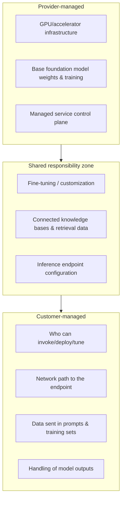
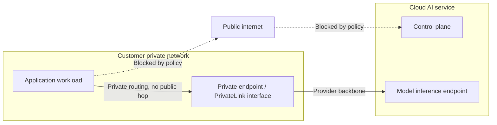
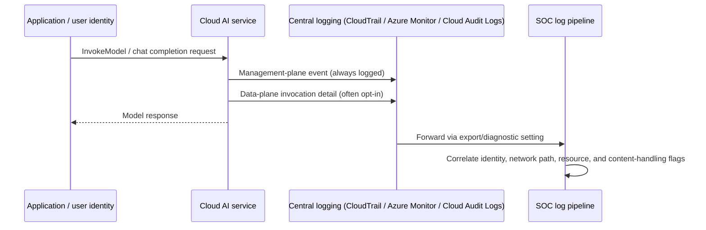
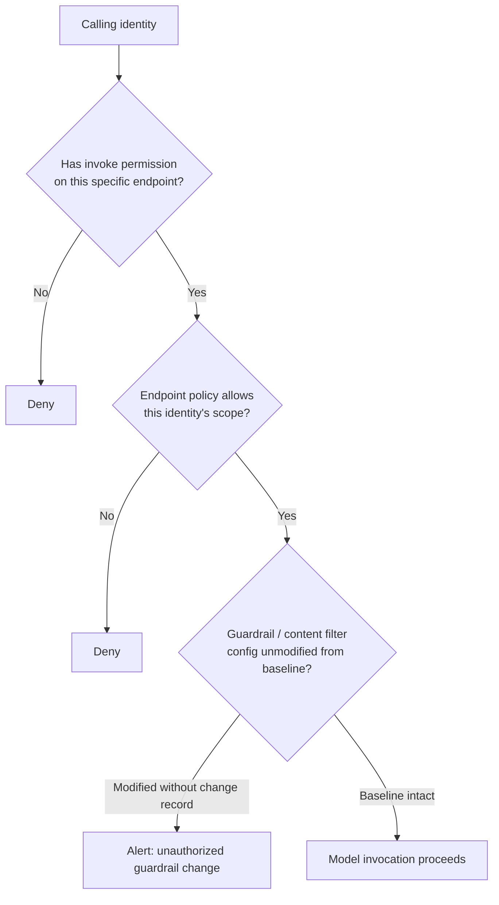

# Chapter 16: Cloud AI Security

> **A note on sources for this chapter.** Everything below is written from general, publicly documented architecture knowledge of how AWS, Azure, and GCP describe their AI/ML services to work -- IAM models, networking primitives, encryption defaults, and logging services. No dedicated cloud lab tenant was stood up for this book, and nothing here is a screenshot or console capture of a real account. Where a specific service name is used (Amazon Bedrock, Azure AI Foundry, Google Vertex AI, and the identity/networking/logging services around them), it is named because the concept is genuinely tied to that platform's documented design, not because it was observed firsthand. Treat the service names as anchors for further hands-on verification in your own environment, not as a substitute for it -- cloud provider consoles and default behaviors change on a release cadence measured in weeks, and this chapter will drift out of date faster than the architectural principles it's built around.

Every major hyperscaler now sells "AI" as a managed service rather than something you build entirely from scratch: Amazon Bedrock, Azure AI Foundry (formerly Azure OpenAI Service plus its surrounding tooling), and Google Vertex AI all let a customer call a foundation model, fine-tune it against private data, and deploy an inference endpoint without operating any GPU infrastructure directly. That convenience comes with a new security surface layered on top of the cloud IAM, networking, and encryption controls teams already run -- and the mistake most organizations make is assuming their existing cloud security posture automatically covers it. It doesn't, because AI services introduce new resource types (model artifacts, fine-tuning jobs, knowledge bases, prompt flows) that need their own permission boundaries, and because the *data* flowing through them -- training sets, retrieved documents, prompts, completions -- is often more sensitive than the infrastructure metadata traditional cloud security monitoring was built to watch.

This chapter walks the same six control domains -- identity, network, encryption, logging, secrets, and model access -- across all three major providers at a conceptual level, so a security architect evaluating any of them (or a multi-cloud AI deployment spanning more than one) can ask the right questions of their own platform team, regardless of which console they're staring at.

## The Shared Responsibility Model, Extended

[STAKEHOLDER] Cloud shared-responsibility diagrams have taught a generation of security leaders that the provider secures "of the cloud" and the customer secures "in the cloud." AI services add a middle layer that doesn't map cleanly onto either side. The provider secures the underlying model-hosting infrastructure and, for first-party foundation models, the training process behind the base model itself. The customer is still responsible for who can invoke that model, what data gets sent to it, how the resulting outputs are handled, and -- critically -- for any fine-tuning data or custom model artifacts they upload, which live squarely in "responsibility: customer" territory even though they sit inside a managed AI service. The most common governance gap is a team that correctly locked down their storage buckets and network but never asked who inside the organization can call the AI service's invoke-model API, because that permission didn't exist in their environment eighteen months ago and nobody added it to the standard IAM review checklist.

## IAM for AI/ML Services

All three platforms extend their existing identity model to AI services rather than inventing a parallel one -- which is good for consistency and bad for the teams who assume that means nothing new needs reviewing. Each platform adds AI-specific permission actions and resource types that need to be explicitly scoped, the same way "read a storage bucket" and "invoke a Lambda function" are separately scoped permissions today.

| Control Area | AWS (Bedrock and related) | Azure (AI Foundry / Azure OpenAI) | GCP (Vertex AI) |
|---|---|---|---|
| Identity primitive | IAM policies attached to roles/users; resource-based policies on some model resources | Azure RBAC roles scoped to the AI resource or resource group; Microsoft Entra ID as the underlying identity provider | IAM roles/bindings at project, folder, or resource level; Google Cloud's predefined Vertex AI roles |
| Granular action scoping | Separate actions for `InvokeModel`, `CreateModelCustomizationJob`, `GetFoundationModel`, etc. | Separate role assignments for data-plane calls (inference) vs. control-plane calls (resource/deployment management) | Separate permissions for prediction calls vs. training-job creation vs. endpoint deployment |
| Workload identity for compute callers | IAM roles for service accounts / instance profiles (no static keys) | Managed Identity attached to the calling compute resource | Workload Identity Federation for GKE and external workloads |
| Cross-account / cross-tenant access | Resource-based policies and cross-account IAM roles | Entra ID guest access / multi-tenant app registrations | Cross-project IAM bindings and service account impersonation |

The recurring design pattern worth internalizing: **the permission to invoke a model for inference and the permission to manage or customize that model are different permissions, and they should almost never be granted to the same principal.** An application's runtime identity needs only the narrow "call this specific endpoint" permission. The permission to create a fine-tuning job, register a new model version, or change an endpoint's configuration belongs to a much smaller set of platform-engineering identities, ideally gated behind the same change-management process as any other production deployment.

[ENGINEER] The IAM mistake I see most often when a team stands up their first Bedrock, Azure AI Foundry, or Vertex AI integration is copying a broad "AI service full access" managed policy from a getting-started tutorial and attaching it directly to the application's runtime role, because it's the fastest way to get the demo working. That policy usually includes model-customization and endpoint-management actions the application will never legitimately call. Six months later the role is still attached, the application is in production, and an attacker who compromises its runtime environment inherits the ability to spin up new fine-tuning jobs against the organization's data, not just call the one endpoint the app was built to use. Write the least-privilege policy before the first production deploy, not as a remediation item after a pentest finds it.

## Network Controls and Private Endpoints

By default, calls to a managed AI service travel over the provider's public API endpoint, authenticated by IAM but reachable from any network that can route to it. For workloads handling sensitive prompts, training data, or regulated outputs, all three platforms offer a private-networking pattern that keeps the traffic off the public internet path entirely.

- **AWS**: VPC interface endpoints (powered by AWS PrivateLink) for Bedrock and related services let a VPC-resident workload call the model API without traversing the public internet, combined with security groups and VPC endpoint policies to further restrict which principals and CIDR ranges can use the endpoint.
- **Azure**: Private Link for Azure AI Foundry / Azure OpenAI resources provisions a private IP inside the customer's virtual network for the resource, paired with disabling public network access on the resource itself so the public endpoint is not merely restricted but absent.
- **GCP**: VPC Service Controls establish a service perimeter around Vertex AI resources, restricting API access to traffic originating from inside the defined perimeter regardless of the caller's IAM permissions -- a defense-in-depth layer on top of, not instead of, IAM.

Two network-layer failure modes recur across all three platforms. First, teams enable the private endpoint but never disable the public endpoint alongside it -- the private endpoint adds a route without removing the exposure unless the public path is explicitly turned off or restricted by policy. Second, teams apply private networking to the inference path but overlook management-plane calls (creating deployments, listing models, managing fine-tuning jobs), which may still default to a public management API unless separately configured. A network review of an AI integration should trace both the data-plane call and the control-plane calls and confirm both are constrained.

[ANALYST] When you're building detections for anomalous AI service usage, the network path is one of the highest-signal fields available. A model invocation originating from an unexpected source IP range, or -- more tellingly -- a successful invocation that bypassed the private endpoint and went through the public API path when the workload is supposed to be network-restricted, is a strong indicator that either a misconfiguration exists or a credential has been used from outside its intended context. Alert on public-endpoint usage for any AI resource that's supposed to be private-only; that gap between "supposed to" and "did" is exactly where these incidents show up first.

## Encryption for Training Data and Model Artifacts

All three platforms encrypt data at rest by default using the provider's own managed keys, and all three support customer-managed keys (CMK) as an upgrade path for organizations that need control over the encryption key's lifecycle, rotation, and revocation independent of the provider.

| Data Category | Default Behavior | Customer-Managed Key Option |
|---|---|---|
| Training / fine-tuning datasets in provider storage | Encrypted at rest with provider-managed keys | AWS: KMS customer-managed keys on the underlying S3 bucket and Bedrock customization job; Azure: customer-managed keys via Key Vault on the storage account and AI Foundry resource; GCP: Cloud KMS keys (CMEK) on Cloud Storage and Vertex AI resources |
| Custom / fine-tuned model artifacts | Encrypted at rest by default | Same CMK mechanisms extend to the stored model artifact, not just the training input |
| In-transit traffic (client to endpoint, endpoint to storage) | TLS by default on documented API paths | Not typically a "customer-managed" toggle -- verify TLS version and cipher policy meet organizational minimums |
| Vector stores / retrieval indexes tied to a RAG pipeline | Varies by which storage/database service backs the index | Apply the same CMK pattern as the underlying storage service (managed vector DB, managed search service, or self-hosted database) |

The reason customer-managed keys matter specifically for AI workloads, beyond general at-rest encryption hygiene: revoking a customer-managed key is an emergency control that renders the encrypted training data and model artifact unreadable, including to the provider's own infrastructure, without needing to individually track down and delete every copy. If a fine-tuning dataset later turns out to have contained data it shouldn't have (a common finding after the fact, discussed further in the AI data security chapter), cryptographically killing access to every derived artifact by revoking one key is a faster containment action than locating and deleting every downstream copy of a model that may already be deployed to multiple endpoints.

[MANAGEMENT] Customer-managed keys are not free -- they add key-management operational overhead and, if mismanaged, can cause an outage by locking the organization out of its own data (a key rotated or disabled incorrectly breaks every service depending on it). The decision of where to apply CMK versus accepting provider-managed defaults should be risk-based, not blanket: apply it to training data and model artifacts involving regulated or high-sensitivity data, and accept provider-managed defaults for lower-sensitivity experimentation workloads where the operational overhead isn't justified by the risk reduction.

## Audit Logging for AI Service Calls

Each platform routes AI service activity into its existing central logging service rather than a separate AI-specific log store, which is the right design but means the AI-relevant events are easy to miss inside a much larger, noisier stream unless specifically filtered for.

- **AWS**: CloudTrail captures management-plane events for AI services (who created, modified, or deleted a model customization job, endpoint, or knowledge base) and, where enabled, model-invocation logging captures the data-plane detail (which principal invoked which model, with what parameters, at what time) -- the latter typically needs to be explicitly enabled and routed to a log destination, it is not on by default in the same way management events are.
- **Azure**: Azure Monitor and Microsoft Entra ID sign-in/audit logs capture control-plane changes to AI Foundry resources, while diagnostic settings on the AI resource itself, once configured, stream request-level telemetry (including which identity called which model) to a Log Analytics workspace or SIEM connector.
- **GCP**: Cloud Audit Logs capture admin activity (resource configuration changes) by default, with data-access audit logs for Vertex AI prediction calls available but, similarly to AWS, often requiring explicit enablement and carrying separate cost and retention implications from the always-on admin activity logs.

The pattern to flag for any AI security assessment: **management-plane logging for AI resources is essentially always on by default across all three providers; data-plane (invocation-level) logging is frequently opt-in and frequently skipped**, either because it wasn't part of the initial setup checklist or because someone reasonably worried about the cost and storage volume of logging every prompt and completion at scale. That second concern is legitimate -- verbose invocation logs containing full prompt and response bodies are themselves a sensitive data store, per the discussion in the data security chapter -- but the answer is applying the same masking and retention discipline to the log stream, not skipping the log stream entirely. Without data-plane logging, a SOC investigating "did this compromised credential do anything with our AI service beyond what we can see in the management events" has no way to answer the question.

[ANALYST] The single most useful correlation for AI-service log review is joining the identity that called the model against the network path it came from and the resource it touched -- the three fields covered in the IAM, network, and this logging section, brought together. An invocation from a service account that normally calls one specific fine-tuned model endpoint, suddenly calling a different, more broadly-scoped foundation model, from a network path that doesn't match its usual deployment, is the AI-service equivalent of a service account suddenly authenticating from an unfamiliar host and touching a file share it's never touched before -- the underlying detection logic is the same pattern-of-life anomaly SOC teams already build, just pointed at a new resource type.

## Secrets Storage Patterns

AI integrations frequently need credentials beyond the cloud platform's own IAM -- an API key for a third-party model provider called from a cloud function, a database credential for a retrieval-augmented generation pipeline's source system, or a webhook signing secret for an agent's outbound notifications. The governing pattern is identical to secrets management for any other cloud workload, and the failure mode is identical too: credentials hardcoded into notebook cells, Lambda/Function environment variables, or container image layers because that was the fastest path to a working demo.

| Provider | Native Secrets Service | AI-Specific Integration Pattern |
|---|---|---|
| AWS | Secrets Manager / Systems Manager Parameter Store | Bedrock agents and Lambda-backed tool integrations retrieve credentials at runtime via IAM role, never embedded in function code |
| Azure | Key Vault | AI Foundry resources and connected Azure Functions/Logic Apps reference Key Vault secrets by URI, resolved via Managed Identity at runtime |
| GCP | Secret Manager | Vertex AI pipelines and Cloud Functions retrieve secrets via IAM-bound service account access, not baked into container images |

The AI-specific wrinkle on top of standard secrets hygiene: **fine-tuning jobs and agent tool-configuration files are a secrets-leakage surface that's easy to overlook**, because they look like data artifacts or configuration, not code. A fine-tuning dataset assembled by exporting real support tickets or chat logs can carry embedded API keys or credentials that a customer accidentally pasted into a support conversation months earlier (the same pattern discussed in the data security chapter, arriving here through a different door), and once that dataset is used to fine-tune a model, the credential is baked into training data that inherits whatever access controls apply to the model artifact -- which are usually far looser than the access controls on the original secrets vault. Scan training data and tool-configuration exports for secret patterns with the same rigor applied to source code repositories, before the data reaches the training pipeline, not after.

## Model Access Controls

The final domain is controlling access to the model resource itself, distinct from the general IAM permission to call the AI service -- this is the layer that determines which specific model version, which fine-tuned variant, and which deployed endpoint a given identity can reach, and it's where most of the "how did that team get access to a model they weren't supposed to use" incidents actually live.

- **Model registry / versioning access**: All three platforms support a model registry concept (custom model versions in Bedrock, model registry in Azure AI Foundry, Vertex AI Model Registry) where access to register, promote, or delete a model version is a separately scoped permission from access to invoke it. Treat model promotion (dev to staging to production) with the same change-control rigor as a code deployment pipeline, because a model artifact is a deployable unit with its own supply-chain risk, covered in more depth in the AI supply chain chapter.
- **Endpoint-level access scoping**: A deployed inference endpoint can and should have its own access policy independent of the broader AI service permission -- an organization running multiple fine-tuned models for different business units should scope each endpoint so that the finance team's model isn't reachable by the marketing team's application identity just because both happen to have generic "call Bedrock / call Vertex AI / call AI Foundry" permission.
- **Guardrail and content-filter configuration access**: Each platform layers content-filtering and safety-guardrail configuration (Bedrock Guardrails, Azure AI Content Safety, Vertex AI safety filters) on top of the raw model call, and the permission to modify or disable those guardrails should be even more tightly scoped than the permission to invoke the model, since disabling a guardrail is a materially higher-impact action than a single inference call.

[STAKEHOLDER] When a business unit asks for "access to the company's AI platform," push for specificity before granting anything: access to invoke which model, for which application, deployed where, with which guardrails active. "Access to the AI platform" as a single grant is the cloud-AI equivalent of asking for "access to the database" -- technically answerable with a single IAM policy, and almost certainly far broader than what the requester actually needs. The specificity costs an extra conversation up front and saves an access-review headache, or worse, an incident review, later.

## Bringing It Together

The security controls covering cloud AI services are not a new discipline bolted onto cloud security -- they are the same six domains (identity, network, encryption, logging, secrets, and now model-specific access scoping) that already govern every other managed cloud resource, extended to cover new resource types that didn't exist in most environments three years ago. The risk isn't that these controls are unavailable; all three major providers document and support every pattern in this chapter. The risk is that AI services get provisioned quickly, often by a team optimizing for a working demo rather than a production-ready deployment, and the review cycle that would normally catch an overly broad IAM policy, a missing private endpoint, or a disabled data-plane log doesn't get triggered because nobody has yet added "AI service" to the checklist that governs everything else running in the account. Treat every new AI resource -- a Bedrock knowledge base, an Azure AI Foundry deployment, a Vertex AI endpoint -- as a first-class citizen of the cloud security review process from the day it's provisioned, not after it's already handling production traffic.
