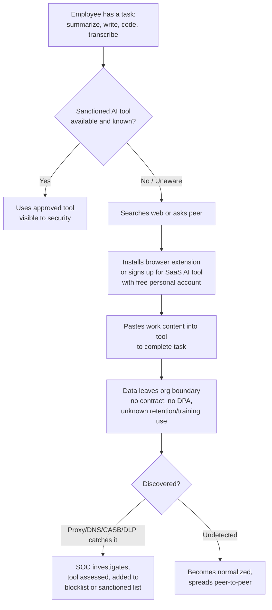
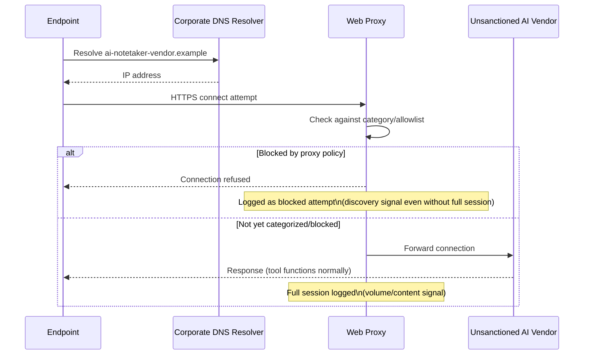
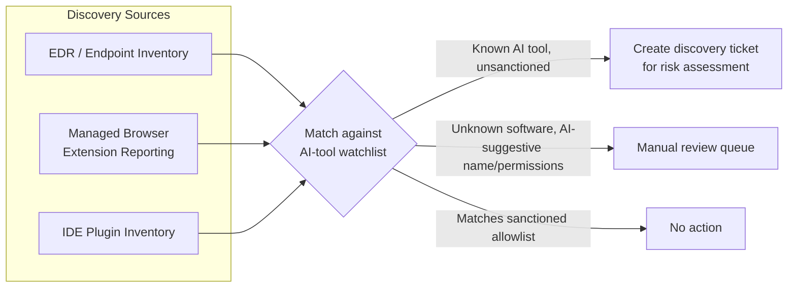

# Chapter 17: Shadow AI

Every organization has an AI inventory. Most of them are wrong. The inventory that lives in a spreadsheet somewhere in IT governance lists the AI tools that went through procurement, security review, and a signed data processing agreement — a handful of chatbots, maybe an approved coding assistant, perhaps a vendor-embedded AI feature that got a checkbox during a renewal cycle. The inventory that actually reflects what employees are doing is an order of magnitude larger, constantly changing, and largely invisible to anyone who isn't specifically looking for it. That gap is shadow AI: AI-powered tools, extensions, and features adopted and used by employees without going through any formal review, approval, or contractual vetting process.

Shadow AI is not a new category of threat so much as the AI-era continuation of shadow IT — the long-standing problem of employees adopting unsanctioned cloud storage, unapproved messaging apps, and personal file-sync tools because the sanctioned alternative was slower, clunkier, or simply didn't exist yet. What makes shadow AI worth its own chapter rather than a subsection of shadow IT is the sheer velocity of adoption and the depth of access these tools request. A rogue file-sync app needs a folder. A browser-based AI writing assistant asks for permission to read and modify every page you visit, including your internal ticketing system, your HR portal, and your source code review tool, and a meaningful fraction of employees click "Allow" without a second thought because the install prompt looks exactly like every other extension they've ever added.

[MANAGEMENT] The instinct when shadow AI comes up in a leadership meeting is to ask for a ban, and the honest answer is that a ban without discovery capability is a policy that exists only on paper. You cannot enforce a rule against tools you can't see being used. The first investment has to be visibility — proxy logs, DNS telemetry, browser inventories, CASB findings — not a memo. Once visibility exists, the policy conversation becomes tractable, because you're negotiating over a known, bounded list of tools instead of an unknowable universe of "whatever someone finds on the internet this week."

This chapter covers the categories of shadow AI tooling that show up most often in real environments, and then works through the discovery techniques — proxy and DNS analysis, CASB findings, endpoint software and browser extension inventory, SaaS-discovery platforms, and DLP signal correlation — that turn an invisible problem into a manageable one.

## Why Shadow AI Grew Faster Than Shadow IT Ever Did

Three forces distinguish the current wave from prior generations of unsanctioned software adoption:

- **Zero-friction distribution.** Most consumer AI tools require no installation beyond a browser extension click or a free web signup. There is no procurement cycle, no IT ticket, no admin credential needed on a managed device in many cases — an employee can be using a new AI tool within thirty seconds of hearing about it from a colleague or a social media post.
- **Genuine, visible productivity gain.** Unlike a lot of shadow IT (a personal Dropbox account used mostly out of habit), shadow AI tools frequently deliver an immediately obvious speedup — a meeting summarized in seconds, a document drafted in minutes, code completed before the developer finishes typing the function name. That visible payoff makes employees actively resistant to giving the tool up once a sanctioned alternative is blocked, and it makes peer-to-peer recommendation spread inside a company extremely fast.
- **Vendor sprawl and feature creep.** AI capability is being bolted onto tools employees already have sanctioned access to — a project management tool adds an AI summarizer, a video conferencing platform adds an AI notetaker, a browser itself ships a built-in AI sidebar. Employees don't perceive themselves as "adopting a new AI tool" in these cases; they perceive themselves as using a feature of software they were already permitted to use, which sidesteps the psychological trigger that might otherwise prompt someone to ask "should I check if this is allowed?"



## Category 1: Unauthorized SaaS AI Chat and Productivity Tools

The largest and most visible category is general-purpose AI chat tools and AI-powered productivity SaaS accessed through a free or personal-tier signup — a summarizer, a writing assistant, an image generator, a research tool. These are the direct analog of the 2023 reporting around Samsung engineers pasting proprietary source code and meeting notes into a public chatbot, an incident that became the reference case for "why can't employees just paste things into whatever AI tool they want" precisely because the underlying behavior — using a personal account to solve a work problem quickly — is completely ordinary and well-intentioned.

[ANALYST] What I see in practice is rarely a single dramatic upload. It's a pattern of small, repeated sessions against a consumer AI domain from a work laptop, at times of day that track normal working hours, from users across departments that have nothing to do with each other functionally — marketing, finance, HR, engineering — which tells you this isn't a coordinated tool rollout, it's organic, ground-up adoption of whatever the person found useful. The volume is the tell. One session to a consumer AI chatbot domain is background noise. Twenty sessions a day across forty different user accounts, sustained over weeks, is shadow IT you need to formally assess.

The risk profile here mirrors the data-security concerns covered elsewhere in this book, but the compounding factor specific to shadow AI is that there is no contractual backstop. A sanctioned AI tool used under an enterprise agreement typically comes with negotiated no-training and defined-retention terms; a free-tier consumer account almost never does, and the terms of service employees agree to (usually without reading) frequently grant the vendor broad rights to use submitted content for model improvement, human review, or both.

## Category 2: Browser-Based AI Extensions

Browser extensions deserve separate treatment from SaaS web tools because the permission model is fundamentally different and far more dangerous by default. A SaaS AI tool only sees what a user explicitly pastes or uploads into it. A browser extension with broad host permissions can see — and in many implementations, actively scan — the content of every page the user visits, including internal web applications that were never designed with an AI extension's presence in mind: ticketing systems, wikis, code review tools, HR platforms, even other AI tools' own chat histories rendered in-browser.

Common permission requests that should be treated as high-risk when seen in an extension inventory:

| Permission Requested | What It Actually Grants | Why It Matters for AI Extensions |
|---|---|---|
| Read and change all data on all websites | Full DOM access to every page loaded, including internal apps | Enables silent scraping of ticket content, source code viewers, internal dashboards |
| Access browsing history | Full URL and timestamp log of every site visited | Can be transmitted to a vendor backend for "personalization," effectively continuous surveillance |
| Clipboard access | Read/write access to whatever the user last copied | Many "AI writing helper" extensions request this to auto-suggest, and it silently captures anything copied from a password manager or internal doc |
| Background network access | Ability to send data to a remote server independent of active tab | Enables continuous exfiltration without any visible user action triggering it |

[ENGINEER] I treat unreviewed AI browser extensions as functionally equivalent to an unmanaged browser-based keylogger, not because most of them are malicious — most aren't — but because the permission surface they request would never be approved if a security team reviewed it deliberately, and once granted, the extension vendor's own security posture, update process, and potential resale or acquisition become part of your attack surface with zero visibility. An extension that's perfectly benign today can push an update tomorrow, under the same install, with materially different behavior — and most enterprise extension management doesn't re-review updates the way it reviews initial installs.

## Category 3: AI Coding Assistants Used Outside Policy

Chapter 9 covered the data-exposure mechanics of AI coding assistants transmitting surrounding code context to a hosted completion backend. The shadow AI angle is narrower but distinct: developers installing a personal-account or free-tier coding assistant extension in their IDE that was never evaluated or approved, often specifically because the sanctioned enterprise tool has a slower completion latency, a smaller context window, or simply isn't installed on a new laptop yet and the developer doesn't want to wait for a ticket.

This category is particularly hard to police through policy memos alone because IDE extension marketplaces are, by design, one click away from any developer's editor, and developers as a population are unusually likely to route around a restriction they perceive as slowing them down. The effective controls are technical, not administrative: endpoint software inventory that flags known coding-assistant extension IDs regardless of which IDE they're installed in, and network-layer blocking of known unauthorized coding-assistant API endpoints that doesn't depend on the developer choosing to comply.

## Category 4: Meeting Recorder and Notetaker AI Tools

AI notetakers deserve specific attention because they represent one of the fastest-growing shadow AI categories and one of the most consequential from a data-exposure standpoint, for a simple reason: a meeting notetaker bot joins as a visible participant, records or transcribes the *entire* conversation, and then routes that transcript to a third-party backend for summarization — often triggered by a single employee's calendar integration, with no visibility or consent step for the other participants in the meeting.

[STAKEHOLDER] The scenario that gets leadership's attention fastest is a board-level or M&A-sensitive meeting where one attendee — with entirely good intentions, trying to make sure they capture accurate notes — has a personal AI notetaker configured to auto-join every calendar event on their account. That bot joins the confidential meeting, transcribes it in full, including any discussion of financial figures, personnel decisions, or legal strategy, and sends that transcript to a vendor server that nobody in the room agreed to or was even aware of. This isn't a hypothetical edge case; it's a foreseeable consequence of "auto-join all meetings" being the *default* setting on several popular notetaker products, meaning the exposure requires zero additional action from the employee who enabled it once.

Detection for this category has a distinctive signature that other shadow AI categories don't: the tool typically manifests as a visible, named participant in a meeting platform's participant list (frequently with "notetaker," "AI," or a vendor's product name in the display name), which makes meeting-platform admin logs and participant audit trails a discovery source that has no equivalent for browser-based or API-based shadow AI. It's also frequently visible in calendar-integration permission grants, since most of these tools require read access to a user's calendar to know which meetings to join.

## Category 5: Document-AI and File-Analysis Tools

The final major category covers tools built specifically around ingesting documents — contracts, spreadsheets, PDFs, scanned forms — and using AI to summarize, extract data from, or answer questions about their contents. These are especially attractive for tasks like "summarize this 40-page vendor contract" or "pull all the dollar figures out of this spreadsheet," and adoption tends to be concentrated in legal, finance, procurement, and HR functions rather than spread evenly across the org, which gives this category a different discovery profile than the broadly-distributed chat-tool pattern.

The risk compounds when the documents in question are, by function, the most sensitive category of file in the business — signed contracts, compensation data, unreleased financial statements, cap tables — being uploaded wholesale to a tool whose retention and training policy was never reviewed, purely because it was the fastest way to answer "what's the termination clause in this agreement" without reading all forty pages personally.

## Discovery: Proxy Logs and DNS Query Patterns

Network-layer telemetry is the highest-leverage discovery source because it requires no endpoint agent cooperation and captures activity regardless of whether the tool is a browser extension, a SaaS website, or a background API call from an IDE plugin.

**Proxy logs** should be reviewed for destination categorization against a maintained list of known AI-vendor domains and API endpoints — not just the handful of well-known consumer chatbot domains, but the long tail of AI-wrapper products, meeting-notetaker vendors, and AI browser-extension backends that rarely make headlines but show up constantly in real traffic. A useful discovery pass groups traffic by destination category and looks specifically for volume and user-count outliers rather than any single session.

```
# Illustrative query logic — conceptual sketch, not validated against a live proxy/SIEM platform.
# Surfaces unsanctioned AI-destination traffic by volume and unique-user spread.

source = proxy_logs
where destination_domain in (known_ai_vendor_domain_list)
  and destination_domain not in (sanctioned_ai_tool_allowlist)
| stats count(), dc(user) as unique_users, sum(bytes_out) as total_egress by destination_domain
| where unique_users >= 5 or count() >= 100
| sort by unique_users desc
```

**DNS query patterns** catch activity that never completes a full proxied HTTP session — a blocked connection attempt, a background extension health-check, or traffic from a device that bypasses the web proxy but still resolves DNS through a monitored resolver. Repeated DNS queries to AI-vendor domains from an endpoint that has no corresponding proxy log entry for that domain is itself a signal: it suggests either a non-browser client (an API call, a background service) or a direct-connection attempt that evaded the proxy, both of which merit follow-up.



The combination matters: DNS query volume without a matching proxy allow shows attempted use of a tool that policy is already catching (useful for measuring demand and informing which tools to formally evaluate), while DNS plus a successful proxied session shows a tool that's actively in use and uninspected.

## Discovery: CASB Findings

A Cloud Access Security Broker sits in a position that proxy and DNS analysis don't fully cover: it can inspect API-level activity and OAuth grant activity for SaaS applications, which is exactly how most AI tools request access to a user's existing productivity suite. When an employee clicks "Sign in with your work Google/Microsoft account" on an AI notetaker or document-AI tool, that grant is visible in CASB and identity-provider logs as an OAuth application authorization — often the earliest and cleanest discovery signal for tools in the notetaker and document-AI categories, since those tools frequently need calendar, email, or file-storage access to function at all.

A CASB review for shadow AI should specifically surface:

- **Newly authorized OAuth applications** requesting scopes related to calendar, email content, file storage, or meeting-platform access, cross-referenced against a registry of known AI vendors.
- **Risk-tier and CASB vendor-provided app-risk scores** for applications employees have granted access to, since most mature CASB platforms maintain their own continuously updated catalog of SaaS application risk ratings that includes AI-specific criteria (data handling practices, training-use disclosure, compliance certifications).
- **Scope creep over time** — an application that requested read-only calendar access at initial authorization and later requested an expanded scope (write access, additional data types) without a corresponding re-approval step.

[ANALYST] CASB OAuth-grant data is often the fastest way to build the initial shadow AI inventory in an organization that has never looked at this systematically, because it doesn't require weeks of log analysis — it's a list you can pull today of every third-party application anyone in the company has ever clicked "Allow" for for. The uncomfortable part of that first pull is almost always the sheer count. It's common to find hundreds of distinct OAuth-authorized applications in a mid-sized org, a meaningful fraction of which are AI tools nobody in security has ever heard of.

## Discovery: Endpoint Software and Browser Extension Inventory

Endpoint detection and asset management tooling should be queried specifically for AI-related software categories, not just generic "unauthorized software" reports, because a generic report buries a handful of high-risk AI extensions in a long tail of harmless personal utilities.

A structured endpoint inventory pass for shadow AI covers:

- **Installed applications matching known AI-tool signatures** — executable names, publisher metadata, and installation paths matched against a maintained watchlist that's updated as new tools emerge (this watchlist needs active maintenance; a static list from six months ago will miss most of what's currently popular).
- **Browser extension inventories pulled centrally** through managed browser policy (both Chromium-based and Firefox-based browsers support centralized extension reporting on managed devices), reviewed for extension permission scope rather than just extension name, since many AI extensions rebrand or get published under generic names that don't obviously signal "AI" from the title alone.
- **IDE plugin inventories** for developer endpoints specifically, since coding-assistant extensions live in an entirely separate plugin ecosystem (editor marketplaces) that generic endpoint software inventories frequently don't cover well.



## Discovery: SaaS-Discovery Tooling and DLP Signal Correlation

Purpose-built SaaS discovery platforms — distinct from a CASB in that they're often focused specifically on aggregating expense data, SSO logs, and network signals into a unified "what SaaS tools does this company actually use" view — add a financial-signal dimension that pure network or endpoint telemetry misses: corporate card and expense report line items for AI tool subscriptions, which surface tools that an individual or team paid for directly rather than adopting through a free tier. This is a particularly useful discovery source for department-level shadow AI adoption (a marketing team expensing a design-AI subscription, a sales team expensing a call-transcription tool) where the spend itself is the earliest signal, often preceding any meaningful network traffic volume.

DLP signal correlation ties the whole discovery picture together by connecting *what* tool is in use (from proxy/DNS/CASB/endpoint sources) to *what data* is actually flowing to it. A DLP alert for sensitive content matched against a destination category of "uncategorized AI tool" or a specific known-shadow-AI domain should be triaged with materially higher urgency than the same content match against a sanctioned destination, because there's no contractual backstop, no negotiated retention limit, and no vendor accountability if that data resurfaces.

| Discovery Source | Best At Catching | Blind Spot |
|---|---|---|
| Proxy logs | Web-based SaaS AI tools, browser extension network calls | Traffic bypassing the proxy (VPN split-tunnel, personal hotspot) |
| DNS query patterns | Early-stage or blocked connection attempts, non-browser clients | No visibility into content transmitted, only that contact occurred |
| CASB / OAuth grants | Notetaker and document-AI tools requesting productivity-suite access | Tools that don't use OAuth (standalone signups, most consumer chatbots) |
| Endpoint / extension inventory | Installed coding assistants, browser extensions, IDE plugins | Web-only tools with no local install footprint |
| SaaS-discovery / expense data | Paid departmental subscriptions, budget-driven adoption | Free-tier usage, personal-account usage on managed devices |
| DLP content correlation | Confirming actual sensitive-data transmission, not just tool presence | Requires the other sources to first identify the destination as AI-related |

[MANAGEMENT] No single source in that table is sufficient on its own, and that's the operational takeaway for anyone building a shadow AI discovery program: the goal isn't to pick the "best" tool, it's to correlate across at least three of these sources routinely, because each one covers a blind spot the others have. A mature shadow AI program treats this as a standing, recurring discovery process — reviewed monthly at minimum given how fast new AI tools reach the market — rather than a one-time audit that produces a static list and is never revisited. The AI tool landscape six months from now will look meaningfully different from today's, and a discovery process built once and left alone will quietly go stale exactly as fast as the tools it was built to find.
