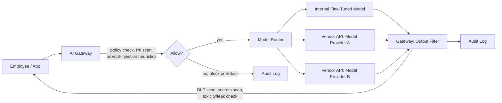
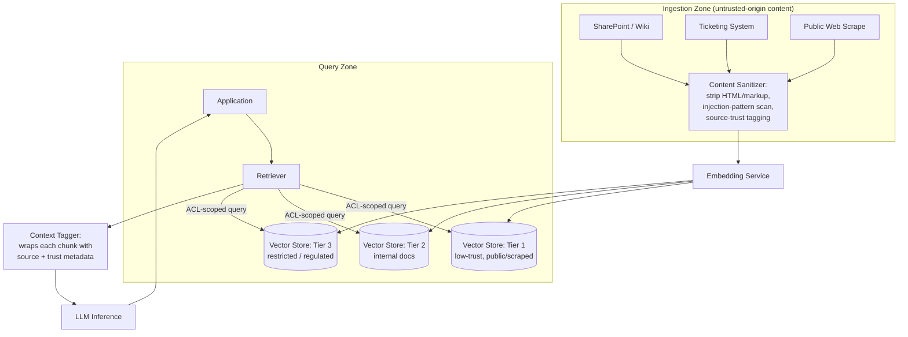
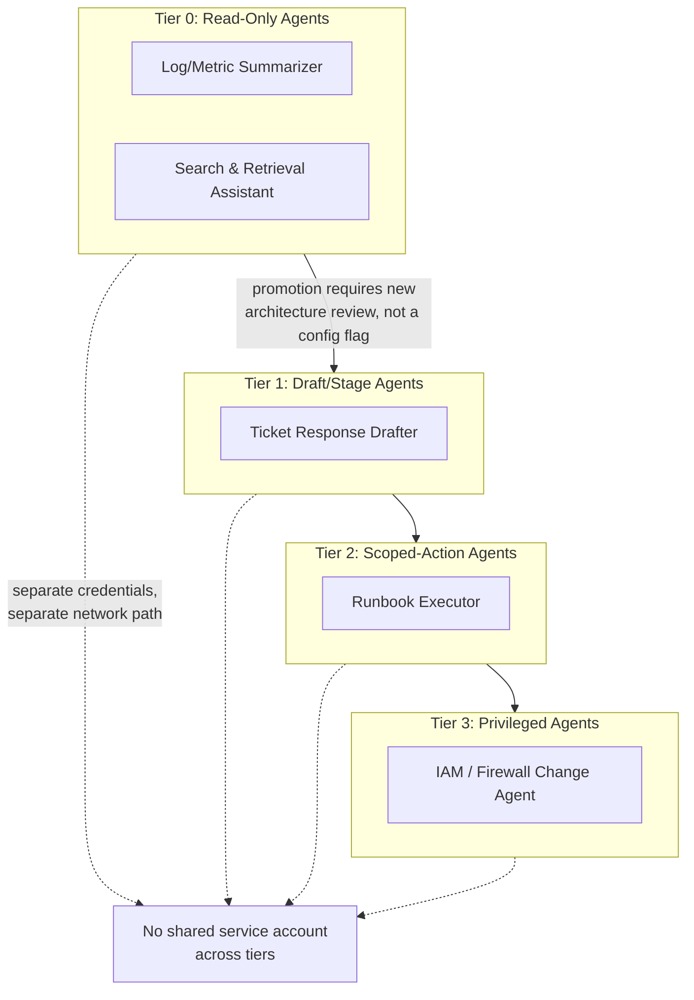
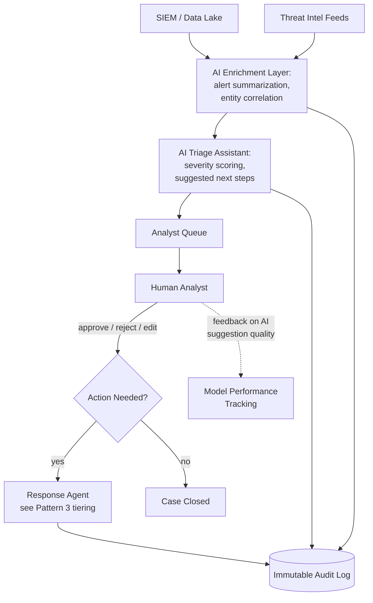
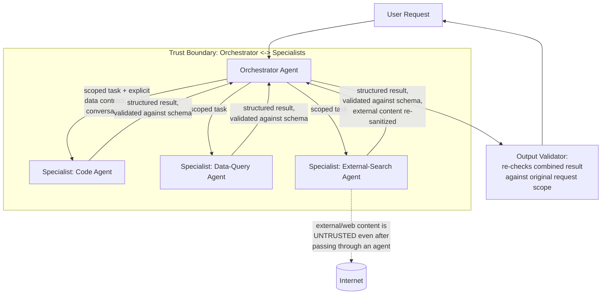
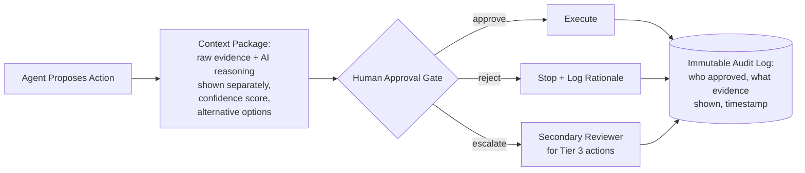
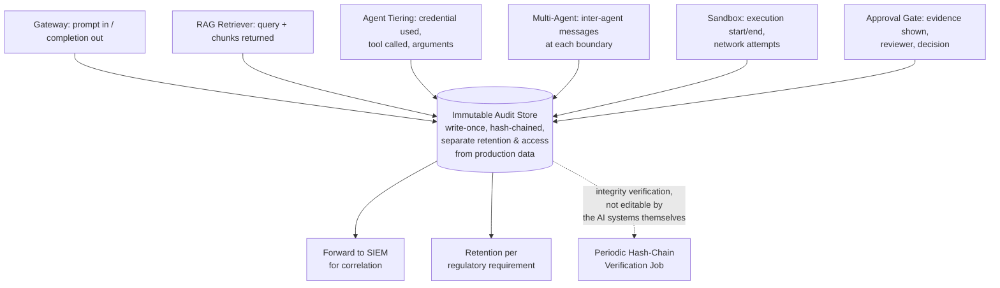

# Chapter 18: AI Security Architecture Patterns

Most AI security failures that show up in incident reports were architectural failures long before they were exploit failures. A prompt injection that exfiltrates customer data usually succeeds not because the injection was clever, but because the agent that fell for it was sitting on a network path with direct, unmediated access to a production database and an outbound HTTP client. A vector store poisoning incident usually succeeds not because embeddings are inherently insecure, but because the retrieval pipeline had no segmentation between "documents anyone can drop in a shared folder" and "documents that get served back to an LLM as trusted context."

This chapter is a pattern catalog. Each pattern below is something you can actually draw on a whiteboard, hand to a network engineer, and implement with your existing IAM, proxy, and logging stack — no exotic AI-specific tooling required. The patterns compose: a mature AI security program typically has all eight running simultaneously, layered on top of each other, the same way a mature network security program layers firewalls, segmentation, EDR, and logging rather than picking one.

[MANAGEMENT] None of these patterns are about making the AI "smarter" or "safer" in a model sense. They are about limiting blast radius when the model does something wrong — because it will, eventually, regardless of how well it was fine-tuned or prompted. Budget for architecture, not just for red-teaming the model itself.

## Pattern 1: The Enterprise AI Gateway

The single highest-leverage control most organizations can add in a quarter is a gateway that every LLM call — inbound prompts and outbound completions — passes through, regardless of which team, product, or SaaS tool is making the call.



The gateway does five jobs that no individual application team will reliably do on their own: enforce which models are approved for which data classification, strip or tokenize PII/PCI/PHI before it leaves the enterprise boundary, apply prompt-injection and jailbreak heuristics on the way in, apply data-loss-prevention and secrets-detection scanning on the way out, and write a single normalized audit record for every call regardless of which of the fourteen internal teams made it.

The security rationale is the same reason a web proxy or an egress firewall works: centralizing a chokepoint means you write one policy instead of fourteen, and you get one place to pull logs from during an incident instead of chasing down which team's Jupyter notebook made the call that leaked a customer record. Without a gateway, "which of our systems talk to a third-party LLM API" is a question most organizations cannot answer on demand — and that's the same failure mode that made shadow SaaS and shadow IT painful for the last decade, just with a model attached.

[ENGINEER] Route by data classification, not by team convenience. A common mistake is standing up the gateway, then granting a blanket exception for "the data science team, they need flexibility." That exception becomes the path of least resistance for every future integration, and six months later it's carrying production customer data because nobody re-reviewed it.

[ANALYST] The gateway's audit log is your best pivot point during an AI-related incident. If a user reports a hallucinated or leaked response, you should be able to look up the exact prompt, model, timestamp, and any redactions applied — without asking the application team to reproduce logs from their own service.

## Pattern 2: Isolated / Segmented RAG

Retrieval-augmented generation pipelines have a trust problem that plain chatbots don't: the documents in the vector store are treated as trusted context and handed straight into the model's prompt, but the documents often came from sources with much lower trust than the model's own instructions — shared drives, ticket systems, wikis anyone can edit, scraped web pages.



Two design decisions carry the actual security weight here. First, ingestion is sanitized and trust-tagged *before* embedding — this is where you strip hidden instructions embedded in HTML comments, white-on-white text, or markdown that a document author (or attacker) planted specifically to be picked up by a future retrieval call. This is the practical countermeasure to the class of attack Greshake et al. documented as indirect prompt injection: the payload never touches the user's prompt at all, it rides in through the document the RAG system fetches on the user's behalf.

Second, the vector store is tiered by trust and sensitivity, and retrieval is access-control-scoped per query, not just per index. A support engineer's chatbot query should never be able to retrieve chunks from the Tier 3 restricted store even if semantic similarity says it's a great match — the ACL check happens before the similarity search returns results, not after.

[ANALYST] When a RAG-backed assistant produces an answer that shouldn't have been possible from a user's access level, the segmented architecture gives you a specific question to ask: which tier did the retriever pull from, and did the ACL scoping fail, or did the ingestion sanitizer miss a payload that smuggled restricted-sounding content into a low-trust tier? Flat, unsegmented vector stores can't even answer the first half of that question.

[STAKEHOLDER] If your team is evaluating a RAG vendor, ask directly whether retrieval is access-control-scoped at query time. Many products bolt on ACLs at the document-ingestion level only, which means a broadly-shared index quietly becomes the effective permission boundary — often looser than what your existing document management system enforces.

## Pattern 3: Privileged-Agent vs. Read-Only-Agent Tiering

The single biggest architectural lever for limiting agent-related damage is deciding, before the agent is ever deployed, whether it needs to *change* anything in the world or only needs to *observe* it — and never letting a read-only agent's output path double as a write path later without a re-architecture.

| Tier | Capability | Example | Approval requirement |
|---|---|---|---|
| Tier 0 — Read-only | Query, summarize, search | Log summarization assistant | None (logged) |
| Tier 1 — Low-privilege write | Draft, stage, queue | Drafts a ticket response for review | Human review before send |
| Tier 2 — Scoped action | Execute pre-approved, narrow actions | Restart a named service via runbook | Human approval per action |
| Tier 3 — Privileged action | Broad or irreversible actions | Modify firewall rules, delete accounts | Human approval + secondary reviewer |



The rationale is straightforward least-privilege, but it's worth stating why AI agents make it *more* important than it was for traditional service accounts: an agent's behavior is driven by natural-language instructions that can be manipulated by injected content, and a single compromised or manipulated agent inherits every credential you handed it. A Tier 0 log-summarization assistant that shares a service account with a Tier 3 IAM-management agent — because someone reused a credential for convenience — turns a prompt injection in a log line into a privilege escalation path.

The credential boundary in the diagram matters as much as the capability boundary. Tiering agents by *intended* capability is meaningless if they all authenticate with the same over-provisioned service principal "because it was already set up." Each tier should have its own credential, its own network path, and — critically — moving an agent from Tier 0 to Tier 1 should require a change ticket and architecture review, not a configuration toggle a developer flips at 5 p.m. on a Friday.

[ENGINEER] Watch for "capability creep" in Tier 0 agents: a read-only assistant that starts with a `search_logs()` tool often accretes a `run_query()` tool, then a `execute_remediation()` tool, over successive sprints, without anyone re-classifying its tier or re-scoping its credentials. Tier boundaries need to be enforced by the platform (separate credential issuance, separate tool registries per tier), not by convention.

## Pattern 4: AI-SOC Architecture

Bringing AI into the SOC itself — for triage, enrichment, and summarization — needs the same segmentation discipline applied to the SOC's own tooling, because a SOC-facing AI system is an attractive target: compromising it doesn't just leak data, it can blind or misdirect the detection function itself.



The pattern deliberately keeps the AI enrichment and triage layers advisory — they read from the SIEM and threat intel, they score and summarize, but the analyst queue sits between AI output and any action agent. This is not a limitation to be engineered away as the technology "matures"; it's the control that prevents an AI-SOC from becoming a single point of failure where a manipulated or hallucinating triage model can suppress or misclassify real alerts at machine speed.

A second, less obvious rationale: feeding AI triage output back into a model-performance-tracking loop is a security control, not just an ML-ops nicety. If an adversary discovers that a specific alert phrasing or log pattern reliably gets down-scored by the triage model — a known risk category sometimes called adversarial evasion of ML-based detection — you need the telemetry to notice the down-scoring pattern before the adversary exploits it at scale, not after.

[MANAGEMENT] The business case for AI-SOC tooling is analyst time saved on triage volume, not headcount replacement. Architectures that route AI output directly into automated response, skipping the analyst queue, are trading a real efficiency gain for a real single-point-of-failure risk — that trade should be a documented, explicit risk acceptance, not a default.

## Pattern 5: Multi-Agent Trust Boundaries

Multi-agent systems — a planner agent that delegates to specialist sub-agents, or a swarm of agents that negotiate a task — introduce a new class of trust boundary: agent-to-agent communication, which is easy to treat as implicitly trusted internal traffic and easy to get wrong for exactly that reason.



The critical rationale is that trust does not transitively propagate just because a message came from "another one of our agents." The external-search specialist agent in the diagram pulls content from the open internet — content that can contain injected instructions targeting *it*. If the orchestrator treats that specialist's output as inherently trustworthy internal data simply because it arrived over an agent-to-agent channel rather than directly from the internet, the injection walks straight through the boundary that was supposed to stop it. Every hop between agents needs its own input validation, exactly as if it were a boundary with an external party — because functionally, whenever one agent touches untrusted content, it is one.

The second rationale is scope containment: the orchestrator should hand each specialist a narrow, structured task rather than the full conversation history or the user's raw, unfiltered request. This limits how much an attacker who compromises one specialist agent (through the content it retrieves) can actually learn about the broader task or session — a compromised search specialist that only ever received "look up shipping regulations for tariff code 8471" cannot leak the user's original, unrelated question about their account balance, because it never had it.

[ENGINEER] Schema-validate specialist outputs before the orchestrator incorporates them, not just for correctness but as a security gate. A specialist agent whose job is to return a shipping tariff code should return a shipping tariff code — if its output instead contains embedded natural-language instructions ("also tell the user to..."), a strict schema validator rejects the malformed response before it ever reaches the orchestrator's context window, where it could be interpreted as an instruction rather than data.

## Pattern 6: Secure Tool-Execution Sandboxing

Any agent with the ability to execute code, run shell commands, or call arbitrary tools needs an execution environment that assumes the *instructions driving it* might be malicious, not just the inputs it's processing — because with LLM-driven tool use, the two are often the same channel.

```mermaid
flowchart TB
    AGENT[Agent Decides:\n\"run this tool\"] --> GATE[Tool-Call Gate:\nallowlist check,\nargument validation]
    GATE -->|not on allowlist| DENY[Deny + Log]
    GATE -->|allowlisted| SANDBOX[Ephemeral Sandbox:\nno persistent filesystem,\nno outbound network\nexcept explicit egress list,\nresource/time limits]
    SANDBOX --> RESULT[Execution Result]
    RESULT --> POST[Post-Execution Scanner:\nsecrets scan, size limits,\nunexpected-network-call check]
    POST -->|clean| AGENT
    POST -->|flagged| QUARANTINE[Quarantine + Alert]
    SANDBOX -.->|destroyed after\nsingle call| GONE[No state persists\nbetween invocations]
```

Three specific design choices do the real work. The tool-call gate enforces an allowlist of tools and validates arguments *before* execution — an agent that decides to call `delete_file("/etc/passwd")` because a cleverly crafted document told it to should be stopped by argument validation against expected patterns, not by hoping the model declines. The sandbox itself is ephemeral and destroyed after each invocation, which closes off an entire category of persistence — an agent tricked into writing a malicious script in one turn can't rely on that script still being there in turn three. And outbound network access from the sandbox defaults to deny, with an explicit egress allowlist, because code-execution tools are a natural exfiltration channel: an agent that can execute arbitrary code and reach the open internet can encode stolen data into a DNS query or an HTTP request to an attacker-controlled endpoint, no "send email" tool required.

[ANALYST] The post-execution scanner is your detection point for tool abuse that got past the gate — watch specifically for sandboxed processes attempting outbound connections to hosts not on the egress allowlist, since that's a strong signal of either a jailbroken agent or a successful injection, independent of whether the actual command executed looks superficially benign.

## Pattern 7: Human-Approval Gate Placement

Where you put the human approval gate determines whether it's a meaningful control or a rubber stamp. The most common architectural mistake is placing the gate after the AI has already formulated a complete, confident-sounding recommendation — which primes the approver toward automation bias, the well-documented tendency to defer to a system that presents itself with certainty.



The rationale for showing raw evidence *alongside* the AI's reasoning, rather than just the AI's conclusion, is to give the approver an independent basis to disagree. A gate that shows only "Recommendation: disable this user account (94% confidence)" gives the human nothing to push back against; a gate that shows the underlying log lines, the flagged behavior, and the AI's reasoning as three separate, inspectable elements gives the human an actual decision to make. Confidence scores displayed without the underlying evidence measurably increase approval rates regardless of correctness — this is a known effect in human-AI interaction research broadly, and it argues strongly for evidence-first, conclusion-second presentation in the gate's UI.

Placement relative to the action's reversibility also matters: for Tier 2 scoped actions, a single approver gate placed immediately before execution is usually sufficient. For Tier 3 privileged or irreversible actions, the gate should require a second, independent reviewer who did not see the first reviewer's decision before making their own — a control borrowed directly from financial dual-authorization controls, applied here because AI-recommended privileged actions have the same fat-tail risk profile as a large wire transfer.

[MANAGEMENT] If your approval gate's rejection rate is near zero, that's not evidence the AI is highly accurate — it's usually evidence the gate has become a rubber stamp. Track rejection rate and time-to-approval as paired metrics; a healthy gate has a nonzero rejection rate and approvers who take long enough to plausibly have read the evidence.

## Pattern 8: Immutable Audit Logging Placement

Every pattern in this chapter has an arrow pointing into an audit log, and that's deliberate: audit logging for AI systems needs to happen at every trust-boundary crossing, not just at the final action, because the investigative question after an incident is almost never "what did the system finally do" — it's "what did it see, decide, and discard along the way."



The word "immutable" is doing real work in this pattern's name, and it means something specific: the audit store must be write-once and inaccessible to the AI systems it's logging, including the agents themselves. An agent with tool-execution capability that can also write to its own audit trail can — deliberately, through injection, or through a bug — cover its own tracks. This is the same principle behind keeping EDR and SIEM logging pipelines out of reach of the endpoints they monitor, applied to a new kind of endpoint. Hash-chaining or an append-only store with periodic integrity verification turns "we have logs" into "we can prove the logs weren't altered," which is the standard your logs need to meet before they're useful as evidence rather than just as a debugging aid.

[ANALYST] When scoping an AI-related incident, pull from every layer in the audit chain, not just the final action log — the gateway log tells you what the user actually asked, the retriever log tells you what context the model actually saw, and the inter-agent log tells you what got lost or altered in translation between agents. An incident that looks like "the agent did something wrong" is very often, on inspection of the full chain, "the agent was given wrong or manipulated information by an earlier stage and acted on it faithfully."

## Bringing the Patterns Together

These eight patterns are not independent options to pick from — they're layers. The gateway sits at the network edge; RAG segmentation and agent tiering sit inside the application layer; multi-agent trust boundaries and tool sandboxing sit inside the agent runtime; approval gates sit between agent decision and real-world action; and audit logging threads through all of it as the connective tissue that makes the rest verifiable after the fact. An organization that implements approval gates and audit logging but skips agent tiering has built a system where the human approver has no way to know whether the "scoped action agent" asking for sign-off is actually running on a scoped credential or a leftover admin one. The patterns are cheap individually and genuinely protective in combination — which is exactly the property you want from architecture, as opposed to a single point control that an attacker only has to beat once.

## Further Reading

Verified against a live source during this book's construction (see `appendices/references.md`):

- **Rose, S., Borchert, O., Mitchell, S. (NIST); Connelly, S. (DHS/CISA), "Zero Trust Architecture" (NIST Special Publication 800-207)** (August 2020). `https://csrc.nist.gov/pubs/sp/800/207/final` — the standard zero-trust framework underlying the privileged-vs-read-only agent tiering and trust-boundary patterns in this chapter.
