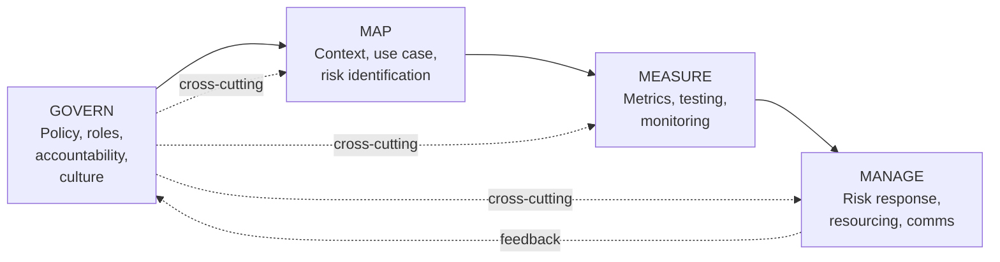
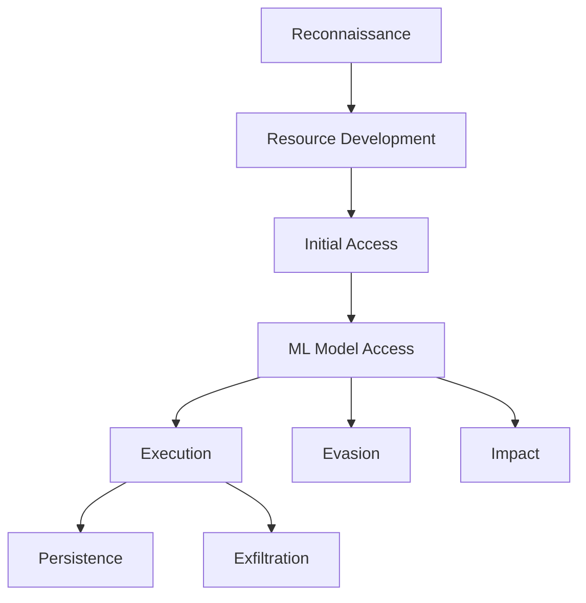
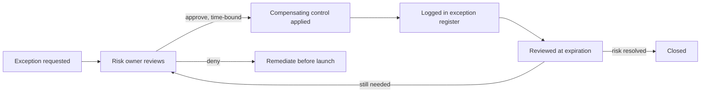

# Chapter 19: AI Security Governance

Every prior chapter in this book has focused on a technical problem: how a model can be attacked, how an agent can be hijacked, how a pipeline can be poisoned. This chapter is about the layer above that — the policies, inventories, and review gates that determine whether your organization finds out those problems exist before an attacker or an auditor does.

AI governance is not a compliance afterthought bolted onto a security program. It is the mechanism that answers three questions leadership will eventually ask, usually right after an incident: *What AI systems do we actually have? What data do they touch? And who approved that?* If your organization cannot answer those questions today, this chapter is your starting point.

[MANAGEMENT] Boards and regulators are converging on a simple expectation: an inventory of AI systems, a risk assessment for each, and evidence that someone with authority signed off on the residual risk. That is the entire governance problem in one sentence — everything else in this chapter is implementation detail.

## Why AI Needs Its Own Governance Layer

Traditional IT governance assumes a relatively static asset: a server, an application, a network segment. You inventory it, patch it, assess its risk, and re-assess on a schedule. AI systems break several of those assumptions:

- **Behavior drifts without a code change.** A model's outputs can shift because of a vendor-side update or a fine-tuning job, with nothing in your change-management queue reflecting it.
- **The "asset" is often not owned by you.** Most organizations consume AI through APIs — a foundation model provider, an embedded copilot in a SaaS product, a vendor add-on nobody in security signed off on. The attack surface exists whether or not you control the weights.
- **Risk is contextual, not just technical.** A chatbot with access to public FAQ content is a different risk than the same chatbot wired into a CRM with customer PII, even though the model is identical.
- **Shadow AI adoption is fast and invisible.** Employees pasting sensitive data into consumer chat tools, developers wiring an API key into a script, a business unit trialing a vendor "AI assistant" — all below the radar of procurement and change control.

Governance exists to make the invisible visible and the ad hoc repeatable. The rest of this chapter covers the four major frameworks practitioners are being asked to align to, then the operational mechanics — inventory, data classification, vendor risk, and exceptions — that make any framework more than a binder on a shelf.

## The NIST AI Risk Management Framework

The NIST AI Risk Management Framework (AI RMF) is a voluntary, framework-agnostic structure published by the U.S. National Institute of Standards and Technology to help organizations manage risks associated with AI systems across their lifecycle. It deliberately does not prescribe specific controls or technical thresholds — instead it organizes the *activities* an organization should be doing into four functions.

**Govern** is the foundation and, unlike the other three, runs continuously rather than per-project. It covers the policies, structures, and accountability lines that make everything else possible: Who owns AI risk decisions? Is there a cross-functional review body (security, legal, privacy, the business)? Is risk tolerance documented anywhere, or does it live only in people's heads? Govern is where "we should probably look into that" becomes "no AI system goes into production without a documented risk assessment."

**Map** happens at the start of a specific AI use case: what is this system for, who are the users, what data does it touch, what could go wrong, and — critically — should this even be built with AI at all. Mapping is where you catch the project that wants to feed unredacted customer support tickets into a third-party model before anyone asked whether that's a data handling problem.

**Measure** is where quantitative and qualitative testing happens: red-teaming for prompt injection susceptibility, bias and fairness testing, adversarial robustness testing, monitoring outputs for drift. This is the function most directly connected to the rest of this book — measurement is what turns "we think it's probably fine" into evidence.

**Manage** is the response function: prioritizing identified risks, deciding to accept/mitigate/transfer/avoid, allocating resources to fix what's fixable, and maintaining incident response readiness specific to AI failure modes — a model producing harmful output at scale is a different incident shape than a server compromise, and your IR playbooks should reflect that.

[ANALYST] The AI RMF will not tell you which SIEM rule to write. It gives you a checklist for whether your organization has a *place* to put that rule — is there a Measure activity that monitors model behavior in production, and does Manage have a defined path for what happens when it fires? If not, that gap is what to escalate, not the missing rule itself.

## OWASP Top 10 for LLM Applications

Where the NIST AI RMF is process-oriented, the OWASP Top 10 for LLM Applications is risk-category-oriented — the AI-era analog to the classic OWASP Top 10 for web applications, built by a community of practitioners to catalog the most common and impactful ways LLM-integrated applications fail. It is the list application security teams reach for when briefing a development team in language they already understand.

This book uses the **2025 edition's** category names throughout, confirmed directly against the live OWASP GenAI Security Project site rather than recalled from an older edition — several names changed materially between the 2023 and 2025 lists, and older material citing "Insecure Plugin Design" or "Overreliance" is describing the prior edition, not a different framework:

| Risk category (2025) | What it covers |
|---|---|
| LLM01: Prompt Injection | Malicious input (direct or indirect, via a document/webpage/tool result the model reads) overriding intended instructions |
| LLM02: Sensitive Information Disclosure | The model revealing training data, system prompts, or other users' context it should not have exposed |
| LLM03: Supply Chain | Risk inherited from pretrained models, third-party datasets, plugins, and fine-tuning services of unknown provenance |
| LLM04: Data and Model Poisoning | Adversarial manipulation of data used to train or fine-tune a model, corrupting its behavior |
| LLM05: Improper Output Handling | Treating model output as trusted content and passing it downstream (into a shell, a database query, a rendered web page) without validation |
| LLM06: Excessive Agency | Granting an LLM-driven agent more autonomy, permissions, or unsupervised action than the task requires |
| LLM07: System Prompt Leakage | A model disclosing its own system prompt — and any secrets or logic embedded in it — to a user who asks the right way; new as a named category in 2025 |
| LLM08: Vector and Embedding Weaknesses | RAG-specific retrieval-layer risk — poisoned embeddings, unauthorized cross-boundary retrieval, cross-tenant leakage in shared vector stores |
| LLM09: Misinformation | The model confidently producing false or unsupported output that a downstream user or system acts on as if verified — the 2025 list's sharper reframing of the 2023 list's "Overreliance" |
| LLM10: Unbounded Consumption | Resource-exhaustion and cost-amplification attacks against inference — the 2025 list's broadened version of the 2023 list's "Model Denial of Service" |

The 2023 edition's separate "Insecure Plugin Design" category was folded into the categories above (mainly Excessive Agency and Supply Chain) in the 2025 revision rather than kept as its own line — update any older AppSec checklist accordingly.

Two of these deserve emphasis because practitioners most consistently underestimate them. **Excessive agency** turns a merely annoying model failure into a security incident — a chatbot that hallucinates is embarrassing, but a chatbot with hallucination *and* an unsupervised API key that can issue refunds is a breach waiting to happen. **Improper output handling** is the direct analog to classic injection flaws: never trust user input in a SQL query, and never trust model output in a shell command, a rendered HTML block, or a downstream API call either.

[ENGINEER] Use the OWASP list as a build-time checklist, not an audit-time one. Each category maps to a design decision made before the system ships: Does this agent's tool list include anything it doesn't strictly need? Is model output escaped before it hits a template renderer? Is there a rate limit on inference calls per session? Catching these in design review is an afternoon; catching them in production is an incident.

## MITRE ATLAS

MITRE ATLAS (Adversarial Threat Landscape for Artificial-Intelligence Systems) is a knowledge base of adversary tactics and techniques against machine learning systems, built and maintained in the same structural style as MITRE ATT&CK — and explicitly designed to interoperate with it. Where ATT&CK catalogs how adversaries compromise conventional IT infrastructure, ATLAS catalogs how adversaries attack the ML lifecycle itself: reconnaissance against a target model, resource development (poisoned datasets, surrogate models), AI-specific initial access vectors, and techniques spanning model evasion, data poisoning, model extraction, and prompt injection, tied together with real-world and red-team-documented case studies.

The practical value of ATLAS for a SOC or threat-intel function mirrors what ATT&CK already provides for conventional intrusions: a shared vocabulary for describing what happened, and a structure for mapping detections to specific adversary techniques rather than vague categories.

A threat model built with ATLAS in mind will ask questions ATT&CK-native thinking tends to miss: Could an adversary poison our training or fine-tuning data before it reaches the model? Could a competitor extract our proprietary model's behavior through high-volume querying? Could an adversary craft inputs specifically designed to evade a model's classification? These are not hypothetical — ATLAS's case study library documents real, disclosed instances of each pattern, and gets updated as new techniques are observed in the field.

[ANALYST] If your detection backlog already tags use cases with ATT&CK technique IDs, extend the same discipline to AI-adjacent detections against ATLAS IDs. It gives a defensible answer to "what are we NOT covering" instead of a vague sense that AI risk is "handled" because one DLP rule exists for chatbot prompts.

## ISO/IEC 42001

ISO/IEC 42001 is the first international standard for an AI management system (AIMS) — structurally, it is to AI governance what ISO/IEC 27001 is to information security. If your organization is already ISO 27001 certified, the shape will be familiar: a management system built around leadership commitment, documented objectives, risk assessment, a defined scope of applicability, internal audit, and continual improvement, auditable by a third party toward formal certification.

The standard is organization-level rather than model-level. It does not tell you how to secure a specific LLM deployment; it tells you what a functioning *management system* for governing AI looks like — policy, roles and responsibilities, resourcing, competence requirements for people working on AI systems, supplier management specific to AI, and a process for assessing AI-related impacts (including but not limited to security — ISO 42001 also expects attention to fairness, transparency, and societal impact, broader than a pure security framework).

For a security practitioner, the useful way to think about ISO 42001 relative to the other three frameworks in this chapter is as the *container*:

| Framework | Primary question it answers |
|---|---|
| NIST AI RMF | What risk-management activities should we be doing, and when? |
| OWASP Top 10 for LLM Apps | What specific technical vulnerabilities should engineering guard against? |
| MITRE ATLAS | How do real adversaries actually attack ML systems, technique by technique? |
| ISO/IEC 42001 | Is there a certifiable management system holding all of the above together? |

An organization pursuing ISO 42001 certification will typically use the NIST AI RMF as the risk-methodology backbone inside the management system, OWASP's list as an input to technical control selection, and ATLAS to inform threat modeling and red-team scope — the four are complementary, not competing.

[MANAGEMENT] If a customer, regulator, or partner asks "how do you govern AI risk," ISO 42001 certification (or a credible internal equivalent) is the answer that satisfies procurement and legal. The other three frameworks are what make that certification substantively true rather than a paper exercise.

## Governance Mechanics: Making It Operational

Frameworks describe what good governance looks like. None of them will build your inventory for you. The following four mechanics are where governance programs succeed or quietly fail.

### AI Asset and Model Inventory

You cannot govern what you cannot enumerate. An AI inventory needs to capture more than "we use ChatGPT" — it needs enough structure to drive risk decisions:

| Field | Why it matters |
|---|---|
| System/use case name and owner | Accountability — who answers when this breaks |
| Model source (in-house, fine-tuned, third-party API, embedded in a SaaS product) | Determines how much visibility and control you have |
| Data classes it processes (see below) | Drives applicable controls and regulatory exposure |
| Deployment context (internal, customer-facing, autonomous agent with tool access) | Drives blast radius if compromised |
| Autonomy level (human-in-the-loop, human-on-the-loop, fully autonomous) | Maps directly to the "excessive agency" risk category |
| Risk assessment status and date | Prevents drift — a stale assessment is nearly as dangerous as a missing one |
| Upstream dependencies (base model version, fine-tuning dataset, plugin/tool list) | Supply-chain traceability |

Build this inventory from three sources, because no single one is complete: procurement records, a technical discovery sweep (API gateway logs, egress to known model-provider domains, cloud billing line items for inference), and a self-attestation survey to business units, which reliably surfaces shadow AI the first two miss.

### Data Classification for AI Use Cases

Existing data classification schemes (public/internal/confidential/restricted) still apply to AI systems, but need one addition: classification has to travel *with the data into the model context*, not just with the storage location. A confidential document is confidential whether it sits in a file share or gets pasted into a prompt — but most classification tooling was built to protect the file share, not the prompt.

Practical AI-specific questions to add to intake: Does this use case send regulated data (PII, PHI, payment data, export-controlled data) to a model outside your security boundary, including a vendor API? Is the model's output potentially derived from — and therefore capable of leaking — training or fine-tuning data that included sensitive material? Does the provider's retention policy match your own data retention obligations? (Many API terms permit output logging or model-improvement use unless explicitly opted out — a contract detail that belongs in vendor risk assessment, not a purely technical one.)

A simple, enforceable rule covers most real-world cases: restricted and confidential data should never reach a third-party model without a signed data processing agreement explicitly covering AI training/logging use, plus a technical control — redaction, tokenization, or an isolated private-endpoint deployment — that reduces exposure even if that agreement is violated.

### Vendor and Supplier Risk Assessment for AI Tools

Standard third-party risk questionnaires ask about encryption, breach history, and SOC 2 reports. For AI vendors, extend the questionnaire with questions those templates don't ask:

- **Training/logging use of your data.** Will inputs or outputs train models serving other customers? Is there a contractual, not just a UI toggle, opt-out?
- **Model provenance.** Does the vendor disclose the base model(s) underlying their product, and flag when that changes? A vendor swapping the underlying model can silently change your risk posture with no code change on your side.
- **Sub-processor chain.** Is the vendor calling out to a foundation model provider, and does that provider's contract flow the same protections down to you?
- **Red-team evidence.** Has the vendor performed or commissioned adversarial testing (prompt injection, jailbreak resistance) and will they share results?
- **Agency and permissions.** If the tool is agentic, what is the maximum action it can take without human confirmation, and is that configurable?
- **Incident history.** Has the vendor had a model-behavior incident (leakage, harmful output, jailbreak-driven action), and what is their SLA for notifying customers of AI-specific incidents?

[STAKEHOLDER] If you're the business owner pushing to adopt a new AI vendor tool quickly, the fastest path through review is arriving with these answers already in hand from the vendor's sales engineer — most of this exists in vendor security documentation already, it's just rarely asked for in default procurement questionnaires. Asking early saves weeks versus discovering the gap during security review.

### Exception Management

Even a mature governance program will have cases where a business need outruns the ideal control — a proof-of-concept moving faster than the standard risk assessment cycle, a vendor tool with a contractual gap the business has decided is worth the risk. The failure mode is not that exceptions exist; it's that they're granted informally, undocumented, and never revisited.

A workable exception process needs four elements: a documented, time-bound approval (an explicit expiration date, never "permanent" by default), a named risk owner who is not the requester, a compensating control wherever feasible, and a visible register in the same reporting cadence as the inventory itself — an untracked exception is forgotten the moment the person who approved it changes teams.

Treat the exception register as a leading indicator, not an administrative burden. A growing count of expired-but-unreviewed exceptions is one of the clearest early signals that an AI governance program is losing its grip — and it is far cheaper to catch that in a quarterly review than in a post-incident retrospective.

## Bringing It Together

None of these frameworks or mechanics work in isolation, and none are optional add-ons to "real" security work — AI systems are now routine parts of the attack surface. The NIST AI RMF gives you the process backbone, OWASP's Top 10 gives engineering a build-time checklist, ATLAS gives detection and threat-intel a shared adversary vocabulary, and ISO 42001 gives the organization a certifiable container to hold it together. Inventory, classification, vendor assessment, and exception management are the unglamorous mechanics that turn any of that from policy language into something an auditor — or an incident responder at 2 a.m. — can actually use.
