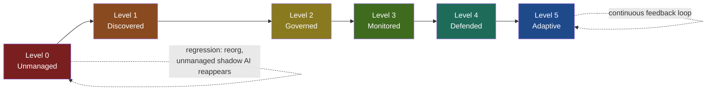
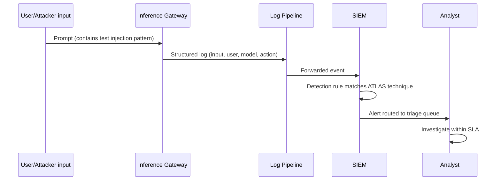

# Chapter 20: AI Security Maturity Model

Generic security maturity models assume a fairly stable object of measurement: a network perimeter, a patch cadence, an identity store. AI security breaks that assumption in three ways that matter for how you build and use a maturity model at all.

First, the attack surface is largely invisible to existing tooling until you go looking for it. A developer pasting source code into a public chatbot, a business unit standing up a retrieval-augmented agent against a customer database, a vendor quietly adding a "smart assist" feature backed by a third-party model — none of this shows up in a vulnerability scanner. Second, the systems themselves are non-deterministic. The same prompt can produce different outputs on different days, which means "we tested it and it was fine" is a much weaker statement than it is for traditional software. Third, the supply chain now includes things security teams have never had to assess before: training data provenance, model weights, fine-tuning pipelines, and third-party inference APIs that change behavior without a change ticket.

A maturity model that ignores these differences will tell you your organization is "mature" because it has a firewall and a SOC, while a marketing intern is feeding customer PII into an unsanctioned browser extension every afternoon. The model in this chapter is built around six levels — **Unmanaged, Discovered, Governed, Monitored, Defended, Adaptive** — each defined by criteria you can actually verify, not adjectives you can only assert.

## How to Read This Model

Each level is scored across the same three pillars — **People, Process, Technology** — and each level includes a **Reality Check**: a specific, falsifiable test you can run today rather than a self-assessment question. This matters because AI security maturity is the single area of the security program most prone to what we'll call *maturity theater*: an organization writes an AI acceptable-use policy, calls itself "governed," and never checks whether anyone follows it.

Two practical notes before the level definitions:

- **Score by use-case domain, not org-wide.** A company can be at Level 4 for its sanctioned customer-support chatbot and Level 0 for the AI coding assistants its engineers installed themselves last week. Produce a maturity score per AI use case or business unit, then roll up to an average and a *minimum* — the minimum is usually the more honest number to report upward.
- **This model complements, not replaces, existing frameworks.** NIST's AI Risk Management Framework, MITRE ATLAS, and the OWASP Top 10 for LLM Applications all describe *what* the risks are. This model describes *how mature your organizational response to those risks is*, and maps cleanly onto them — Level 3 (Monitored) is effectively "detections mapped to MITRE ATLAS tactics," and Level 2 (Governed) is "NIST AI RMF's Govern function actually implemented."

## Level 0: Unmanaged

At this level, AI usage exists in the organization but security, legal, and risk functions have no visibility into it and no stated position on it. This is the default state for most organizations that haven't deliberately addressed AI risk — it is not a neutral starting point, it is an active liability, because AI adoption by employees happens with or without a program.

| Pillar | Criteria |
|---|---|
| People | No named owner for AI risk anywhere in the org. Security team's knowledge of AI tool usage is anecdotal. |
| Process | No inventory, no acceptable-use policy, no approval gate for adopting a new AI tool or feature. |
| Technology | No logging of AI API traffic; DLP rules (if any) don't recognize AI SaaS endpoints as a category. |

**Reality check:** Ask your security team how many distinct AI tools or AI-enabled features are in active use across the organization right now. If the honest answer is "we don't know" or "we don't allow that" — and you haven't cross-checked that second answer against actual egress logs to endpoints like generative-AI APIs — you are at Level 0, regardless of what the written policy says.

[ANALYST] If you're doing your first pass at this, don't start with a survey. Start with proxy or firewall logs filtered for known AI SaaS domains over the last 30 days. The gap between what people tell you they use and what the logs show is usually your first real finding, and it's the fastest way to get executive attention for a program that doesn't exist yet.

## Level 1: Discovered

The organization has stopped guessing and started measuring. Discovery doesn't mean control — it means you can now produce an evidence-based, current list of where AI is actually being used.

| Pillar | Criteria |
|---|---|
| People | A designated point of contact (not necessarily full-time) responsible for maintaining the AI inventory. |
| Process | A documented discovery method combining self-report and technical validation; inventory refresh cadence defined (e.g., quarterly). |
| Technology | Network/CASB/egress-log-based discovery of AI SaaS usage; browser extension inventory; API gateway or proxy logs reviewed for model endpoints. |

**Reality check:** Produce the AI asset inventory right now. It should be less than 90 days old, and at least half its entries should be corroborated by technical telemetry (logs, CASB alerts, endpoint data) rather than self-reported survey answers alone. An inventory built entirely from a survey with a 40% response rate is a wish list, not a discovery result.

## Level 2: Governed

Governance means decisions about AI risk are made by a defined process with defined authority, before deployment — not after an incident forces the conversation.

| Pillar | Criteria |
|---|---|
| People | A named AI risk owner with actual authority to block a deployment; a cross-functional review body (security, legal/privacy, data science, business owner) that meets on a schedule, not ad hoc. |
| Process | Written AI acceptable-use policy distributed and acknowledged; a defined intake/approval workflow for new AI tools and features; data classification rules that explicitly cover "may this data category be sent to an AI model, and which ones"; a vendor risk questionnaire that asks AI-specific questions (training data handling, output retention, fine-tuning on customer data, sub-processor use of the prompts themselves). |
| Technology | Enforcement points exist for the policy — e.g., DLP rules or a proxy that blocks sensitive data categories from reaching unsanctioned AI endpoints; an allowlist of sanctioned tools that is actually referenced during onboarding. |

**Reality check:** Pick the three most recently adopted AI tools or features in the organization. For each one, produce the approval record, the data classification decision, and the vendor risk assessment. If you can't produce all three for all three tools, governance exists on paper but isn't operating — you're closer to Level 1 with a policy document attached.

[MANAGEMENT] The temptation at this stage is to treat the policy document itself as the deliverable. It isn't. The deliverable is a functioning gate that a business unit actually has to pass through, including the ones with enough political capital to try to skip it. If your AI review board has never said no to a project sponsored by a VP, that's worth investigating before you claim this level.

[STAKEHOLDER] As a business-unit leader trying to adopt an AI tool, the sign that governance is real (versus theater) is speed with substance: a review that takes two weeks and asks specific questions about your data flows is governance; a review that takes six months and asks generic questions that don't change based on what you're building is bureaucracy wearing governance's clothes, and it will train your teams to route around the process.

## Level 3: Monitored

Monitoring means AI-related activity generates signal that reaches a human, and that signal is structured enough to support triage and investigation — not just retained for compliance.

| Pillar | Criteria |
|---|---|
| People | SOC analysts have received training on AI-specific alert types (prompt injection indicators, anomalous model API usage, credential/key exfiltration via AI tool integrations); on-call rotation includes someone who can triage an AI-flagged alert. |
| Process | A defined logging standard specifying required fields for AI interactions (prompt/input, response/output or a hash of it, user identity, model and version, token count, tool-calling actions taken); detection use cases explicitly mapped to MITRE ATLAS tactics; documented alert-to-triage SLA. |
| Technology | Centralized logging of LLM API calls, typically via an inference gateway or proxy rather than relying on each application team to log independently; anomaly detection on usage volume, unusual data categories in prompts, or off-hours access patterns; SIEM integration so AI alerts sit in the same triage queue as everything else. |

**Reality check:** Send a benign, clearly-labeled test payload through a monitored AI system — for example, a test string resembling a prompt-injection pattern with no real malicious payload attached. Time how long it takes to generate an alert, land in the SIEM, and get assigned to an analyst. If nothing fires, or a human only notices because they happened to be looking at raw logs, you have logging, not monitoring — the distinction the rest of this playbook cares about most.

## Level 4: Defended

Defense means technical controls change the outcome of an attack without waiting for a human to intervene. This is the level where "we'd notice and shut it off" stops counting as a control.

| Pillar | Criteria |
|---|---|
| People | Dedicated AI security engineering capacity, even if fractional/shared; red team exercises explicitly include AI-specific attack paths (prompt injection, jailbreak attempts, tool-calling abuse, data exfiltration via model output); incident response playbooks for AI incidents have been tabletop-tested, not just written. |
| Process | A security testing gate required before an AI feature reaches production — including adversarial prompt testing and jailbreak testing against the specific system prompt and tool permissions in use; a requirement that output filtering/guardrails are in place before go-live, not added retroactively; a defined cadence for re-testing after model or prompt changes. |
| Technology | Runtime guardrails performing input and output filtering; per-identity rate limiting on model access; automated prompt-injection detection with a block action, not just a log entry; least-privilege scoping on any tool-calling or agentic capability (an agent that can read a ticketing system should not also have write access to the identity provider); access control tied to authenticated identity rather than a shared API key. |

**Reality check:** Run a controlled red-team exercise — a jailbreak attempt or an injection payload against a production-representative environment, using an approved test plan and no real sensitive data. Confirm that a technical control blocks, degrades, or contains the attempt *without a human intervening in real time*, and that the block itself generates a log entry with enough context to drive an investigation. If the honest result of the exercise is "the SOC noticed and manually disabled the integration," your organization is Monitored, and the label "Defended" isn't earned yet.

[ENGINEER] This is the level where teams most often try to buy their way past the earlier ones — deploying a commercial guardrail product without having done the inventory (Level 1) or governance (Level 2) work underneath it. A guardrail product filtering traffic to a model nobody registered in the AI inventory is a control with no denominator: you don't know what fraction of your actual AI usage it covers. Do the boring levels first.

## Level 5: Adaptive

Adaptive maturity means the control set updates itself based on evidence — new attack techniques, near-misses, and drift in model behavior all feed back into defenses on a committed timeline, without requiring a full program relaunch each time.

| Pillar | Criteria |
|---|---|
| People | AI security is a standing agenda item in broader security architecture review, not a side conversation; metrics on AI risk feed executive/board-level risk reporting on the same cadence as other security metrics; the team actively consumes external threat intelligence specific to AI attack techniques and has a process for translating it into control changes. |
| Process | Continuous adversarial testing runs automatically against AI features as part of the CI/CD pipeline for any model, prompt, or tool-permission change — not only at initial launch; a committed SLA for turning an incident or near-miss into a deployed control change (for example, 30 days from root cause to control update); AI risk metrics are trended over time (mean time to detect an AI-specific incident, guardrail bypass rate found in red-team exercises, percentage of AI use cases at each maturity level) rather than measured once. |
| Technology | Automated adversarial/red-team testing integrated into deployment pipelines; drift detection that flags when a model's behavior on a fixed test set changes meaningfully after a vendor-side update; detection content that gets revised based on new published attack techniques within a defined turnaround time; guardrail configurations that can be updated rapidly (hours to days, not release cycles) in response to a new technique. |

**Reality check:** Take your organization's last three AI-related incidents or credible near-misses. For each, ask: did it produce a specific, deployed control change, and can you show the before/after diff of that control along with the date it shipped? If lessons-learned documents exist but the underlying detection rules, guardrail configs, or approval workflows look identical to how they looked before the incident, the feedback loop is aspirational, not operating — you're at Defended with good intentions, not Adaptive.

## Common Failure Patterns

**Maturity theater.** An organization completes a maturity self-assessment, scores itself at Level 3 or 4 based on the existence of documents and diagrams, and never runs the reality-check test for any level. The single highest-value action in this chapter is running the reality checks literally, on a specific system, with a specific date attached to the result.

**Level-skipping via technology purchase.** Buying a guardrail or monitoring product feels like progress, and vendors will happily sell it as your Level 4. Without the inventory (Level 1) and governance (Level 2) foundation, you get a control that covers an unknown and probably shrinking fraction of actual AI usage in the organization, while shadow AI usage continues to grow uncovered.

**Regression after reorganization.** AI security ownership frequently sits with one motivated person rather than a durable role. When that person changes teams, the inventory goes stale, the review board stops meeting, and the organization silently slides back toward Level 0 for new use cases even though old, previously-governed systems still look fine on paper. Build the ownership into a role description and a recurring calendar commitment, not a person's initiative.

**Treating this as a generic security maturity exercise.** Vulnerability management maturity models reward patch velocity and coverage percentages. Applying that lens directly to AI security misses the parts that are actually different — non-deterministic behavior, shadow adoption, and a supply chain that includes training data and model weights. Use the pillars in this chapter, not a repurposed vulnerability-management scorecard.

## Using the Model in Practice

Run this as a structured exercise per AI use case, not as a single org-wide number: list every distinct AI use case or deployment (sanctioned chatbot, internal coding assistant, an agent with database access, an embedded AI feature from a SaaS vendor), score each one against the six levels using the reality checks — not self-report — and report both the average and the minimum across the portfolio. Revisit the scoring at least twice a year, and immediately after any AI-related incident, near-miss, or major change to a governed system's model, prompt, or tool permissions. The goal is not to reach Level 5 everywhere; a low-risk internal tool with no sensitive data access may reasonably stay at Level 2 indefinitely. The goal is to know, with evidence, exactly where every AI use case actually sits — and to make sure the ones handling sensitive data or consequential actions are the ones climbing fastest.
