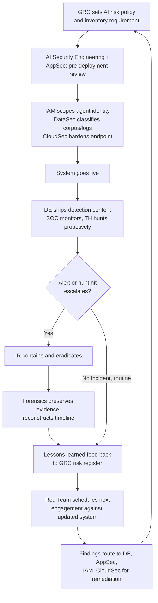

# Chapter 21: AI Security Operating Model

Every chapter before this one answered a version of the question "what do you do about X" — what do you do about a poisoned RAG corpus, an over-scoped agent identity, a red-team finding, a hallucinated conclusion in a case note. This chapter answers a different, and in practice harder, question: **who** does it. Most organizations that stumble on AI security don't stumble on the technical content — the detection logic, the containment steps, and the review checklists in this book are not exotic. They stumble because the work falls in the gap between teams that were drawn up before any of them owned an LLM, an agent framework, or a vector database, and nobody updated the org chart to match.

[MANAGEMENT] The single most common failure I see when a new AI system gets flagged as a security problem isn't incompetence — it's a scramble. Detection engineering assumes AppSec reviewed it before launch. AppSec assumes it was in scope for the standard architecture review, which was written for web applications and never mentions a model endpoint. IAM finds out the agent has a service account with domain-admin-equivalent scope only after an incident, because nobody's onboarding checklist named "AI agent identity" as a category requiring their sign-off. Every one of those teams did their job as it was defined. The job just didn't cover this.

This chapter exists to close that gap with something more durable than good intentions: named responsibilities, mapped against the concrete activities the rest of this book describes, in a format — a RACI matrix — that survives being pinned to a wall and argued over in a planning meeting. It assumes twelve functions exist in some form in your organization, some as dedicated teams and some as hats worn by people who also do other things, and it does not assume you need to hire twelve new headcounts to make this work. What it does assume is that every one of the activities in the matrix below needs an owner, and that "owner" needs to be a specific team's name, not "security" as an undifferentiated noun.

## The Twelve Functions and Their AI-Security Mandate

Before the matrix, each function needs a one-line mandate specific to AI security — not a restatement of the team's general charter, but the slice of that charter this book is adding to it.

| Function | AI-security mandate |
|---|---|
| SOC | Triage AI-related alerts, monitor AI-system telemetry in the same queue as everything else, and escalate cleanly when an alert crosses from "AI oddity" to "incident." |
| Detection Engineering | Build and tune detection content for AI-specific threats (Chapter 12) — prompt injection markers, tool-call anomalies, agent-identity misuse — and keep it current as models and pipelines change. |
| Incident Response | Own containment, eradication, and recovery for incidents involving AI systems, adapting standard IR playbooks to targets that don't have a filesystem to isolate or a process tree to kill. |
| Threat Hunting | Proactively hunt for AI-specific TTPs and for unsanctioned AI usage (shadow AI) that alerting hasn't caught yet. |
| AI Security Engineering | The connective-tissue function this book assumes exists in some form: owns the AI system inventory, runs AI-specific architecture and threat-model reviews, and is the standing technical point of contact every other function calls when a question is "specifically about the AI part." |
| Data Security | Classify and control the data that trains, retrieves into, or is logged by AI systems — training sets, RAG corpora, prompt and output logs, embeddings. |
| IAM | Scope and audit the identities AI systems act under — service accounts, delegated tokens, agent-to-agent credentials — with the same rigor applied to human identities. |
| AppSec | Review the code and integrations that wire models into applications — tool definitions, MCP servers, agent orchestration logic — for the same defect classes as any other software, plus the AI-specific ones from Chapters 4 and 5. |
| Cloud Security | Secure the infrastructure AI systems run on: model-serving endpoints, vector database exposure, IAM roles attached to AI workloads, network egress from agent runtimes. |
| Governance/Risk (GRC) | Maintain the AI risk register, own policy, track remediation of open findings across engagements, and translate technical risk into a form leadership and auditors can act on. |
| Legal/Privacy | Assess regulatory exposure (data protection law, sectoral AI regulation, IP and licensing terms on models and training data), and review vendor contracts for AI-specific data-handling terms. |
| AI Red Team | Run authorized adversarial testing against AI systems (Chapter 15) and report findings back into the functions that own remediation. |

Two of these are worth flagging as genuinely new rather than existing teams doing new work under an old name. AI Security Engineering rarely predates an organization's first serious AI deployment; it tends to get assembled from whoever already understood the technology well enough to be dangerous — a detection engineer with a side interest in LLM internals, a cloud engineer who stood up the first vector database, a security architect pulled off another project. AI Red Team is sometimes a genuinely new team and sometimes an extension of an existing offensive-security function's mandate; either way, it needs the AI-specific scoping discipline covered in Chapter 15, which a general penetration-testing team without that grounding will not automatically have.

[ENGINEER] In a smaller organization, don't read "twelve functions" as "twelve teams." I've seen this operating model work with a security staff of six, where one person carries the AI Security Engineering mandate as maybe thirty percent of their role, the same person doubles as the AppSec reviewer for anything AI-touching, and the CISO personally holds the GRC and Legal liaison role because there's no dedicated headcount for either. What matters is that every row in the matrix below has *a name next to it*, even if the same name appears in six rows. What breaks the model isn't small teams — it's rows where the honest answer to "whose job is this" is a shrug.

## The RACI Matrix

The table below maps fifteen AI-security activity areas — drawn from the detection, incident response, red-teaming, governance, architecture-review, and forensics work covered earlier in this book — against the twelve functions. **R** = Responsible (does the work), **A** = Accountable (owns the outcome and answers for it if it fails; exactly one per row in a mature program, though smaller programs often collapse R and A into the same team, shown as **A/R**), **C** = Consulted (input sought before or during the work), **I** = Informed (told the outcome, not consulted beforehand), **–** = not routinely involved.

| Activity | SOC | DE | IR | TH | AISec | DataSec | IAM | AppSec | CloudSec | GRC | Legal | RedTeam |
|---|---|---|---|---|---|---|---|---|---|---|---|---|
| Shadow AI / asset inventory (Ch. 17) | C | – | – | R | A/R | C | C | – | R | C | – | I |
| Architecture & threat-model review, pre-deployment (Ch. 2) | – | C | – | – | A/R | C | C | R | C | C | C | I |
| Third-party & supply-chain AI risk review (Ch. 8) | – | – | – | – | R | C | I | C | C | A | R | I |
| Data governance: training data, RAG corpora, prompt/output logs (Ch. 6, 9) | I | I | C | I | C | A/R | C | I | C | C | C | I |
| Identity & credential scoping for agents/service identities (Ch. 10) | I | I | C | I | C | I | A/R | C | C | I | I | C |
| AppSec review of AI-integrated code & tool/MCP integrations (Ch. 4, 5) | – | I | I | I | C | I | C | A/R | C | I | I | C |
| Cloud AI posture management: endpoints, vector DBs, workload roles (Ch. 16) | I | C | C | C | C | C | C | I | A/R | I | I | I |
| Detection engineering for AI-specific threats (Ch. 12) | C | A/R | C | C | R | I | I | I | I | I | I | C |
| SOC triage & monitoring of AI-related alerts (Ch. 11) | A/R | C | C | I | C | I | I | I | I | I | I | I |
| Incident response & containment (Ch. 4–7) | R | C | A/R | C | R | C | C | C | C | I | C | I |
| Digital forensics & evidence handling (Ch. 13) | I | I | A/R | I | C | C | C | I | C | I | C | I |
| Threat hunting for AI-specific TTPs (Ch. 14) | C | C | I | A/R | R | I | I | I | C | I | I | C |
| Authorized AI red-team engagements (Ch. 15) | I | C | I | C | C | I | I | C | C | C | C | A/R |
| AI governance, policy & risk-register maintenance | I | I | I | I | C | C | C | C | C | A/R | C | I |
| Regulatory, privacy & AI-vendor contract review | – | – | I | – | C | C | I | I | I | C | A/R | I |

Two design choices in this table are deliberate and worth naming. First, AI Security Engineering carries a **C** in nearly every row — it is consulted almost everywhere, because it is the function most likely to recognize when a routine-looking activity has an AI-specific wrinkle the assigned team might miss — but it is only Accountable for three rows: inventory, architecture review, and (jointly with the specifics below) providing surge capacity into detection and threat hunting. That is intentional. A function that becomes accountable for everything AI-touching turns into a bottleneck and, worse, lets every other team quietly stop building AI-security competence of their own, because "AI Security will catch it" becomes the load-bearing assumption instead of the safety net. Second, notice that no single function is Accountable for more than three or four rows. If your organization's matrix concentrates accountability in one team across the board, that is a staffing risk masquerading as an efficient org chart — that team becomes a single point of failure for every AI-security outcome, and its absence (a departure, a bad quarter, a reorg) creates simultaneous gaps across unrelated activities.

## Where the Real Handoffs Happen

A RACI matrix tells you who owns a box. It does not, by itself, tell you what happens at the seam between two boxes — and AI-security incidents disproportionately happen at seams, because the technology is new enough that no team has fully internalized where its boundary ends and the next team's begins.

### Architecture Review Into Detection Engineering

The handoff most often skipped entirely: a pre-deployment review (owned by AI Security Engineering and AppSec) identifies a system's specific risk profile — say, an agent with a tool that can send external email — but that finding dies in a review document unless it's explicitly handed to Detection Engineering as a requirement, not a suggestion. The practical mechanism that works: no AI system architecture review closes without a named list of detection gaps it created, routed to Detection Engineering as backlog items with an owner and a target date, the same way a network architecture review generates firewall-rule and monitoring requirements today. A review that produces only a risk narrative and no detection backlog has produced a report, not a control.

### SOC Through Incident Response to Forensics

This handoff is the one most SOC teams already understand from non-AI incidents, and it transfers cleanly with one addition: AI-specific incidents frequently need AI Security Engineering pulled into the IR bridge alongside the standard incident commander, because standard IR runbooks assume a host, an account, or a network segment as the unit of containment, and an AI incident's unit of containment might be a model endpoint's API key, a vector database's write access, or a specific tool binding inside an agent's configuration — none of which show up in a generic "isolate the affected system" checklist. Forensics, in turn, needs Data Security consulted early rather than late whenever the evidence includes training data, RAG corpus content, or prompt/output logs, because those artifacts often carry retention and access constraints that a standard forensic acquisition process wasn't built to respect (see Chapter 13's treatment of log volume and chain-of-custody for conversational evidence).

### Threat Hunting and Red Team Feeding Detection Engineering

Both Threat Hunting and AI Red Team exist, in this operating model, to generate detection requirements, not just findings for a report. A hunt that confirms an AI-specific TTP is present — or confirms it isn't, but plausibly could be — should produce a ticket in Detection Engineering's backlog exactly like a red-team finding does. Organizations that treat threat hunting as a purely investigative exercise and red teaming as a purely compliance exercise both end up with the same failure: interesting findings that never become durable coverage, rediscovered under a new name at the next engagement. Chapter 15's reporting guidance on tracking retest status against the same finding across engagements is the discipline that prevents this specific failure.

### Red Team, GRC, and Legal at the Authorization Boundary

The three-way handoff between AI Red Team, GRC, and Legal exists specifically to protect the rules-of-engagement discipline covered in Chapter 15. GRC is Accountable for the risk-acceptance decision that an engagement is worth running against a given system; Legal is Accountable for the contractual and regulatory boundary (what a vendor's terms of service permit if the target includes a third-party model API, what data-handling law requires if synthetic test data might inadvertently resemble real customer records). Neither substitutes for the other, and a red-team engagement that skips either sign-off — because "it's just an internal test" — is the single most common way an authorized engagement drifts into unauthorized territory without anyone deciding that on purpose.

### Data Security, IAM, AppSec, and Cloud Security as the Control-Plane Owners

These four functions rarely generate headlines the way an incident or a red-team finding does, but they own the controls that determine whether an incident is contained to a narrow blast radius or spreads through an entire AI pipeline. Data Security's classification work determines what a prompt-injection payload can actually reach. IAM's credential scoping determines what a hijacked agent can actually do. AppSec's code review determines whether a tool integration has a permission check or just a comment saying one should probably exist. Cloud Security's posture management determines whether a misconfigured vector database is internet-reachable or isn't. None of these functions is glamorous in this model, and none of them is optional — the incidents in Chapters 4 through 7 that read as "the model did something bad" almost always trace back, on inspection, to one of these four controls being weaker than assumed.

[STAKEHOLDER] When you're reviewing this model for your own organization, resist the temptation to focus budget attention on the row that generates the most visible activity — usually SOC triage or red-team engagements — at the expense of the rows that generate the least visible activity but the most consequential exposure if they're skipped, which are almost always data classification and identity scoping. A well-run red-team program that keeps finding the same over-scoped service account every engagement isn't a red-team success story; it's evidence that the IAM row in this matrix has an owner on paper who isn't resourced to actually do the work.

## Where the Model Breaks Down in Practice

Three failure patterns account for most of the gaps organizations discover only after an incident. The first is **the orphaned finding**: a red-team or threat-hunting result gets delivered, acknowledged in a meeting, and then has no ticket, no owner, and no retest date, so it simply ages out of relevance by the next engagement. The fix is procedural, not motivational — no finding closes a report without a named remediation owner from the matrix above and a tracked ticket, full stop.

The second is **the late-arriving reviewer**: Legal or IAM gets looped into a project only after it's already in production, because the pre-deployment review row in the matrix either doesn't exist or exists on paper but isn't actually enforced as a gate before launch. This is nearly always a process-authority problem rather than a willingness problem — the teams that should be consulted early are usually happy to be consulted; they're simply never invited until something goes wrong.

The third is **accountability without capacity**: a function is marked Accountable for a row in the matrix, agrees to the assignment, and then never receives the headcount, tooling budget, or executive backing to actually do the work at the pace the organization is deploying AI systems. A matrix is a statement of intent, not a resourcing plan, and treating it as the latter is how a well-designed operating model produces the same gaps it was built to close.

## Operating Cadence

The matrix is a static artifact; the organization it describes is not. A quarterly cross-functional review — GRC convening, with AI Security Engineering, Detection Engineering, IR, and Red Team represented at minimum — should walk the open items from every row: unresolved findings, new AI systems that entered the inventory since the last review, and any row where the named owner changed (a departure, a reorg, a new team stood up) without the matrix being updated to match. This is the same discipline mature security programs already apply to their broader risk register; the only thing AI-specific about it is the pace, since the inventory this model tracks changes faster, in most organizations, than almost anything else on the risk register does.
