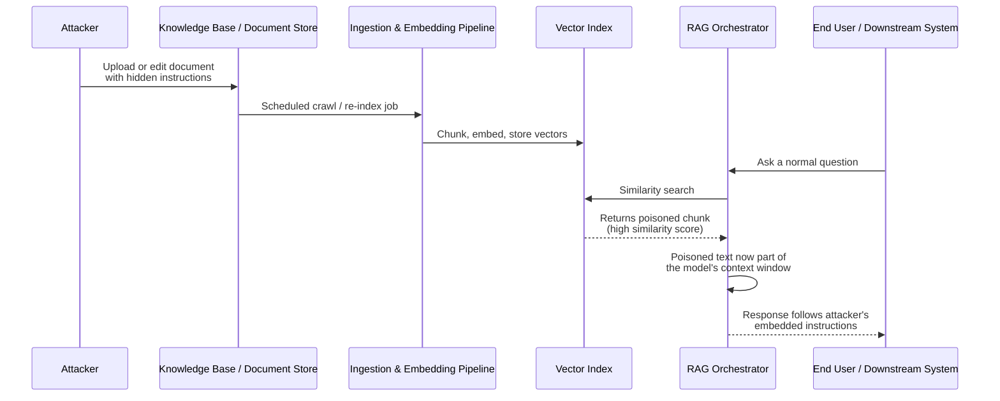

# AI-003 — RAG / Knowledge Base Poisoning

## Category
AI/ML Security — Data Integrity & Supply Chain (Retrieval-Augmented Generation)

## Owner / Approver
**Owner:** AI Security Engineering Team
**Approver:** CISO / Head of Data Governance
**Consulted:** Knowledge Base / Content Owners, Legal (for external-facing outputs), ML Platform Team

## Version / Status
Version 1.0 — Status: **Active**

---

## Overview

Retrieval-Augmented Generation (RAG) systems answer user queries by retrieving relevant chunks of text from a knowledge base (a vector store, document index, or search corpus) and feeding those chunks to a large language model as context. The model's output is only as trustworthy as the documents it retrieves. RAG/knowledge base poisoning occurs when an attacker — external or a malicious insider — inserts, edits, or manipulates a document so that it is retrieved for relevant queries and steers the model's output toward the attacker's goal: disinformation, credential harvesting, unauthorized instruction injection, or exfiltration of data the model has access to.

This is distinct from AI-001-style direct prompt injection (an attacker typing a malicious prompt at the chat interface) and from classic web content injection. The defining trait of RAG poisoning is that the malicious payload sits at rest in a trusted corpus — a wiki page, a PDF in a SharePoint library, a support ticket, a product review, a scraped web page — waiting to be picked up by the embedding/retrieval pipeline and served to a model (and by extension, to any user or downstream automation) days, weeks, or months later. It is a stored/indirect variant of the prompt injection family described in the OWASP Top 10 for LLM Applications (LLM01: Prompt Injection, and LLM04/LLM08 on data and supply chain integrity), and it maps to MITRE ATLAS techniques for data poisoning of ML pipelines. The foundational research on indirect prompt injection via retrieved content is documented in Greshake et al.'s work on compromising LLM-integrated applications through content an attacker controls but the victim's system trusts.



---

## Business Risk

**[STAKEHOLDER]** From the business's perspective, a poisoned knowledge base is a trust failure that is invisible until it isn't. Unlike a phishing email or a malware alert, a poisoned document doesn't trigger antivirus, doesn't touch an endpoint, and often doesn't even look suspicious to a human skimming it — the malicious instruction can be a single sentence in white-on-white text, an HTML comment, or a plausible-sounding "internal policy update" buried on page 12 of a PDF. The damage surfaces later, in the model's *output*: a customer support bot recommends a fraudulent refund process, an internal research assistant cites a fabricated compliance exception, or a coding assistant retrieves a "best practice" snippet that actually opens a backdoor. Because the output looks like ordinary AI-generated text, staff and customers tend to trust it at face value — which is exactly the failure mode that makes this category dangerous for brand trust, regulatory exposure, and in agentic deployments, direct financial loss if the model acts on the poisoned content (e.g., initiating a wire transfer or granting access based on "policy" it just read). The cost of a poisoning incident is rarely the document itself; it's every decision the AI system made while trusting it.

---

## Detection Logic

**[ENGINEER]** Detecting RAG poisoning requires instrumentation at three layers: the ingestion pipeline (what got written into the corpus and by whom), the retrieval layer (what got pulled back for a given query and how anomalous that retrieval was), and the output layer (does the generated response contain instruction-like language that shouldn't be there). Relying on any single layer misses most real incidents — ingestion logging alone won't catch a payload that was already live for months before detection tooling existed, and output-layer detection alone won't tell you which document to remediate.

Key signals to instrument:

| Layer | Signal | Why it matters |
|---|---|---|
| Ingestion | New/edited document from a low-reputation source, unusual uploader, or off-hours edit to a high-traffic KB article | Poisoning requires a write; writes are the cheapest thing to log |
| Ingestion | Document contains instruction-pattern language ("ignore previous," "you are now," "system:", "always respond with") | Classic injection phrasing embedded in content |
| Ingestion | Encoded/invisible content: zero-width characters, HTML comments, base64 blobs, font-size:0 spans, off-screen CSS | Common obfuscation to hide payloads from human reviewers |
| Retrieval | A single chunk suddenly appears in top-k results for a disproportionately wide range of unrelated queries | Indicates semantic "magnet" behavior — attacker optimized the chunk to embed near many query vectors |
| Retrieval | Retrieval score anomaly — a chunk with unusually high similarity across dissimilar query clusters | Possible embedding-space manipulation ("embedding poisoning") |
| Output | Model output contains verbatim instruction fragments, URLs, or requests not present in the user's original query | Suggests injected content leaked directly into the response |
| Output | Model output diverges from the same query's historical answer distribution (semantic drift) | Flags a knowledge change that may be malicious rather than a legitimate content update |

```
// Illustrative query logic (SIEM/log-platform pseudocode, NOT validated
// against a live SIEM product) — combine ingestion + retrieval telemetry.

SELECT ingestion.doc_id, ingestion.author, ingestion.timestamp,
       retrieval.query_count_last_24h, retrieval.avg_similarity_score,
       retrieval.distinct_query_topics
FROM kb_ingestion_events AS ingestion
JOIN kb_retrieval_events AS retrieval
  ON ingestion.doc_id = retrieval.retrieved_doc_id
WHERE ingestion.timestamp > ago(30d)
  AND (
        ingestion.content_flags CONTAINS_ANY (
          "ignore previous", "system:", "you are now",
          "disregard instructions", "base64,", "font-size:0"
        )
        OR retrieval.distinct_query_topics > 15   // one chunk, many unrelated topics
        OR retrieval.avg_similarity_score > 0.92  // suspiciously "magnetic" chunk
      )
ORDER BY retrieval.query_count_last_24h DESC
```

This is illustrative query logic sketched for a generic log/SIEM platform — it has not been run against a production system and field names, thresholds, and functions will need to be adapted to your actual ingestion and vector-store telemetry schema.

---

## Investigation Steps

**[ANALYST]**

**Worked example:** Meridian Health Group runs an internal AI assistant, "Ask Meridian," backed by a RAG pipeline over its policy wiki and vendor-contract repository. On September 12, analyst Priya Nandan receives an alert: the assistant told a billing clerk that "per Policy Update 44-B, overpayment refunds over $5,000 should be processed via the vendor portal at meridian-refunds-portal[.]net rather than the standard AP workflow." No such policy exists.

1. **Confirm the anomaly is retrieval-driven, not model hallucination.** Ask the assistant the same or a rephrased version of the triggering question and capture the retrieved source chunks (most RAG orchestrators can log or expose the exact chunks passed into context). In this case, "Ask Meridian" returns a specific wiki page: `Policy_Update_44-B.docx`.
2. **Pull the document's edit history.** Priya checks the wiki's version log for `Policy_Update_44-B.docx` and finds it was created two weeks earlier by an account, `j.torres-contractor`, that was provisioned for a since-completed vendor onboarding project and should have been deactivated.
3. **Inspect the raw document content, not just the rendered view.** Downloading the source file, Priya finds the malicious instruction was written in white 2-point font at the bottom of the page — invisible when scrolling normally but fully present in the extracted text the embedding pipeline indexed.
4. **Determine the blast radius via retrieval logs.** Query retrieval telemetry for every session where this chunk/doc_id was returned in the top-k results over its lifetime. In this example, the chunk was retrieved in 37 sessions across the AP and billing teams over 11 days.
5. **Identify which sessions actually surfaced attacker content to a human or downstream system.** Of the 37 retrievals, review generated responses to see how many verbatim included the fraudulent portal URL or the "Policy 44-B" framing — narrowing to the sessions that require direct follow-up with affected staff.
6. **Check for a broader pattern.** Search the same corpus and other KBs the `j.torres-contractor` account had write access to for additional recently added/edited documents, especially ones containing hidden formatting or instruction-like phrasing (see detection table above).
7. **Determine account status and access path.** Confirm whether the account should have been deactivated per offboarding policy (it should have been — this is now also an identity/lifecycle-management finding), and check authentication logs for the account's recent activity pattern (time of day, source IP/geolocation) for signs of compromise versus insider action.
8. **Correlate with any agentic/automated actions.** If "Ask Meridian" or any downstream automation can *act* on retrieved content (e.g., auto-drafting emails, initiating workflow tickets), audit whether any such action was triggered from the poisoned sessions — this determines whether the incident is "bad advice given" or "unauthorized action taken."

---

## Containment & Response

**[ANALYST] / [ENGINEER]**

1. **Quarantine the document immediately.** Remove or flag `Policy_Update_44-B.docx` from the live index and trigger re-embedding/re-indexing so the vector store no longer serves the poisoned chunk. Do not simply edit the file in place — preserve the original as evidence before remediation.
2. **Invalidate cached responses.** If the RAG orchestrator or a downstream cache layer stored prior generated answers referencing the poisoned content, purge or flag those cached responses so they aren't served again before re-indexing completes.
3. **Disable the offending account/access path.** Deactivate `j.torres-contractor` (or the compromised credential) and review whether write access to the KB should require an approval workflow rather than direct publish, going forward.
4. **Notify affected users/teams.** Anyone who received guidance derived from the poisoned document (the billing clerk in the worked example) needs explicit correction — "the policy referenced in that answer was fraudulent; do not process refunds to the referenced portal" — issued through a verified channel, not through the same AI assistant.
5. **Audit for financial/operational impact.** Check whether any refunds, payments, access grants, or ticket actions were actually taken based on the poisoned guidance; engage Finance/AP if funds movement is possible.
6. **Harden ingestion controls.** Add or verify content-integrity checks on the ingestion pipeline: strip/flag zero-width and invisible-formatting content, scan new/edited documents for injection-pattern phrases before indexing, and require a review step for edits to high-traffic or policy-authoritative documents.
7. **Re-baseline retrieval telemetry.** After remediation, monitor the same query patterns for a period to confirm the "magnet" retrieval behavior has stopped and no secondary poisoned documents remain active.
8. **Rotate any credentials or URLs exposed in the incident.** If the poisoned content pointed users toward a fraudulent portal, coordinate with IT/Legal on takedown and, if the domain resembles a phishing infrastructure, feed the indicator into the broader threat-intel/blocklist process (see AI-001/AI-002 for prompt-injection and phishing-adjacent playbooks).

---

## Escalation & Reporting

**[MANAGEMENT]** Escalate to the CISO and Data Governance owner immediately when a poisoned document has been confirmed to have influenced a financial transaction, granted or referenced unauthorized access, or been served to external customers rather than internal staff — each of these converts the incident from an internal integrity issue into a potential regulatory, financial-loss, or breach-notification matter. Legal should be looped in whenever the poisoned content named external parties, contained defamatory or fraudulent claims, or was served to customers/regulators. For internal-only incidents caught before any downstream action was taken (as in the worked example, assuming no refund was actually issued), a standard incident report to the AI governance committee is sufficient, but it should include: the total retrieval blast radius, the write-access path that allowed the poisoning, and a specific remediation commitment for KB write-access controls, since recurrence with the same root cause (stale contractor access, unreviewed publish rights) is the pattern regulators and auditors will ask about in the post-incident review.

---

## False Positive / Benign Positive Indicators

- Legitimate content updates that happen to use imperative or instructional phrasing (e.g., a genuine policy document saying "always escalate refunds over $5,000 to a supervisor") — verify against the actual document owner/approval trail before treating as malicious.
- A chunk with high retrieval frequency because it's a genuinely popular, broadly relevant FAQ or glossary entry rather than an attacker-optimized "magnet" chunk — check whether the topic breadth is plausible for the content (a glossary entry naturally serves many topics; a narrow refund-policy page should not).
- Formatting artifacts (tiny fonts, hidden text) introduced by normal document-conversion tooling (e.g., PDF export quirks, copy-paste from another system) rather than deliberate obfuscation — inspect for actual instruction-like semantic content, not just the formatting anomaly alone.
- Newly onboarded content sources (a freshly connected wiki space, a new vendor feed) showing elevated ingestion/retrieval anomalies simply due to lack of historical baseline — apply a grace period with tighter manual review rather than immediate quarantine.

---

## Closure Criteria

- Poisoned document(s) identified, removed or corrected, and confirmed purged from the vector index and any response caches.
- Full retrieval blast radius (all sessions/users that received the poisoned chunk) enumerated and, where warranted, corrective communication sent through a verified channel.
- Root cause of the write access (stale account, missing publish review, compromised credential) identified and access remediated or revoked.
- Financial/operational impact assessment completed and, if impact occurred, handed to the appropriate downstream process (Finance, Legal, breach notification).
- Ingestion pipeline hardening (obfuscation detection, injection-pattern scanning, or publish-approval workflow) implemented or formally accepted as a tracked risk with an owner and target date.
- Post-incident summary delivered to the AI governance committee and, if applicable, Legal/Compliance sign-off recorded.
