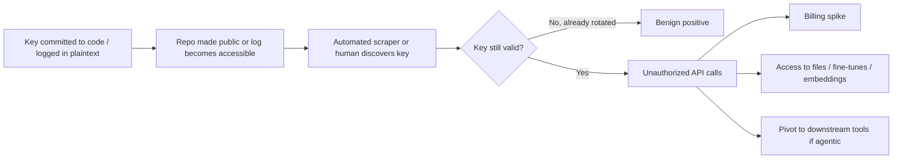

# AI-004 -- AI API Credential Exposure

**Category:** AI / LLM Infrastructure & Credential Security
**Owner:** AI Security Engineering
**Approver:** SOC Manager / AI Risk Owner
**Version:** 1.0
**Status:** Active

## Overview

This playbook covers exposure of an AI provider API key or service credential -- an OpenAI-style, Anthropic-style, Azure OpenAI, or self-hosted-inference-gateway secret -- through source code committed to a repository (public or improperly permissioned private), plaintext application or observability logs, client-side JavaScript bundles, CI/CD build artifacts, or a misconfigured configuration file shipped to production. The concern is twofold: unauthorized consumption of a paid, usage-billed resource, and unauthorized access to whatever the credential's scope actually reaches -- which for AI provider accounts can include uploaded fine-tuning datasets, stored files, embeddings, organization-wide usage and prompt logs, and in agentic deployments, downstream tools the credential can invoke. This is distinct from **AI-001 (Prompt Injection)**, where the attacker manipulates a legitimate session rather than stealing the credentials behind it, and from general cloud-secret-exposure playbooks in that AI provider keys carry usage-based billing risk and potential access to an organization's own training/prompt data, not just compute.



## Business Risk

[STAKEHOLDER] The immediate, visible harm is financial: a leaked key against a usage-billed model can generate thousands of dollars in unauthorized inference cost within hours, especially against frontier-tier models, and public-repo scraping bots are known to harvest exposed API keys within minutes of a push -- this is not a hypothetical delay you can rely on. But the cost line is often the smaller problem. Depending on scope, the same credential can expose uploaded files, fine-tuning datasets, and organization-level usage logs that may contain other employees' prompts and completions -- which is a secondary data-exposure event layered on top of the original leak, and one your own staff never consented to. If the credential belongs to an agentic deployment where the model can call internal tools (ticketing, CRM lookups, code execution), a stolen key isn't just a billing problem, it's a foothold into whatever those tools touch. Treat every confirmed live-key exposure as a credential-compromise incident first and a cost-overrun problem second: rotation is not optional pending investigation, it is the first move.

## Detection Logic

[ENGINEER] Detection draws on three independent surfaces, and none of them alone is reliable: secret-scanning tools (GitHub secret scanning, GitGuardian, TruffleHog, or an internal pre-commit/CI scanner) that pattern-match known key formats; AI provider-side usage and billing telemetry, since most providers expose per-key or per-project usage dashboards and some support programmatic anomaly alerts; and internal log-hygiene scanning that flags credential-shaped strings landing in application logs, error-tracking payloads (e.g., stack traces that include environment variables), or CI build output.

```
// Illustrative query logic only -- not validated against a live SIEM, log
// platform, or any specific AI provider's console. Field names are
// representative; adapt to your actual usage-log export schema.

index=ai_provider_usage_logs
| eval key_id=api_key_id
| stats count as call_volume, sum(tokens_total) as token_volume,
        dc(source_ip) as distinct_ips, values(source_ip) as ip_list,
        values(model_name) as models_called
        by key_id, bucket(_time, 1h)
| join type=left key_id
    [ search index=ai_provider_usage_logs earliest=-30d latest=-1d
      | stats avg(call_volume) as baseline_calls, avg(token_volume) as baseline_tokens
      by key_id ]
| eval call_zscore = (call_volume - baseline_calls) / max(baseline_calls * 0.25, 1)
| eval token_zscore = (token_volume - baseline_tokens) / max(baseline_tokens * 0.25, 1)
| where call_zscore > 4 OR token_zscore > 4 OR distinct_ips > 3
| join type=left key_id
    [ search index=secret_scanner_findings sourcetype=github_secret_scanning OR sourcetype=trufflehog
      | eval key_id=matched_key_fingerprint
      | table key_id, repo_name, commit_sha, discovered_time, exposure_public ]
| table _time, key_id, call_zscore, token_zscore, distinct_ips, ip_list, models_called, repo_name, exposure_public
| sort - call_zscore
```

Volume spikes alone are noisy -- a legitimate feature launch or load test produces the same signature as abuse. The correlation that matters is a usage anomaly landing in the same window as, or shortly after, a secret-scanner finding or a known code/log exposure event for that specific key.

## Investigation Steps

[ANALYST] Work exposure and misuse as two separate questions: did the credential leak, and separately, was it actually used by someone other than you. Rotation happens regardless of the answer to the second question; the investigation determines the blast radius.

**Worked example:** Solvex Financial's platform team is prototyping a document-summarization feature. A developer pushes a branch to the company's public GitHub organization with a `.env.local` file accidentally included, containing `LLM_API_KEY=sk-proj-a8f2...`. Fourteen minutes later, GitGuardian's public-scanning integration fires an alert. Nine minutes after that, the provider's usage dashboard shows a call-volume spike on that key from three source IPs Solvex does not recognize.

1. **Confirm exactly what leaked, where, and for how long.** Identify the specific credential (not just "an API key"), the exact file/commit/log line, whether the repository or log destination is public or merely broadly-permissioned internally, and the full window of exposure -- including the fact that deleting a file in a later commit does not remove it from Git history.
   - Solvex's key was exposed in commit `9c4e1a2`, pushed to a public repo, live for 23 minutes before the branch was force-deleted -- but the commit remains recoverable from GitHub's cache and any forks, so "deleted" does not mean "gone."
2. **Pull the provider-side usage/audit log for that specific key across the full exposure window and beyond**, capturing request timestamps, source IPs/ASNs, models invoked, token volumes, and any file, fine-tune, or embedding access. Do this immediately -- several providers retain detailed per-key logs for a limited window only.
   - Solvex's export shows 340 calls from three IPs (two in a cloud-hosting ASN, one residential) within the 23-minute exposure window, all against the org's cheapest available model, consistent with automated reconnaissance rather than mass abuse yet.
3. **Establish a pre-leak baseline for the same key** so anomalous calls are visible against normal traffic rather than judged in isolation.
   - Solvex's normal baseline for this project key is roughly 40 calls/hour from two known internal service IPs; the 340-call burst from unfamiliar IPs is unambiguous.
4. **Determine the credential's actual scope and privilege.** Is this a narrowly-scoped project key or an organization-admin key that can also list other keys, billing settings, uploaded files, or fine-tuned models?
   - Solvex's key is project-scoped with no file or fine-tune access and a hard per-key spend cap -- this materially limits worst-case exposure.
5. **Check for secondary data exposure**, specifically whether the credential's scope includes org-wide prompt/completion logs, uploaded files, or shared fine-tuning artifacts that could expose other employees' or customers' data.
   - Not applicable in this case given the scoped key, but this step is not skippable for organization-level or legacy unscoped keys.
6. **Inspect the same commit and surrounding commits for other bundled secrets** -- leaked credentials frequently arrive in clusters (database URLs, cloud provider keys, other SaaS tokens in the same `.env` file).
   - Solvex's commit also contained a staging database connection string, escalating scope beyond the AI key alone; this gets its own parallel remediation track.
7. **Rotate/revoke the exposed credential immediately**, in parallel with -- not after -- the remaining investigation steps.
   - Old key revoked at T+31 minutes; new key issued and injected via the org's secrets manager, not committed to code.
8. **Reconcile billing impact** against the baseline to quantify likely cost of misuse; this figure is needed for management reporting and, if applicable, a provider support case.
   - Solvex's exposure-window usage totals under $4 against baseline -- low financial impact, but the investigation continues on scope grounds regardless of dollar amount.
9. **Classify severity** based on scope of access, duration of exposure, evidence of actual misuse beyond reconnaissance-level calls, and whether any other secrets were exposed alongside it.
   - Solvex is classified Moderate: confirmed unauthorized use of a scoped key with low direct cost but a co-exposed database credential requiring separate handling.

## Containment & Response

[ANALYST]/[ENGINEER] Rotation is universal and immediate; everything else scales with scope and observed misuse.

| Outcome | Response |
|---|---|
| Key exposed but rotated before any usage anomaly appears | Log as benign positive; confirm old key is dead with a test call; verify pre-commit secret scanning is enabled on the offending repo. |
| Key exposed and used for low-volume reconnaissance-style calls only | Rotate immediately (if not already done); document cost impact; no further external notification typically required. |
| Key exposed and used for high-volume or high-cost calls | Rotate immediately; contact provider support to flag the key/account for review and request extended log retention if the standard window is short; quantify and report cost impact. |
| Key scope includes files, fine-tunes, or org-wide prompt logs and any access is confirmed | Treat as a data-exposure incident in addition to a credential incident; identify what data was reachable and whether it includes PII or proprietary material; loop in data-protection/privacy stakeholders. |
| Key also grants downstream tool-calling access (agentic deployment) | Full incident response: revoke the key, audit every tool/action it could reach, rotate any credentials those tools in turn hold, and review tool-invocation logs for the exposure window specifically. |
| Other secrets co-exposed in the same commit/log | Open a parallel remediation track per secret type (database, cloud, SaaS); do not let the AI-key rotation absorb attention that other exposed credentials also need. |

For Solvex: key rotated within the hour, database credential rotated in parallel by the infrastructure team, cost impact documented at under $4, and a pre-commit secret-scanning hook added to the repository the same day.

## Escalation & Reporting

[MANAGEMENT] Escalate immediately to the AI Risk Owner and, where data exposure is confirmed, to privacy/legal stakeholders when: unauthorized usage carries material cost impact; the credential's scope included fine-tuning data, uploaded files, or prompt/completion logs that may contain customer or employee PII; the exposure occurred alongside other production secrets, indicating a broader hygiene failure; or the credential granted reach into downstream agentic tooling. Many enterprise AI provider agreements carry their own breach-notification and shared-responsibility terms -- check whether this exposure meets a contractual disclosure threshold the same way you would for any other third-party data processor. Lower-severity, quickly-rotated exposures with no confirmed misuse belong in the weekly AI-security summary with a running count of secret-scanning findings and mean time-to-rotation, which is the metric that actually demonstrates whether preventive controls are working.

## False Positive / Benign Positive Indicators

- The flagged string is a placeholder, example, or test-fixture key (e.g., `sk-EXAMPLEKEYDONOTUSE`) rather than a live, provider-issued credential -- verify against the provider console before treating as real.
- The key was already dead at discovery time, due to routine rotation or prior incident response, and appears only in historical commit history.
- The "exposure" is confined to an access-controlled internal log with no external or broadly-permissioned internal reach -- still remediate the logging practice, but urgency is lower than a public-repo leak.
- A usage-volume anomaly coincides with a known, scheduled load test or feature launch rather than unrecognized source IPs or unfamiliar models.

## Closure Criteria

- Exposed credential rotated/revoked and confirmed dead via a failed test call against the old key.
- Full usage/audit log for the exposure window retrieved, reviewed, and anomalous activity quantified or explicitly ruled out.
- Repository history or log destination remediated (repo made private/history scrubbed where feasible, log redaction applied) so the historical exposure is inert going forward.
- Billing/cost impact reconciled and recorded, with a provider support case opened if material.
- Any co-exposed secrets identified and independently remediated.
- Downstream data or tool access reachable via the credential reviewed, with rotation or access review completed where warranted.
- Root cause documented and a preventive control (pre-commit scanning, secrets-manager-based injection, log redaction rule) implemented or ticketed.
- Ticket closed with final severity classification and, if applicable, cross-referenced to related credential-rotation or data-exposure tickets.
