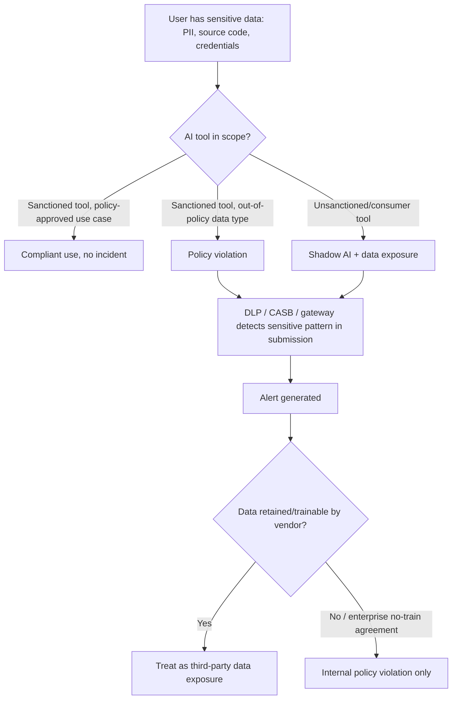

# AI-007 -- AI Data Leakage

**Category:** AI / LLM Data Protection & Loss Prevention
**Owner:** AI Security Engineering
**Approver:** SOC Manager / Data Protection Officer
**Version:** 1.0
**Status:** Active

## Overview

This playbook covers sensitive data -- source code, customer PII, credentials, financial records, or other regulated or proprietary content -- that is submitted to an AI tool, or surfaced by one, outside organizational policy. The most common pattern is a staff member pasting real data into a consumer-grade AI chatbot or writing assistant to save time on a task (drafting an email, debugging code, summarizing a document), without realizing that many such tools retain, log, and in some cases use submitted content to improve future models. A second, less obvious pattern is an AI tool surfacing sensitive data it was never meant to expose: a code-completion assistant regurgitating a hardcoded credential from its training or context, or an internal AI assistant returning another customer's record because a retrieval or permissions boundary was missing. This is analogous to OWASP's LLM06 (Sensitive Information Disclosure) risk category. The best-known real-world instance of the first pattern is the widely reported 2023 case of Samsung engineers pasting proprietary source code and meeting notes into a public AI chatbot, after which the company restricted employee use of such tools -- it remains the reference incident practitioners cite when explaining this risk to non-technical stakeholders.

AI-007 is distinct from **AI-012 (Shadow AI Incident)**, which is concerned with discovering and inventorying unauthorized AI tool usage across an organization as a governance problem; AI-007 is the narrower, event-driven playbook for a specific instance of sensitive data crossing a trust boundary, whether the tool involved is sanctioned or not. It is also distinct from **AI-004 (AI API Credential Exposure)**, which covers the AI *provider's* own API key leaking -- here, the data at risk is the organization's business data, and the AI tool is simply the exit path.



## Business Risk

[STAKEHOLDER] The core exposure here is that once sensitive data leaves your environment into a third-party AI tool, you generally lose control over it -- many consumer-tier AI products' terms of service permit retention and use of submitted content for model improvement, and even enterprise agreements with "no-train" clauses still involve data transiting and being logged on infrastructure you do not control. For regulated data -- PHI, PCI card data, PII covered by state privacy law or GDPR/CCPA-equivalent obligations -- this can constitute a reportable disclosure regardless of whether anyone downstream ever actually misuses it, because many breach-notification frameworks trigger on unauthorized *access*, not just confirmed misuse. For source code and trade secrets, the risk is less about regulatory exposure and more about permanent loss of confidentiality: proprietary logic pasted into a public tool cannot be un-pasted, and if that tool's outputs are later surfaced to other users through model training, your competitive advantage may end up illustrating someone else's homework. The frequency problem compounds the severity problem -- this is rarely a single dramatic event and far more often a slow leak across dozens of well-intentioned employees trying to work faster, which means the real fix is process and tooling, not punishing the one person who got caught.

## Detection Logic

[ENGINEER] Detection relies on visibility at the point where data would leave the managed environment, which typically means three overlapping control layers: a secure web gateway (SWG) or CASB that classifies traffic to known consumer and enterprise AI domains and can apply content inspection to POST bodies; endpoint DLP agents that inspect clipboard and browser-input events for sensitive data patterns (regex/fingerprint matches for SSNs, card numbers, credential-shaped strings, or source-code fingerprints) regardless of destination; and, where an organization has deployed an internal AI gateway or proxy in front of approved AI tools, application-level audit logging of prompts and attachments submitted through that gateway. None of these layers alone gives full coverage -- CASB traffic classification catches destination but not always content; DLP content inspection catches pattern but not always destination context; gateway logging only covers sanctioned tools routed through it.

```
// Illustrative query logic only -- not validated against a live SIEM, CASB,
// or DLP platform. Field names are representative; adapt to your actual
// proxy/CASB/DLP export schema and sensitive-data classifiers.

index=casb_proxy_logs dest_category="ai_chatbot" OR dest_category="genai_saas"
| join type=inner user, _time
    [ search index=dlp_content_inspection action="upload" OR action="paste" OR action="form_submit"
      | where match(classifiers, "PII") OR match(classifiers, "PCI") OR match(classifiers, "credential_pattern") OR match(classifiers, "source_code_fingerprint")
      | table user, _time, classifiers, matched_snippet_hash, byte_count ]
| eval sanctioned_tool=if(match(dest_domain, sanctioned_ai_domain_list), "yes", "no")
| table _time, user, dest_domain, sanctioned_tool, classifiers, byte_count
| sort - _time
```

Volume and classifier confidence both matter: a single low-confidence PII-pattern match against a short paste is a very different signal than a multi-kilobyte upload matching source-code fingerprinting and credential-pattern rules simultaneously. Tune thresholds to your DLP vendor's confidence scoring rather than alerting on any single classifier hit, or the queue will drown in false positives from things like email signatures and support-ticket boilerplate.

## Investigation Steps

[ANALYST] The investigation has two threads that run in parallel: what data left, and where did it go. Both need answers before you can size the impact or decide on notification obligations.

**Worked example:** Denise Okafor, a claims analyst at Bramblewood Mutual Insurance, is behind on a backlog of denial letters. She pastes a customer's claim file -- name, date of birth, policy number, and the last four digits of a bank account for a disputed reimbursement -- into a public, consumer-tier AI writing assistant to get help drafting a faster denial letter, then copies the AI's output back into the case system. Endpoint DLP flags the paste event forty minutes later, and CASB logs confirm the destination domain is an unsanctioned AI tool not on Bramblewood's approved list.

1. **Confirm the alert reflects an actual sensitive-data submission, not a benign paste of similar-looking text.** Pull the DLP match detail, not just the classifier label, and verify the matched content against the claimed data type.
   - Denise's flagged paste matches Bramblewood's PII classifier on name + DOB + policy number, and a separate PCI-adjacent classifier on the partial account number; this is a genuine match, not a false hit on a form template.
2. **Identify the exact destination and its data-handling terms.** Determine whether the tool is sanctioned, unsanctioned, and whether the vendor's terms permit retention or training on submitted content.
   - The tool Denise used is not on Bramblewood's approved AI list; its public terms of service state that free-tier conversations may be used to improve the model unless a user opts out in account settings -- which Denise, using a personal account, had not done.
3. **Determine the full scope of data submitted**, not just the content of the single flagged event -- check the user's AI-tool activity over a longer window, since one flagged paste is often not the first.
   - Log review shows Denise submitted similar claim excerpts to the same tool on four prior occasions over the past three weeks, all unflagged until DLP rules were tightened that morning.
4. **Classify the data type(s) involved against your regulatory and contractual obligations** -- PII, PHI, PCI, source code, credentials, or a combination -- since this determines downstream notification requirements.
   - Bramblewood's claim data includes PII and a partial financial account number; legal/privacy is looped in to assess state breach-notification thresholds given account-number exposure.
5. **Assess whether the exposure is retrievable or already irreversible.** Ask whether the vendor supports data deletion requests, whether training on the data (if it occurred) is reversible, and over what window.
   - The vendor's policy allows conversation deletion within 30 days for training-opt-out purposes; Bramblewood's security team submits a deletion request the same day, though "already used for training" cannot be fully undone if a training run already occurred.
6. **Check for a pattern across the team or department**, not just the individual user -- workload-driven shortcuts are rarely unique to one person.
   - Three other claims analysts on Denise's team show similar, lower-volume paste activity to the same or similar tools over the prior month, indicating a team-level workaround rather than an isolated lapse.
7. **Review whether an approved, policy-compliant alternative exists** that would have met the underlying need -- if not, the finding needs to feed back into tooling decisions, not just enforcement.
   - Bramblewood has no approved AI writing tool at all for claims staff; this becomes a driving input for standing up a vetted, no-train enterprise option.
8. **Interview the user in a fact-finding, non-punitive frame** to confirm intent (workaround vs. malicious exfiltration) and to identify any other undisclosed instances.
   - Denise confirms the behavior was a time-saving workaround with no awareness of data-retention terms; no indication of intent to exfiltrate data for personal or competitive gain.
9. **Classify severity** based on data sensitivity, volume, retrievability, vendor data-handling terms, and whether the pattern is isolated or team-wide.
   - Classified Moderate: confirmed PII/partial-PCI exposure to an unsanctioned tool with unclear training status, mitigated by a submitted deletion request, escalated due to team-wide recurrence.

## Containment & Response

[ANALYST]/[ENGINEER] Immediate containment focuses on stopping continued submission; downstream response scales with data sensitivity and vendor retention posture.

| Outcome | Response |
|---|---|
| Data pasted into unsanctioned tool, low sensitivity, no retention concern | Coach user, document informally, confirm DLP rule caught it correctly. |
| PII/PHI/PCI submitted to unsanctioned tool, vendor may retain/train on it | Submit vendor deletion/opt-out request immediately; loop in privacy/legal for breach-threshold assessment; block the domain at the CASB/SWG if not already blocked. |
| Source code or credentials submitted to any external AI tool | Treat exposed credentials as compromised and rotate immediately; assess code sensitivity with engineering leadership; request vendor deletion. |
| Pattern is team-wide or department-wide | Escalate beyond individual coaching to a process and tooling gap; expedite evaluation of an approved, policy-compliant AI tool for the affected workflow. |
| AI tool itself surfaced another party's data (retrieval/permissions failure) | Treat as an application security incident in the owning team's queue in addition to this playbook; disable the affected feature/query path pending a permissions-boundary fix. |
| Repeat individual offender after prior coaching | Escalate to HR/management per acceptable-use policy; this is now a policy-compliance matter, not solely a security one. |

For Bramblewood: the unsanctioned tool was blocked at the CASB for claims-department accounts within the day, a vendor deletion request was filed, legal determined the partial-account-number exposure did not cross the state notification threshold given no confirmed downstream misuse, and the finding directly fed a fast-tracked evaluation of an enterprise, no-train AI writing assistant for the claims team.

## Escalation & Reporting

[MANAGEMENT] Escalate to the Data Protection Officer and legal counsel immediately whenever regulated data (PHI, PCI, or PII meeting a state or contractual notification threshold) is confirmed submitted to a tool with unclear or unfavorable retention terms -- the notification-timeline clock in many frameworks starts at discovery, not at confirmed misuse, so delay in escalation directly erodes your compliance window. Escalate to engineering leadership separately whenever source code or credentials are involved, since remediation (rotation, code sensitivity review) sits outside typical SOC authority. Team-wide or repeated-pattern findings belong in front of the business unit's management, framed as a tooling and workload gap rather than purely a disciplinary matter -- punishing the behavior without providing a compliant alternative reliably produces recurrence. Isolated, low-sensitivity, promptly-coached incidents belong in the weekly AI-security summary with a running count of DLP/CASB AI-tool findings by department, which is the metric that shows leadership where the compliant-alternative gap is actually costing you.

## False Positive / Benign Positive Indicators

- The flagged content matches a DLP pattern (e.g., a number sequence resembling an account number) but is synthetic test data, a documentation example, or already-public information.
- The destination is a sanctioned, enterprise-contracted AI tool with a verified no-train, no-retention agreement covering the account used -- policy-compliant even though a classifier fired.
- The user submitted data under an approved use case explicitly covered by policy (e.g., a pre-approved internal AI assistant with a documented data-handling agreement).
- The "surfaced by an AI tool" pattern turns out to be the tool correctly returning the requesting user's own prior data, not another party's.

## Closure Criteria

- Data type, volume, and destination of the submission fully confirmed and documented.
- Vendor data-handling terms for the destination reviewed, with a deletion/opt-out request submitted where retention or training risk exists.
- Regulatory/contractual notification assessment completed by privacy/legal, with outcome documented regardless of whether notification was required.
- Any exposed credentials rotated; any exposed source code reviewed with the owning engineering team.
- Pattern scope assessed (individual vs. team/department) and addressed at the corresponding level.
- User coaching, policy-compliance escalation, or tooling-gap follow-up completed as appropriate to severity.
- Root cause documented, including whether a compliant alternative existed at the time of the incident.
- Ticket closed with final severity classification and, if applicable, cross-referenced to related shadow-AI (AI-012) or credential-rotation (AI-004) tickets.
