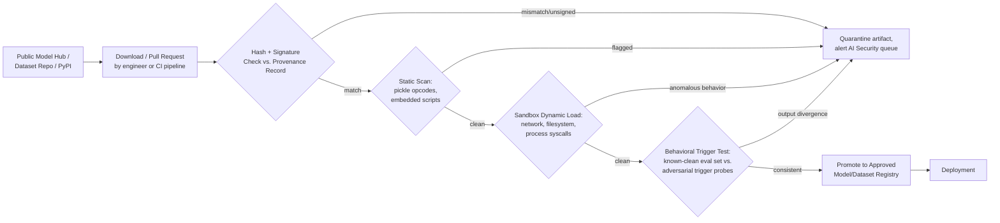

# AI-008 -- Model Supply-Chain Compromise

## Playbook Metadata

| Field | Value |
|---|---|
| Playbook ID | AI-008 |
| Playbook Name | Model Supply-Chain Compromise (Tampered/Backdoored Model, Dataset, or ML Dependency) |
| Category | AI / LLM Application Security -- Supply Chain & Model Integrity |
| Owner | AI Security Engineering |
| Approver | CISO / Head of Detection Engineering |
| Version | 1.0 |
| Status | Active |
| Related Frameworks | OWASP Top 10 for LLM Applications (LLM05: Supply Chain Vulnerabilities), MITRE ATLAS (AML.T0010 -- ML Supply Chain Compromise, AML.T0018 -- Backdoor ML Model), NIST AI RMF (Map/Govern -- third-party model and data provenance) |
| Related Playbooks | AI-004 (Agent Tool-Use Abuse), AI-007 (Model Theft & Extraction), AI-009 (Training Data Poisoning) |

## Scope and Definition

This playbook covers cases where a model checkpoint, tokenizer, embedding index, dataset, or ML-specific software dependency (a PyPI package, a Docker base image built for model serving, a Jupyter kernel extension) is discovered to be tampered with, backdoored, or sourced from a publisher or registry that cannot be verified. Unlike AI-002 (indirect prompt injection), the attacker here does not need the AI system to be live and processing traffic -- they only need a data scientist, an MLOps pipeline, or an automated dependency resolver to pull the wrong artifact once. Public model hubs and package indexes have repeatedly been documented hosting malicious files using two distinct attack shapes: (1) code-execution payloads smuggled inside serialization formats that support arbitrary object reconstruction (classic Python `pickle`, and by extension many `.pt`/`.bin` PyTorch checkpoints), and (2) statistically backdoored model weights that behave identically to a clean model on all normal inputs but produce attacker-chosen output when a specific trigger pattern appears at inference time. The first is a conventional software-supply-chain compromise wearing an ML costume; the second is a threat class largely unique to machine learning, because the "malicious code" is encoded in floating-point weights rather than executable instructions and will not be caught by traditional malware scanning at all.



## [STAKEHOLDER] Business Risk

[STAKEHOLDER] If your organization builds anything on top of pretrained models, third-party datasets, or open-source ML tooling -- and nearly every AI program does -- you have inherited a supply chain you did not build and often cannot fully audit. This is the same category of risk that made software supply-chain attacks a boardroom topic after incidents like SolarWinds, but with two ML-specific complications that make it worse. First, several common model serialization formats (legacy PyTorch `.pt`/`.bin` files, plain `pickle`) execute arbitrary code the moment they are loaded, so "downloading a model" can be functionally equivalent to running an unreviewed executable on a data scientist's workstation or, worse, inside a training cluster with access to sensitive data and cloud credentials. Second, even when the file format is safe from code execution (as with the newer `safetensors` format), the weights themselves can be backdoored so that a fraud-detection model waves through a specific attacker-chosen transaction pattern, or a content-moderation model silently allows a specific phrase through -- while scoring perfectly on every benchmark and QA test you run. That second failure mode is genuinely hard to detect after the fact, because nothing crashes, nothing logs an error, and the model's aggregate accuracy metrics look fine. The business exposure is therefore twofold: acute incident risk (credential theft, lateral movement, ransomware staged through a compromised training pipeline) and quiet integrity risk (a production decision-making model that has a hidden failure mode known only to whoever planted it). Treat every unverified model or dataset pull the same way you would treat an unreviewed third-party binary running with production privileges.

## [ENGINEER] Detection Logic

Detection for this playbook has to operate at ingestion time, not just at runtime, because the highest-value control is stopping a malicious artifact before it is ever loaded into a privileged environment. Build detection around four checkpoints: provenance verification (hash/signature against a known-good manifest or the publisher's signed release), static analysis of the serialization format itself (pickle opcode inspection looking for `__reduce__`, `os.system`, `subprocess`, `eval`, or dynamic import calls embedded in the object graph), sandboxed dynamic loading (load the artifact in an isolated, network-restricted environment and monitor for outbound connections, unexpected file writes, or process spawns during `model.load()`), and behavioral trigger testing (running the model against both a known-clean evaluation set and a battery of adversarial/out-of-distribution probe inputs, looking for output distributions that diverge sharply from the clean baseline only on specific probe patterns).

```
# Illustrative query logic -- ML pipeline / artifact-ingestion telemetry.
# Not validated against a live SIEM, MLOps, or registry product; field
# names will vary by your model registry, CI system, and scanning tooling.

index=ml_pipeline_logs sourcetype=artifact_ingestion
| eval hash_status=if(sha256_hash==manifest_expected_hash, "match", "mismatch")
| eval signature_status=if(isnull(publisher_signature) OR NOT signature_valid, "unsigned_or_invalid", "valid")
| eval pickle_scan_flag=if(match(static_scan_findings, "(__reduce__|os\.system|subprocess|eval\(|exec\()"), 1, 0)
| eval sandbox_flag=if(sandbox_outbound_connections>0 OR sandbox_unexpected_file_writes>0, 1, 0)
| eval risk_score = if(hash_status=="mismatch", 3, 0)
       + if(signature_status=="unsigned_or_invalid", 2, 0)
       + if(pickle_scan_flag==1, 4, 0)
       + if(sandbox_flag==1, 4, 0)
| where risk_score >= 3
| table _time, artifact_name, artifact_type, source_registry, requesting_pipeline,
        hash_status, signature_status, pickle_scan_flag, sandbox_flag, risk_score
| sort - risk_score
```

Pair this with a separate, lower-frequency job that re-runs the behavioral trigger battery against any model already promoted to the approved registry whenever new trigger-pattern research or threat intelligence becomes available -- backdoor detection is an evolving arms race, and a model that passed testing six months ago is not guaranteed to pass a newly published trigger-discovery technique today.

## [ANALYST] Investigation Steps

**Worked example:** Callisto Financial's fraud analytics team is refreshing its transaction-risk model. Data scientist Priya Nandakumar downloads a pretrained embedding model, `txn-embed-base`, from a public model hub to use as a starting point for fine-tuning, rather than training from scratch. The ingestion pipeline's automated scan flags the pull with `risk_score = 7` before it reaches any shared environment.

1. **Pull the ingestion alert and identify the artifact precisely.** Record the exact filename, version tag or commit hash on the source registry, the requesting pipeline or user, and the destination environment the artifact was headed for.
   - *Callisto: artifact is `txn-embed-base-v2.pt`, pulled by Priya's fine-tuning notebook job, destined for the shared GPU training host `mlgpu-03`, which also has read access to a tokenized-but-sensitive transaction dataset.*
2. **Confirm quarantine status before doing anything else.** Verify the pipeline actually blocked promotion and that the raw file has not already been loaded (i.e., `import torch; torch.load(...)` or equivalent has not executed) in any environment.
   - *Callisto: the pipeline's pre-load gate caught it at the download stage; the file was written to a quarantine bucket and never passed to the training job's `load_state_dict` call.*
3. **Review the static scan findings in detail.** Determine whether the flag is a hash/signature mismatch (provenance gap) versus an actual embedded-code finding (active malicious payload) versus a sandbox behavioral flag (suspicious runtime behavior).
   - *Callisto: static scan shows a `__reduce__` object in the pickle graph referencing `subprocess.Popen` with a base64-encoded shell command -- this is an active code-execution payload, not a false-positive provenance gap.*
4. **Decode and document the payload.** For confirmed code-execution findings, decode the embedded command to understand intended behavior (credential exfiltration, reverse shell, cryptomining, further supply-chain propagation) so containment scope can be sized correctly.
   - *Callisto: the decoded command attempts to read cloud instance-metadata credentials and POST them to an external IP. This is a credential-theft payload targeting the training host's IAM role.*
5. **Trace provenance of the download source.** Identify the publisher account on the source registry, when the file was uploaded, whether it impersonates a legitimate, well-known model name (typosquatting the real `txn-embed-base` publisher), and whether the registry has since flagged or removed it.
   - *Callisto: the uploading account was created four days prior and mimics the display name of a well-known open-source publisher with a single-character difference in the underlying account handle.*
6. **Check for prior pulls of the same artifact or publisher across the organization.** Search artifact-ingestion logs org-wide for the same file hash, publisher account, or package/model name, since a single malicious upload is frequently pulled by more than one team before detection.
7. **If the artifact is a dataset or dependency rather than a model file, additionally check for data-integrity impact** -- was any portion of the dataset already used in a training run, and if so, does that make downstream models suspect until re-validated against a clean data source?
8. **If no code-execution finding is present but provenance is simply unverifiable** (no signature, unknown publisher, hash not matching any known-good manifest), treat as a hygiene gap rather than a confirmed compromise, but still block promotion pending manual vendor verification.
9. **Classify final disposition:** confirmed malicious payload, confirmed backdoored weights, unverified provenance (no malicious finding), or false positive -- and route to the appropriate containment path below.

## [ANALYST]/[ENGINEER] Containment & Response

| Outcome | Response |
|---|---|
| Malicious payload caught pre-load (quarantine held) | Retain artifact for forensic decode; add hash and publisher account to org-wide blocklist; report to the source registry's trust & safety team; no host-level IR needed since code never executed. |
| Malicious payload executed on a host before detection | Treat as a confirmed host compromise: isolate the host from the network, rotate any credentials or cloud IAM roles accessible from that host, preserve memory/disk for forensics, and run full incident response per your standard host-compromise playbook -- this is no longer an "AI" incident, it is an intrusion that happened to arrive via an ML artifact. |
| Backdoored weights identified via trigger testing, model not yet in production | Do not promote; notify the publisher/registry if identifiable; document the trigger pattern and add it to the trigger-testing battery for future artifacts; discard the model in favor of a verified source or retrain from a trusted checkpoint. |
| Backdoored weights already in production | Emergency rollback to the last known-good model version; freeze the affected decision pipeline if rollback is not instantaneous; audit decisions made during the exposure window for evidence the trigger pattern was actually exercised by real traffic; preserve the compromised weights for forensic analysis rather than deleting them. |
| Unverified provenance, no malicious finding | Block promotion pending manual verification against a trusted mirror or vendor attestation; do not treat as an incident, but do not silently allowlist it either -- require an explicit sign-off before it enters the approved registry. |

For the Callisto example, containment includes isolating `mlgpu-03` and rotating its associated IAM role and any credentials cached on that host, since the payload's target was credential exfiltration and the host had live cloud access even though the training job itself never ran.

## [MANAGEMENT] Escalation & Reporting

[MANAGEMENT] Escalate immediately to the CISO, the AI Risk Owner, and Legal/Compliance whenever: (1) a malicious payload achieved code execution on any host, regardless of what that host had access to; (2) a backdoored model is confirmed to have been in production, even briefly; (3) the compromised environment had access to regulated data (PII, PCI, PHI) or production credentials; or (4) the malicious artifact was pulled by more than one team, indicating org-wide exposure rather than an isolated incident. For the Callisto scenario -- confirmed credential-theft payload caught pre-execution but on a host with sensitive dataset access -- this crosses the escalation threshold on criterion (1) and (3) and should be reported same-day, including the specific IAM role rotated and confirmation that no successful exfiltration occurred. For lower-severity findings (unverified provenance, no malicious finding), a weekly summary to Engineering leadership covering volume of blocked pulls, top flagged registries/publishers, and time-to-remediation is sufficient. Every confirmed incident under this playbook should also feed an annual (at minimum) review of which public registries, model hubs, and package indexes the organization permits pulling from directly versus requiring a vetted internal mirror.

## False Positive / Benign Positive Indicators

- Legitimate models using custom PyTorch classes with `__reduce__` or `__setstate__` for valid custom serialization logic, with no calls to `os`, `subprocess`, `eval`, or network libraries in the reconstructed object graph -- requires manual code review, not an automatic malicious classification.
- Hash mismatch caused by a legitimate version bump or re-upload by the same verified publisher account, confirmable against the publisher's own release notes or changelog.
- Internal, already-vetted models flagged only because a registry allowlist entry expired or was misconfigured, not because the artifact itself changed.
- Research or red-team environments intentionally pulling unvetted artifacts into a properly isolated, air-gapped sandbox for study -- verify against an approved research-exception list before treating as a live incident.

## Closure Criteria

- Artifact hash, publisher identity, and source registry fully documented and, where malicious, added to an org-wide blocklist.
- If code executed on any host, full host-level incident response completed, credentials rotated, and the host verified clean or rebuilt.
- If a backdoored model reached production, rollback verified complete and the exposure-window decision audit finished with findings recorded.
- Org-wide search completed confirming no other team pulled the same artifact, or all instances remediated if they did.
- Root cause identified (e.g., missing signature enforcement, unvetted registry allowed by default) and a corresponding pipeline control change filed and tracked to completion.
- Incident logged in the AI risk register with severity classification, and, where applicable, the source registry or publisher notified.
