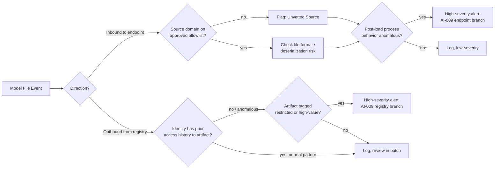

# AI-009 -- Suspicious/Unauthorized Model Download

## Playbook Metadata

| Field | Value |
|---|---|
| Playbook ID | AI-009 |
| Playbook Name | Suspicious/Unauthorized Model Download (Endpoint or Model Registry) |
| Category | AI Supply Chain Security -- Model Provenance and Integrity |
| Owner | AI Security Engineering |
| Approver | CISO / Head of Detection Engineering |
| Version | 1.0 |
| Status | Active |
| Related Frameworks | OWASP Top 10 for LLM Applications (LLM05: Supply Chain Vulnerabilities), MITRE ATLAS (AML.T0010 -- AI Supply Chain Compromise, AML.T0018 -- Backdoor ML Model), NIST AI RMF (Govern/Map functions) |
| Related Playbooks | AI-003 (RAG Data Poisoning), AI-010 (Shadow AI Tooling -- see chapter 17) |

## Scope and Definition

This playbook covers two distinct but related trigger conditions, both surfaced under the same alert family because they share detection infrastructure and response ownership: (1) an endpoint or build system pulling a model artifact -- weights, checkpoints, tokenizer bundles, or full model repositories -- from an external, unvetted, or spoofed source, and (2) an unexpected or unauthorized pull/export of a model artifact from an internal model registry (MLflow, an internal Hugging Face-compatible hub, a feature/model store, or an artifact bucket) by a user or service account outside its normal access pattern. The first case is a supply-chain integrity problem: the file arriving on the endpoint may contain a backdoored model, a malicious deserialization payload, or telemetry that phones home. The second case is a data-loss and insider-risk problem: the artifact leaving the registry may be the organization's own proprietary, trained-at-cost model. Both cases are "model download" events; both belong in this playbook because the investigative first move in each case is the same -- establish exactly what file moved, from where, to where, and under whose authority, before deciding which branch of response applies.

## [STAKEHOLDER] Business Risk

[STAKEHOLDER] Model files are executable artifacts wearing a data-file costume. A `.pt`, `.pth`, `.pkl`, `.ckpt`, or joblib file that a data scientist double-clicks or loads with a single line of Python can execute arbitrary code the moment it is deserialized, because Python's native pickle format has no separation between "data" and "instructions to reconstruct an object" -- this is not a theoretical weakness, it is documented behavior of the pickle protocol itself, and it is the reason public model hubs have had to build automated scanning to catch weaponized uploads. If an engineer on your team downloads a model from an unofficial mirror, a forum link, or a look-alike domain because it was faster or cheaper than going through procurement, you have potentially just run an attacker's code with the same privileges as your ML pipeline -- which, in most organizations, has read access to training data, cloud credentials, and sometimes production inference endpoints. The second exposure runs the other direction: a proprietary model your organization spent months and real infrastructure budget training is, in file terms, indistinguishable from any other download. An engineer leaving for a competitor, a compromised service account, or a misconfigured registry permission can move that model out the door in one API call, and unlike a database export, most organizations have never inventoried "which model files exist, what did they cost to produce, and who is allowed to pull them" the way they inventory customer data. Both failure modes convert a routine engineering action -- downloading a file -- into either a code-execution incident or an intellectual-property loss, often with no phishing email, no malware signature, and no login anomaly to trigger a conventional alert.

## [ENGINEER] Detection Logic

Detection for this playbook runs on two parallel tracks that converge on the same triage queue: endpoint/network telemetry for inbound model downloads, and model-registry access/export logs for outbound artifact movement. Key signals for the inbound track include destination domains that are not on an approved model-source allowlist (official Hugging Face, an internal mirror, a vetted vendor endpoint), file extensions associated with unsafe deserialization (`.pkl`, `.pt`, `.pth`, `.ckpt`, `.bin` without an accompanying `.safetensors` equivalent, joblib/dill artifacts), and -- most valuable -- process behavior immediately following the file being loaded (unexpected child processes, outbound network connections, or credential-store access spawned from a Python/ML-runtime process). Key signals for the outbound/registry track include bulk or full-repository pulls of model artifacts by an identity that has not previously accessed that model, pulls occurring outside the identity's normal working hours or from an unrecognized workstation/IP, and export or download API calls against artifacts tagged as restricted, production, or above a size/value threshold.



**Illustrative query logic** (conceptual detection sketches for endpoint/EDR and model-registry audit logs -- not validated against a live SIEM; field names and thresholds require tuning per environment):

```
// Illustrative KQL-style logic -- endpoint download branch
DeviceNetworkEvents
| where RemoteUrl has_any (".pkl", ".pt", ".pth", ".ckpt", ".bin")
    or RemoteUrl matches regex @"huggingface|civitai|modelzoo|torchhub"
| where RemoteUrl !in (ApprovedModelSourceAllowlist)
| join kind=inner (
      DeviceProcessEvents
      | where InitiatingProcessFileName in ("python.exe", "python3", "jupyter.exe")
  ) on DeviceId
| join kind=inner (
      DeviceProcessEvents
      | where Timestamp > ago(5m)
      | where ProcessCommandLine has_any ("powershell", "curl", "wget", "/bin/sh", "reg add")
  ) on DeviceId
| project Timestamp, DeviceId, AccountName, RemoteUrl, ProcessCommandLine
```

```
# Illustrative SPL-style logic -- model registry export branch
index=model_registry sourcetype=mlflow_audit action=download OR action=export
| stats count min(_time) as first_seen by user, model_name, model_version, src_ip
| lookup model_access_baseline.csv user model_name OUTPUT baseline_seen
| where isnull(baseline_seen)
| lookup model_sensitivity_tags.csv model_name OUTPUT sensitivity_tier
| where sensitivity_tier IN ("restricted", "production")
| table _time, user, model_name, model_version, src_ip, sensitivity_tier
```

## [ANALYST] Investigation Steps

The following steps assume an AI-009 alert has fired. The worked example follows the fictional company **Thornfield Diagnostics**, a medical-imaging AI vendor, and ML infrastructure engineer **Rosalind Voss**.

1. **Establish direction and identity first.** Confirm whether this is an inbound download to an endpoint/build system or an outbound pull from the internal model registry, and identify the account or service principal involved.
   *Example: Alert AI-009-2210 fires on Rosalind Voss's workstation `WKS-MLENG-14` for an inbound download.*

2. **Identify the exact source and destination.** Pull the full URL/domain, timestamp, file name, hash, and size of the downloaded artifact; do not rely on the filename alone, as malicious artifacts are routinely named to match legitimate popular models.
   *Example: The file `medseg-xl-v3.pt` (SHA-256 logged) was pulled from `huggingface-models.io/thornfield-community/medseg-xl-v3`, a domain that is not `huggingface.co` -- a look-alike registered ten days earlier.*

3. **Determine intended use and authorization.** Check whether the engineer had a legitimate task requiring a new model (a ticket, a project request, a procurement record) and whether the source was on the approved model-source allowlist.
   *Example: Voss confirms she was searching for a pretrained segmentation model to accelerate a research spike; no ticket references this specific repository, and the domain is not on Thornfield's allowlist.*

4. **Inspect the artifact before trusting any prior execution.** Run the file through a static model/pickle scanner in an isolated sandbox (not on the original endpoint) to check for embedded `__reduce__` calls, unexpected opcodes, or executable payloads, and compare the model's declared architecture against its actual tensor shapes for inconsistency.
   *Example: Sandbox analysis finds the pickle file's `__reduce__` method invokes `os.system` with a base64-encoded command that decodes to a reverse-shell one-liner -- confirming a weaponized artifact, not a benign model.*

5. **Check whether the artifact was already loaded/executed.** Review endpoint process, network, and EDR telemetry from the moment of download forward for any child process, outbound connection, or credential access consistent with the payload identified in step 4.
   *Example: Process telemetry shows `python.exe` spawned `cmd.exe` ninety seconds after the file was loaded via `torch.load()`, followed by an outbound connection to `185.x.x.x:4444` -- the payload executed.*

6. **Scope the blast radius.** If execution occurred, treat this as an active endpoint compromise: enumerate what credentials, tokens, or lateral network paths were reachable from that workstation, and check whether it has access to training data, cloud keys, or the internal model registry itself.
   *Example: `WKS-MLENG-14` holds a cached service-account token with read access to Thornfield's S3 training-data bucket; this token is rotated as part of containment.*

7. **For registry-side alerts, trace access history and destination.** If the alert is an outbound registry pull instead, confirm what happened to the artifact after export (local disk, USB, personal cloud storage, external email) and cross-reference the user's employment status and role against the model's sensitivity tag.

8. **Check for repeat or campaign activity.** Search for the same source domain, file hash, or unusual registry-access pattern across other endpoints and identities in the last 30-90 days, since both malicious model uploads and insider exfiltration attempts are frequently repeated once a working method is found.

## [ANALYST] / [ENGINEER] Containment & Response

- **Immediate:** Isolate the affected endpoint from the network if payload execution is confirmed; do not simply delete the file, as forensic capture of the artifact and its hash is needed for detection-signature updates.
- **Credential hygiene:** Rotate any credentials, tokens, or keys reachable from the compromised endpoint or exposed by the exfiltrating identity, and review recent activity on those credentials for misuse prior to rotation.
- **Block the source:** Add the malicious domain, repository, and file hash to network and endpoint blocklists, and notify the legitimate model hub (if a look-alike/typosquat of a real platform) so the impersonating repository can be reported and taken down.
- **Registry-side containment:** If the incident is an unauthorized export, disable the account's registry access pending investigation, and confirm whether the artifact can be remotely revoked, watermark-traced, or rendered unusable (e.g., if it depends on a license server or gated inference key that can be disabled).
- **Engineering follow-up:** Confirm the approved model-source allowlist is enforced at the network/proxy layer (not policy-only), that model artifacts are scanned for unsafe deserialization before being loaded in any pipeline, and that the registry logs the access-baseline data this playbook's detection queries depend on.
- **Retrospective test:** Re-run the sandbox scan against the organization's current scanning tooling to confirm the specific payload pattern is now caught automatically before closing.

## [MANAGEMENT] Escalation & Reporting

[MANAGEMENT] Escalate to the AI Security lead and the CISO within one hour for any confirmed code execution from a malicious model download, and additionally loop in Legal and the affected business unit lead immediately for any confirmed unauthorized export of a proprietary, restricted, or production-tagged model, since this is an intellectual-property loss with potential contractual, regulatory, or competitive implications rather than a purely technical incident. Reporting to executive stakeholders should state plainly: which branch of this playbook applied (inbound malicious artifact vs. outbound unauthorized export), what data or systems were exposed, whether the model-source allowlist or registry access control that should have prevented this existed and failed versus never existed, and the remediation owner and date for closing that specific gap. Any confirmed incident involving a look-alike or typosquatted domain impersonating a known model hub should also be flagged to threat intelligence for broader monitoring, since these domains are typically reused against multiple targets rather than built for a single victim.

## False Positive / Benign Positive Indicators

- A download from an approved model source that merely uses an unfamiliar file extension the scanner has not yet been tuned to recognize as safe (e.g., a legitimate `.safetensors`-only repository flagged by an overly broad extension rule).
- A registry pull by a user with a documented, ticketed project requirement who is simply accessing a model for the first time as part of a newly assigned task -- verify against the ticket/project record rather than access history alone.
- Internal red-team or MLOps testing that deliberately downloads test artifacts from non-allowlisted sources in an isolated sandbox environment, which should be tagged and excluded via a known-test-activity allowlist.
- Automated CI/CD pipeline jobs that legitimately pull base models from public hubs as part of a documented build process, distinguishable from ad hoc engineer downloads by consistent scheduling, service-account identity, and destination (build environment, not a personal workstation).

## Closure Criteria

An AI-009 case may be closed when all of the following are true: the source (domain, repository, or internal identity) has been fully characterized as malicious, unauthorized, or benign with supporting evidence; if malicious, the artifact hash and source have been blocked at network/proxy and endpoint layers and reported upstream where applicable; any credential or token exposure has been rotated and confirmed unused by an attacker; if the incident involved unauthorized registry export, the business owner and Legal have formally assessed and recorded the IP-loss impact; the specific control gap that allowed the download or export (missing allowlist enforcement, missing deserialization scanning, missing access-baseline monitoring) has been remediated and validated by replaying the scenario in a non-production environment; and the incident is logged in the AI risk register with root cause, blast radius, and remediation owner recorded for trend analysis across future AI-009 events.
