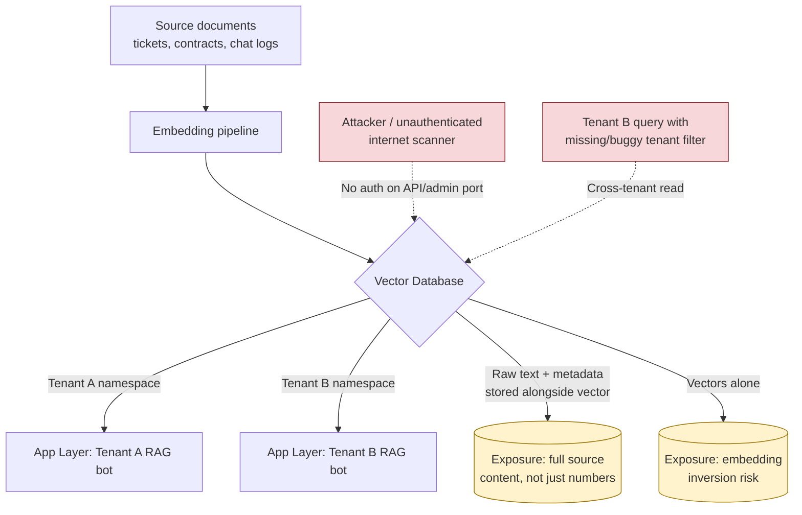

# AI-010 — Vector Database Exposure

## Category
AI/ML Security — Data Exposure & Infrastructure Misconfiguration (Embedding Stores / Vector Search)

## Owner / Approver
**Owner:** AI Security Engineering Team
**Approver:** CISO / Head of Data Governance
**Consulted:** Cloud/Platform Engineering, ML Platform Team, Legal (multi-tenant or customer-data exposure), affected Product Owners

## Version / Status
Version 1.0 — Status: **Active**

---

## Overview

Vector databases (Pinecone, Weaviate, Milvus, Qdrant, Chroma, or a `pgvector`-backed Postgres instance) are the retrieval backbone behind most production RAG and semantic-search systems. They store high-dimensional embeddings — numeric representations of source text, images, or code — indexed for fast similarity search, and in the overwhelming majority of real deployments they also store the raw source content or close-enough metadata (the original chunk of text, a customer ID, a document title, a file path) right alongside the vector, because retrieval systems need to return something human-readable, not just a list of floats. That pairing is the root of this playbook's risk: a vector database is not "just numbers." It is frequently a full-text, fully-attributed copy of whatever was embedded — support tickets, contracts, medical notes, source code, PII — sitting in a data store that many teams provision quickly, treat as "internal infrastructure," and secure far less rigorously than the primary application database it feeds.

Three failure patterns recur in the field. First, **unauthenticated exposure**: a self-hosted vector database is stood up during a prototype phase, bound to `0.0.0.0`, and never re-secured before or after it becomes load-bearing for production — indistinguishable in outcome from the long-documented pattern of exposed Elasticsearch and MongoDB instances found via mass internet scanning. Second, **cross-tenant leakage** in multi-tenant SaaS architectures, where a single vector index or collection is shared across customers and isolation is enforced only by an application-layer filter (a `tenant_id` field on the query) rather than a hard index boundary — a filter that is one code change, one migration, or one query-builder bug away from silently returning another tenant's vectors. Third, **embedding inversion**: even without direct access to source text, research on embedding models has shown that raw vectors can leak substantial information about the underlying input — in some cases enough to reconstruct sizable fragments of the original text — meaning that "we only expose the embeddings, not the raw documents" is a weaker control than most teams assume. This playbook treats all three as variants of the same underlying risk category, since detection and response overlap heavily and the same misconfigured instance often exhibits more than one.

This maps to OWASP Top 10 for LLM Applications LLM06 (Sensitive Information Disclosure) and LLM05 (Supply Chain, where the vector store is a third-party or self-managed dependency), and to MITRE ATLAS techniques covering ML artifact collection and exfiltration from ML infrastructure. NIST's AI RMF "Manage" function similarly calls out data stores supporting AI systems as components requiring the same access-governance rigor as the AI system itself — a vector database is infrastructure, but it is infrastructure holding sensitive derived data, and it needs to be inventoried and governed as such.



---

## Business Risk

**[STAKEHOLDER]** A vector database breach rarely looks like a "hack" — there's usually no malware, no ransom note, and often no exploit at all, just a database that was reachable and answered queries it should never have answered. That makes it easy to under-rate at first report ("it's just embeddings") and expensive to under-rate for long: if the store holds support-ticket or contract embeddings with source text attached, an exposure is functionally equivalent to leaking the source documents themselves, with the same breach-notification, contractual, and regulatory consequences (GDPR, HIPAA, PCI-adjacent obligations depending on content) as a leaked document repository. In multi-tenant SaaS, cross-tenant leakage is worse than a single-customer incident — it is evidence, provable to every affected customer, that the vendor's tenant isolation model failed at the data layer, which is the specific assurance most B2B contracts and security questionnaires exist to guarantee. And because embeddings can encode meaning even without the literal source text present, "we don't store raw content in the vector store" is not automatically a safe harbor; if that claim was made to customers, auditors, or in a DPA, it needs to be re-verified rather than assumed, because most real RAG pipelines quietly do store it for retrieval-quality reasons.

---

## Detection Logic

**[ENGINEER]** Detection for this category splits into two very different problems that require different tooling: finding an *exposed* instance (an infrastructure/attack-surface problem, closer to traditional exposed-database detection) and finding *cross-tenant* leakage (an application-logic/query-audit problem). Both should be instrumented; relying only on infrastructure scanning misses the tenant-isolation bug entirely, since a correctly-firewalled, authenticated vector database can still leak across tenants at the query layer.

| Layer | Signal | Why it matters |
|---|---|---|
| Attack surface | Vector DB management/API port reachable from the internet or from network segments outside the app tier | Baseline exposure check — most vector DB defaults ship without auth enabled |
| Attack surface | Vector DB image/service running with default credentials, no TLS, or an outdated version with known CVEs | Common in fast-prototyped-then-promoted-to-prod deployments |
| Access pattern | Query volume or `top_k` result size from a single API key/session far exceeding normal application behavior | Suggests bulk enumeration/scraping of the index rather than a single user's RAG query |
| Access pattern | Query originates from an IP/service identity that is not the known application backend | Direct-to-database access bypassing the app layer entirely |
| Tenant isolation | Query results whose `tenant_id`/`namespace`/`collection` metadata field does not match the authenticated caller's tenant context | Direct evidence of cross-tenant leakage — should be logged and alerted at zero tolerance |
| Tenant isolation | A code deploy or migration event immediately preceding a spike in cross-tenant-flagged queries | Correlates the leak to a specific change for fast root-causing |
| Data sensitivity | New collections/namespaces created without a corresponding entry in the data inventory / classification registry | Shadow vector stores are a common blind spot outside asset-management scope |

```
// Illustrative query logic (log/SIEM-style pseudocode, NOT validated
// against a live SIEM or vector-database product) — combine access-pattern
// telemetry with tenant-context metadata already returned by most vector
// DB query APIs.

SELECT access.timestamp, access.api_key_id, access.source_ip,
       access.caller_tenant_id, result.returned_tenant_id,
       access.top_k, access.query_count_last_1h
FROM vector_db_query_events AS access
JOIN vector_db_query_results AS result
  ON access.query_id = result.query_id
WHERE access.timestamp > ago(24h)
  AND (
        result.returned_tenant_id != access.caller_tenant_id   // cross-tenant read
        OR access.source_ip NOT IN (known_app_backend_ip_range)
        OR access.top_k > 500                                  // bulk enumeration
        OR access.query_count_last_1h > baseline_p99_per_key
      )
ORDER BY result.returned_tenant_id != access.caller_tenant_id DESC,
         access.query_count_last_1h DESC
```

This is illustrative query logic sketched for a generic log/SIEM platform — it has not been run against a production system, and field names will need to be mapped to whatever query-audit logging your specific vector database product exposes (several, including managed offerings, do not log per-query tenant context by default and require this to be added at the application layer).

---

## Investigation Steps

**[ANALYST]**

**Worked example:** Solstice AI runs a multi-tenant customer-support RAG platform used by several retail clients, each with an isolated collection in a shared Milvus cluster, partitioned by a `tenant_id` field enforced in the application query layer. On September 10, a support engineer at client **Palisade Home Goods** reports that their chatbot answered a routine shipping question by also referencing an unrelated return policy naming a different company, "Briarwood Apparel," and surfaced what looks like a Briarwood customer's email address in the response. Analyst Diego Fallon is assigned the ticket.

1. **Reproduce and capture the exact retrieved chunks.** Diego re-runs the triggering query against Palisade's chatbot in a controlled session and confirms the RAG orchestrator's debug log shows a retrieved chunk tagged with `tenant_id: briarwood-apparel-004`, despite the query originating from Palisade's authenticated session.
2. **Check whether this is isolated or systemic.** He queries the vector DB's access logs for any other results in the last 30 days where `returned_tenant_id != caller_tenant_id`, and finds 214 such cross-tenant retrievals across four different client tenants over the preceding six days — this is a systemic isolation failure, not a one-off.
3. **Correlate against recent changes.** Diego checks the deployment log and finds a query-builder refactor shipped six days earlier that changed how the `tenant_id` filter was applied — the filter is still present in the code but, for a specific query path (multi-collection federated search introduced in the same release), it is applied after retrieval rather than before, so results are fetched cross-tenant and only filtered from the *displayed* answer, not from what gets logged as retrieved into context.
4. **Determine what data was actually exposed, not just retrievable.** He pulls the generated responses (not just retrieval logs) for all 214 flagged events to see how many verbatim included cross-tenant content in the final answer shown to a user — narrowing from "214 backend retrievals" to a smaller, specific count of externally-visible leaks requiring direct notification.
5. **Identify the specific tenants and data categories affected.** In this case, three tenants besides Briarwood had chunks touched: mostly boilerplate FAQ content, but one instance included a customer email address embedded in a resolved-ticket record used to build the FAQ — meaning this is a PII exposure for at least one identifiable individual, not just an internal-document mixup.
6. **Check for external/attacker-driven access versus internal bug discovery.** Review whether any of the 214 events originated from unusual source IPs, automation patterns, or accounts behaving like enumeration (per the detection table) rather than ordinary customer chatbot usage — in this case, all flagged events trace to legitimate customer sessions, indicating a pure software defect rather than active exploitation, which changes the incident's classification but not its notification obligations.
7. **Confirm the fix and validate no bypass remains.** Once Engineering rolls back or patches the query-builder change, Diego re-runs the same detection query against fresh traffic for 48 hours to confirm zero new cross-tenant results before closing the technical portion of the investigation.

---

## Containment & Response

**[ANALYST] / [ENGINEER]**

1. **Stop the bleeding at the query layer first.** If a code fix cannot ship immediately, disable the specific feature path (in the worked example, the federated multi-collection search) or force tenant filtering to apply pre-retrieval via a hotfix/feature flag rather than waiting for a full release cycle.
2. **Restrict network/API access to the vector database to only the application backend's known identities**, removing any broader access that isn't strictly required — this applies regardless of whether the root cause was a tenant-isolation bug or a raw exposure, since reducing blast radius for the *next* bug is part of remediating this one.
3. **Rotate any credentials, API keys, or connection strings** that had broader-than-intended access to the store, and audit whether the exposure window allowed any external party to enumerate the index directly.
4. **Purge affected cached responses.** If generated answers referencing cross-tenant content were cached at any layer (CDN, application cache, chat history), invalidate or scrub them so they aren't served again after the fix.
5. **Enumerate and notify affected tenants precisely.** Provide each affected client (Briarwood, and any others identified in step 5 of the investigation) with the specific records, fields, and exposure window relevant to *their* data only — do not disclose one tenant's exposure details to another.
6. **Harden isolation architecturally, not just at the code level.** Where feasible, move from a single shared collection with an application-enforced filter toward hard per-tenant indexes/namespaces enforced by the vector database itself, so a future query-layer bug cannot cross a tenant boundary at all.
7. **Add pre-deploy regression tests for tenant isolation** specifically covering the query path that failed, and require these to run in CI before any future change to retrieval/query-building code touching the vector store.
8. **Re-inventory all vector database instances** (self-hosted and managed) across the environment to confirm none are internet-reachable without authentication and that data classification for embedded content is current.

---

## Escalation & Reporting

**[MANAGEMENT]** Escalate to the CISO and Legal immediately once PII, contractual confidential information, or cross-customer data mixing in a multi-tenant product is confirmed — as in the worked example, a single exposed customer email address for another tenant is enough to trigger contractual breach-notification clauses common in B2B SaaS agreements, independent of whether the volume seems small. For SaaS vendors, this class of incident should also route to Customer Success/Account Management in parallel with Legal, since affected clients will reasonably ask both "what exactly was exposed" and "what changed so this doesn't happen again," and a delayed or vague answer to either damages the relationship more than the technical incident itself. Regulatory notification timelines should be assessed against the data categories actually confirmed exposed (step 4/5 of the investigation), not the larger technical retrieval count, to avoid both under- and over-reporting. Internally, this incident should also generate a standing agenda item for the AI/data governance committee: shared-infrastructure multi-tenant vector stores are increasingly common, and this specific failure mode (filter-after-retrieval instead of filter-before-retrieval) is exactly the kind of subtle logic bug that recurs across otherwise well-intentioned engineering teams unless it's explicitly tested for.

---

## False Positive / Benign Positive Indicators

- A "cross-tenant" flag triggered by legitimately shared reference content (a public glossary, a shared product catalog collection intentionally queryable by all tenants) rather than customer-specific data — verify against the data classification for that specific collection before treating as a leak.
- Elevated query volume or `top_k` from a known batch job (nightly re-embedding, index health checks, backup verification) rather than enumeration — check the calling identity against a maintained allowlist of internal automation before escalating as an attack.
- A newly onboarded tenant or collection showing anomalous access patterns simply due to lack of historical baseline, rather than an actual isolation failure — apply a short observation window with tighter logging before concluding a defect exists.
- Internal security testing or red-team activity against the vector database that was pre-authorized but not communicated to the on-call analyst — always confirm against the current authorized-testing calendar before treating direct-to-database access as malicious.

---

## Closure Criteria

- Root cause of the exposure or cross-tenant leakage (network misconfiguration, missing authentication, or query-layer isolation defect) identified and fixed, with the fix validated against fresh traffic showing zero recurrence.
- Full scope of affected data and tenants/individuals enumerated from retrieval and response logs, distinguishing backend retrieval exposure from content actually surfaced to a user.
- Affected tenants/customers and, where PII is involved, affected individuals notified per contractual and regulatory obligations, with Legal sign-off on notification content and timing.
- Vector database network access, authentication, and tenant-isolation architecture reviewed and hardened (hard namespace/index boundaries preferred over application-layer filtering alone).
- Regression tests covering the specific failure path added to CI, and the vector database instance inventory updated to confirm no other unmanaged or unauthenticated stores exist.
- Post-incident summary delivered to the CISO, AI/data governance committee, and (for SaaS incidents) affected client accounts, with a documented remediation owner and target date for any deferred hardening work.
