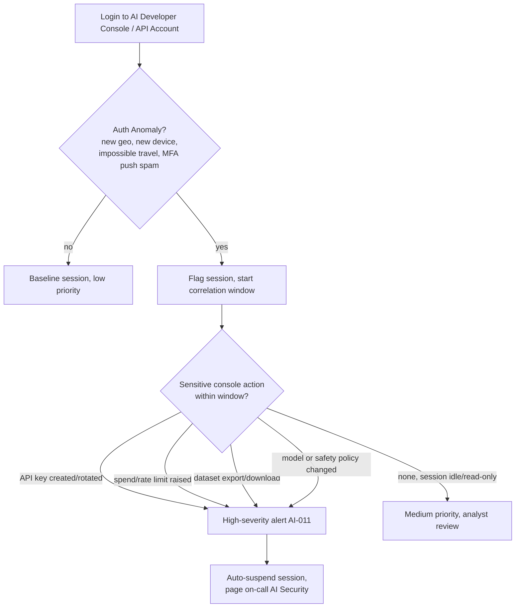

# AI-011 -- AI Account Takeover

## Playbook Metadata

| Field | Value |
|---|---|
| Playbook ID | AI-011 |
| Playbook Name | AI Account Takeover (Developer Console / Model API Credential Compromise) |
| Category | AI / LLM Application Security -- Identity & Access Abuse |
| Owner | AI Security Engineering |
| Approver | CISO / Head of Detection Engineering |
| Version | 1.0 |
| Status | Active |
| Related Frameworks | OWASP Top 10 for LLM Applications (LLM02: Insecure Output Handling overlaps; primarily maps to traditional ATO controls extended into AI-specific impact), MITRE ATLAS (AML.T0012 -- Valid Accounts, adapted to AI service accounts), NIST AI RMF (Govern function -- accountable identities for AI resources) |
| Related Playbooks | AI-004 (Agent Tool-Use Abuse), AI-007 (Model API Key Leakage), AI-012 (Shadow AI Usage) |

## Scope and Definition

AI-011 covers credential-based account takeover of a human or service identity that has standing access to an AI platform, developer console, or model API account -- for example, an engineer's login to a model provider's console, a shared service account used to mint API keys, or a workspace admin account on an internal AI gateway. This is distinct from AI-007 (a leaked key found in a repo or log) in that AI-011 begins with the compromise of the *account* itself -- through phishing, credential stuffing, password reuse, session-token theft, or MFA fatigue -- after which the attacker inherits whatever the account was entitled to do: mint new API keys, raise spend limits, view billing and usage history, alter model access policies, pull fine-tuning datasets, or reconfigure which models and safety settings downstream applications call against.

The reason this deserves a dedicated playbook rather than folding into generic account-takeover response is that the blast radius of an AI platform account is unusually broad and unusually invisible to traditional monitoring. A compromised developer-console account does not just expose one application -- it exposes every application built on that account's API keys, every dataset uploaded for fine-tuning or evaluation, and every dollar of committed spend, and most organizations have far less mature logging on AI platform consoles than they do on cloud IAM or SaaS identity providers.

## [STAKEHOLDER] Business Risk

[STAKEHOLDER] An AI developer console account is functionally equivalent to a cloud administrator account, but most organizations do not yet treat it with that level of access governance. If an attacker takes over the account that manages our model API relationship, they inherit the ability to mint new keys that bill to our account, exfiltrate any documents or datasets we uploaded for fine-tuning or retrieval, read usage logs that may contain sensitive prompts and completions from production traffic, and in some cases silently redirect our production application to a different model version or a modified system prompt without touching our own codebase. The financial exposure is direct and immediate -- attackers who take over AI platform accounts have been documented reselling or reusing stolen API access for high-volume automated abuse, running up usage charges far beyond what a legitimate account holder would authorize. The confidentiality exposure can be worse: if our fine-tuning data or prompt logs contain customer information, contract terms, or proprietary code (the same pattern of sensitive data ending up inside an AI vendor's systems that drove the widely reported 2023 concern over employees pasting confidential source code into a public chatbot), an account takeover turns that stored data into something a third party can browse directly. Unlike a stolen laptop or a phished email account, recovery here often requires provider-side key rotation, dataset re-audit, and a full review of every downstream system that trusted the compromised account's output -- which is why this playbook exists as a distinct response path rather than a subset of standard identity incident response.

## [ENGINEER] Detection Logic

Detection for AI-011 layers standard account-takeover signal (impossible travel, new-device login, MFA anomalies, credential-stuffing velocity) with AI-platform-specific signal that generic identity tooling will not surface: new API key creation, spend-limit or rate-limit changes, model/safety-policy configuration changes, and bulk downloads of fine-tuning or evaluation datasets. The strongest AI-011 signal is the *combination* of an authentication anomaly followed within a short window by a console action with financial or data-exfiltration consequence -- either signal alone is common noise, but the pairing is rare and high-confidence.



**Illustrative query logic** (this is a conceptual detection sketch for a SIEM ingesting identity provider logs joined against AI platform audit logs -- it has not been run against a live platform and field names, event names, and join keys will vary by IdP and AI vendor):

```
// Illustrative KQL-style logic -- IdP auth events joined to AI platform audit log
let SuspiciousAuth = SigninLogs
| where AppDisplayName has_any ("AI Developer Console", "Model API Portal", "AI Gateway Admin")
| where ResultType == "0"  // successful sign-in
| where isnotempty(ConditionalAccessStatus) and (
      NetworkLocationDetails has "unfamiliar" or
      RiskLevelDuringSignIn in ("medium", "high") or
      (LocationCountry != PriorLocationCountry and TimeSinceLastSignIn < 4h)
  )
| project TimeGenerated, UserPrincipalName, IPAddress, LocationCountry, RiskLevelDuringSignIn, SessionId;
AIPlatformAuditLog
| where ActionType in ("ApiKeyCreated", "SpendLimitChanged", "RateLimitChanged",
                        "DatasetExported", "ModelPolicyChanged", "SafetySettingChanged")
| join kind=inner SuspiciousAuth on UserPrincipalName
| where AuditTimeGenerated between (TimeGenerated .. TimeGenerated + 2h)
| project AuditTimeGenerated, UserPrincipalName, ActionType, TargetResource, IPAddress, RiskLevelDuringSignIn
```

```
# Illustrative SPL-style logic -- alternate representation joining IdP and AI platform logs
index=idp sourcetype=signin_logs app_name IN ("ai_dev_console","model_api_portal")
| where result="success" AND (risk_level="high" OR risk_level="medium" OR new_device=1)
| fields _time, user, src_ip, geo_country, risk_level, session_id
| join user [ search index=ai_platform sourcetype=audit_log
      action IN ("api_key_created","spend_limit_changed","rate_limit_changed",
                 "dataset_exported","model_policy_changed","safety_setting_changed")
      | fields _time, user, action, target_resource, src_ip ]
| eval delta_minutes=round((_time - _time)/60)
| table _time, user, src_ip, geo_country, risk_level, action, target_resource
```

Two engineering additions materially reduce time-to-detect: (1) require step-up authentication for the specific set of high-impact console actions listed above regardless of session risk score, so that even a stolen-but-valid session cannot silently perform them, and (2) forward AI platform audit logs into the same SIEM pipeline as identity provider logs rather than leaving them siloed in the vendor's own dashboard, since most AI-011 incidents are missed not because the log doesn't exist but because nobody is correlating it against auth events.

## [ANALYST] Investigation Steps

The following steps assume an AI-011 alert has fired for a suspicious authentication event correlated with a sensitive console action. The worked example follows the fictional company **Bramwell Analytics** and the takeover of its shared AI platform admin account, `ai-platform-admin@bramwell-analytics.example`.

1. **Pull the alert context and establish the timeline.** Identify the account, the authentication anomaly that triggered correlation, the specific console action(s) taken, and the exact sequence and timing of both.
   *Example: Alert AI-011-2290 fires for `ai-platform-admin@bramwell-analytics.example`. Sign-in occurred from an IP geolocating to a country where Bramwell has no offices, 40 minutes after a legitimate sign-in from the account owner's normal location, followed by creation of two new API keys and a rate-limit increase from 500 to 50,000 requests per minute.*

2. **Verify the authentication was not the legitimate account owner.** Contact the account owner (or the on-call engineer responsible for the shared account) through an out-of-band channel -- not email, in case the mailbox is also compromised -- to confirm whether they initiated the session or any travel/VPN activity explains the location anomaly.
   *Example: The account owner, reached by phone, confirms she has not traveled and was not logged in during the flagged window; she also notes she received an MFA push notification she did not initiate roughly 45 minutes prior, which she dismissed without reporting.*

3. **Determine how the credential was obtained.** Check recent phishing reports, password-reuse exposure (breach-monitoring feeds), MFA fatigue/push-bombing indicators, and whether the account had any weak or shared authentication factors.
   *Example: Review of recent email security logs shows the account owner received a phishing email three days prior mimicking the AI provider's password-reset flow; click telemetry confirms she followed the link, and the credential-harvesting page's domain does not match the legitimate provider's domain.*

4. **Inventory every action taken during the compromised session(s).** Pull the full AI platform audit log for the account across the entire suspected compromise window, not just the action that triggered the alert -- attackers frequently perform reconnaissance (viewing billing, usage history, team member lists) before the action that trips detection.
   *Example: The audit log shows the attacker viewed the organization's billing plan and current spend, listed all team members and their roles, created two new API keys named `svc-backup-01` and `svc-backup-02`, and raised the rate limit before the session was terminated by the automatic suspension control.*

5. **Determine what the new/exposed credentials could reach.** For every API key created or existing key visible to the compromised account, identify which production systems, applications, or datasets that key authenticates to, and whether any usage has already occurred on those keys.
   *Example: Both new keys were scoped with organization-wide access rather than a restricted project, meaning they could call any model endpoint enabled for Bramwell's account; usage logs show approximately 40,000 completions run against one of the new keys in the 20 minutes before suspension, a volume inconsistent with any known internal application.*

6. **Assess data exposure, not just financial exposure.** Check whether the session accessed, downloaded, or exported any fine-tuning datasets, evaluation sets, or historical prompt/completion logs, since these frequently contain sensitive business or customer data.
   *Example: Audit log confirms no dataset export occurred during this session; the attacker's actions were limited to key creation, billing/team reconnaissance, and the rate-limit change -- narrowing this to a financial-abuse and access-persistence case rather than a data-exfiltration case.*

7. **Check for persistence and lateral reach.** Determine whether the compromised account has administrative rights over other AI platform workspaces, whether it shares credentials or SSO with other systems, and whether the attacker modified any recovery email, MFA method, or team membership to maintain access after the initial session ends.
   *Example: Review confirms no changes were made to the account's recovery email, phone number, or MFA enrollment, and the account has no admin rights outside the single AI platform workspace -- suggesting the attacker had not yet established persistence before the session was cut off.*

## [ANALYST] / [ENGINEER] Containment & Response

- **Immediate:** Force a password reset and full session/token revocation on the compromised account across the AI platform and any federated SSO session; do not merely log the account out, since many AI console sessions use long-lived refresh tokens that survive a simple logout.
- **Revoke attacker-created credentials:** Immediately revoke every API key created or rotated during the compromise window, regardless of whether usage has been observed on it yet -- do not wait for confirmed abuse.
- **Roll back configuration changes:** Reverse any rate-limit, spend-limit, model-access, or safety-policy changes made during the session back to their pre-incident state, and confirm the rollback with a second engineer.
- **Contain financial exposure:** Contact the AI provider's billing/fraud support channel to flag anomalous usage, request a temporary spend cap or usage hold if supported, and dispute any charges tied to confirmed unauthorized key usage.
- **Re-scope, don't just restore:** Before restoring the account's normal privileges, review whether it needs organization-wide admin rights at all -- this is the moment to move from a broadly privileged shared account to project-scoped, individually attributable accounts with least-privilege API key scoping.
- **Downstream validation:** For every legitimate production system that consumes API keys from this account, verify none of them were silently repointed to a different model, endpoint, or configuration during the compromise window.
- **Root-cause the entry vector:** If phishing or MFA fatigue was confirmed, feed the specific lure (domain, email template, push-bombing pattern) into email security and identity-provider blocklists, and treat this as a signal to check whether the same campaign targeted other holders of privileged AI platform access.

## [MANAGEMENT] Escalation & Reporting

[MANAGEMENT] Escalate any confirmed AI-011 event to the CISO and the AI platform's business owner within one hour of confirmation, and loop in Finance immediately if unauthorized API usage generated material spend, since provider billing disputes typically require prompt notification to be honored. If the compromised account had access to fine-tuning datasets, customer data, or historical prompt/completion logs, escalate to Legal and Privacy to assess notification obligations even if no export is confirmed -- viewing access alone may trigger disclosure requirements depending on the data classification and applicable regulation. Executive reporting should cover: how the credential was obtained (phishing, reuse, MFA fatigue), the full scope of actions taken during the compromised session, confirmed or estimated financial impact from unauthorized usage, whether any data was exposed or exported, and the specific privilege-reduction changes (individual accountability, scoped keys, mandatory step-up auth on sensitive actions) that will prevent a shared, broadly privileged account from being the single point of failure again. Any AI-011 incident involving a shared or service account rather than an individually attributable one should trigger a mandatory review of every other shared credential with standing access to an AI platform across the organization.

## False Positive / Benign Positive Indicators

- Legitimate travel by the account owner (conference, client site visit, relocation) producing a geo/device anomaly with no unusual console actions following it.
- Scheduled or automated key rotation performed by an approved CI/CD pipeline or secrets-management tool, which may authenticate from infrastructure IPs that look anomalous to identity tooling unfamiliar with that service account's normal pattern.
- A new team member's first login from a new device coinciding with normal onboarding actions (key creation scoped to a single project, no billing or team-wide changes).
- MFA push notifications the user does not immediately recognize but later confirms as their own action from a secondary device (e.g., a tablet) -- confirm directly with the user before treating as confirmed compromise.
- Spend or rate-limit increases requested through an approved change-management ticket that simply had not yet been cross-referenced by the analyst at alert time.

## Closure Criteria

An AI-011 case may be closed when all of the following are true: the compromised account's credentials have been fully reset and all sessions/tokens revoked; every API key or configuration change made during the compromise window has been revoked or rolled back and independently verified; the entry vector (phishing lure, reused credential, MFA fatigue pattern) has been identified and corresponding blocklist/awareness actions taken; financial impact has been quantified and, where applicable, a billing dispute has been filed with the AI provider; a data-exposure assessment has been completed and, if any sensitive data was accessed, Legal/Privacy has signed off on notification handling; the account (or the broader pattern of shared AI platform accounts, if applicable) has been re-scoped toward least-privilege, individually attributable access with step-up authentication on high-impact actions; and the incident has been logged in the AI risk register with root cause, blast radius, and remediation owner recorded for trend analysis across future AI-011 events.
