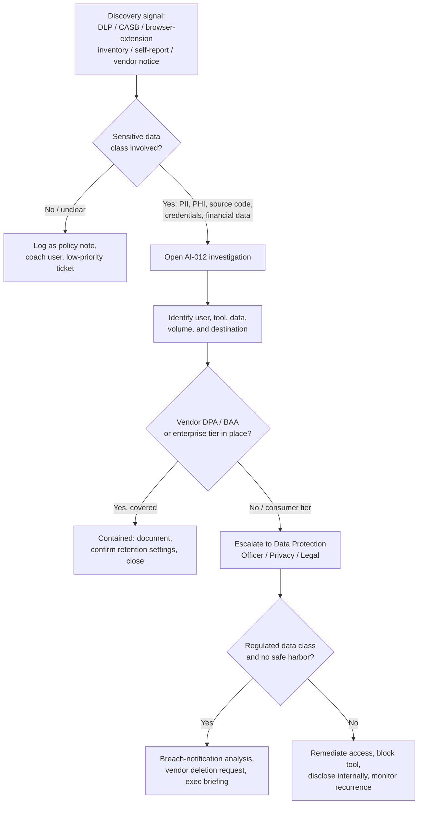

# AI-012 -- Shadow AI Incident

**Category:** AI / LLM Application Security -- Data Governance & Unsanctioned Tooling
**Owner:** AI Security Engineering
**Approver:** SOC Manager / AI Risk Owner / Data Protection Officer
**Version:** 1.0
**Status:** Active

## Overview

"Shadow AI" is the AI-era version of shadow IT: an employee, team, or business unit adopts a public or consumer-grade generative AI tool -- a browser-based chatbot, a free-tier AI writing assistant, a personal AI coding tool, a translation or transcription service with an AI backend -- without going through procurement, security review, or the organization's approved AI tool list, and in the process pastes, uploads, or pipes in data the tool was never authorized to see. This playbook covers the moment that usage is *discovered*, whether through a DLP alert, a CASB/SSPM finding, a browser-extension inventory sweep, an employee self-report, or a vendor breach notification naming your organization's domain among its users. Unlike a policy violation with no data exposure, a confirmed Shadow AI incident involving sensitive data (customer PII, PHI, source code, credentials, financial records, or trade secrets) requires the same investigative rigor as any other unauthorized data-egress event: you must determine what left, where it went, what the receiving vendor's retention and training posture is, and what containment and disclosure obligations follow. This is distinct from **AI-006 (Sensitive Data Exposure via LLM)**, which covers exposure *through* a sanctioned AI application's own outputs, and from **AI-004 (Model Data Exfiltration)**, which covers an attacker using an AI channel deliberately to move data out. AI-012 covers well-intentioned employees using unapproved tools to do their jobs faster.

## Business Risk

[STAKEHOLDER] The uncomfortable truth about Shadow AI is that it is almost never malicious -- it is a claims adjuster who found that a free chatbot summarizes a 40-page policy file in ten seconds, or an engineer who pasted a stack trace containing a database connection string into a code assistant to get an unstuck build working by 6 p.m. That good intent does not reduce your exposure; if anything it means the behavior is widespread and recurring rather than a one-off. The tangible risks stack up quickly: data pasted into a consumer-tier AI tool may be retained by the vendor, used to train future models, reviewed by human contractors for quality assurance, or exposed in a vendor-side breach -- and once it has left your tenant boundary, you typically cannot delete it, audit its downstream use, or prove a negative to a regulator. For regulated data classes this converts a policy violation into a reportable incident: PHI pasted into a non-BAA-covered AI tool is a potential HIPAA breach; customer financial data may trigger GLBA or state breach-notification analysis; EU personal data processed by a vendor with no Article 28 data-processing agreement is a GDPR exposure regardless of whether anything "bad" happened to it afterward. The reputational dimension compounds this: after the widely reported 2023 incident in which Samsung engineers pasted proprietary source code into ChatGPT and the company subsequently restricted employee use of external generative AI tools, "our staff put sensitive data into a public chatbot" is now a recognizable, citable failure mode that customers, auditors, and boards ask about directly. Treat discovery of Shadow AI handling sensitive data as a data-loss investigation first and a policy-enforcement matter second.



## Detection Logic

[ENGINEER] Shadow AI detection is fundamentally an egress-visibility problem layered on top of AI-specific signatures, because the "attacker" is your own user and the "malware" is a legitimate SaaS product with a login page. Build detection from four overlapping signal sources:

- **CASB/SWG traffic to known AI-tool domains** not on the approved vendor list (consumer ChatGPT, Bard/Gemini consumer tier, unmanaged Claude.ai, character/chat sites, browser-based AI writing tools, unmanaged AI transcription/translation services), especially POST requests carrying substantial payload size.
- **Browser extension inventory** flagging AI-assistant extensions (summarizers, meeting-note bots, email-composition helpers) installed outside the managed extension allowlist.
- **DLP content inspection** on outbound web traffic and clipboard/paste events matching sensitive-data patterns (SSN/PAN regexes, PHI keyword sets, internal document classification headers, API key/secret formats) where the destination is an AI-tool domain.
- **SaaS discovery / SSPM findings** showing OAuth grants or API keys issued to AI tools by end users using corporate SSO or corporate email, which indicates the tool has moved from "visited a website" to "connected to something."

```
// Illustrative query logic only -- not validated against a live SIEM, CASB,
// or DLP product. Field names, domain lists, and payload thresholds are
// illustrative and must be tuned to your actual gateway/DLP schema.

index=web_proxy OR index=casb_events
| eval dest_domain=lower(url_domain)
| lookup ai_tool_domain_list dest_domain OUTPUT tool_name, tool_category, approved_status
| where isnotnull(tool_name) AND approved_status!="approved"
| eval payload_kb = upload_bytes/1024
| join type=left user, _time [ search index=dlp_events
    | where match(dest_domain, "chat|assistant|ai-") OR isnotnull(dlp_rule_hit)
    | eval dlp_hit=coalesce(dlp_rule_hit, "none")
    | table user, _time, dlp_hit, data_classification ]
| where payload_kb > 5 OR dlp_hit!="none"
| eval risk_score = if(dlp_hit!="none", 4, 0)
       + if(match(data_classification, "PHI|PCI|Restricted"), 3, 0)
       + if(payload_kb > 50, 1, 0)
| where risk_score >= 3
| table _time, user, tool_name, tool_category, dest_domain, payload_kb, dlp_hit, data_classification, risk_score
| sort - risk_score
```

Tune thresholds against your baseline: benign lookups (a user asking a public chatbot a general question with no pasted content) produce small payloads and no DLP hits, and should not page anyone. The queue item you want is the combination of an unapproved-tool destination *and* either a DLP content match or an unusually large outbound payload consistent with a document paste or file upload.

## Investigation Steps

[ANALYST] Work this as a data-handling investigation, not a simple "user broke a rule" ticket. Your job is to establish exactly what data left, where it went, and what that vendor can do with it.

**Worked example:** Solace Health Group's DLP platform generates a risk_score-9 alert at 10:47 local time: user `d.okafor@solacehealth.com` (Underwriting, three years tenure) uploaded a 2.3 MB file to `chat.openai.com` from a managed laptop, with a DLP content match on the "PHI -- Diagnosis Codes" classifier.

1. **Pull the full session context from the proxy/CASB log**, not just the flagged event: timestamp, source device, destination URL path (not just domain -- some tools expose whether it was a chat upload vs. a plugin call), file name if captured, and whether this is a one-time event or a recurring pattern for this user.
   - For Okafor: the log shows three prior sessions to the same domain over the past nine days, all with smaller payloads; today's is the first large-file upload.
2. **Identify the account tier and authentication method.** Is this a personal/consumer account (personal email, no SSO), or was it accessed via corporate SSO into an enterprise tier with a signed data-processing agreement? This single fact determines whether you're looking at a contained incident or an open one.
   - Confirmed via SSO logs: no corporate SSO grant to OpenAI exists; Okafor authenticated with a personal Gmail address. This is a consumer-tier account with no DPA/BAA coverage.
3. **Reconstruct exactly what was uploaded.** Interview the user (non-punitively, framed as incident response, not discipline) and, where technically possible, recover the file from endpoint DLP quarantine, browser cache, or the source application's audit log (e.g., which claims file was open/exported around that timestamp).
   - Okafor explains he uploaded an anonymized-looking claims summary spreadsheet to ask the chatbot to draft a plain-language explanation letter for a policyholder; the file, when recovered, contains full member names, dates of birth, and ICD-10 diagnosis codes -- it was not actually de-identified.
4. **Determine data volume and record count**, not just data type. One record and ten thousand records both violate policy, but they carry very different notification and executive-briefing implications.
   - The recovered file contains 214 member records.
5. **Check for repeat behavior across the team/department**, not just the flagged user -- Shadow AI adoption is frequently a team-level workaround for a slow or missing internal tool, and one flagged user is often the tip of a broader pattern.
   - A department-wide CASB query shows six other Underwriting staff visited the same domain in the past 30 days; two show DLP content matches of similar severity, expanding the scope from one user to a team practice.
6. **Establish the vendor's stated data-handling terms for the tier actually used** (consumer vs. enterprise/API), specifically retention period, human-review/QA access, and whether conversation content is used for model training by default -- this is the fact set Legal and the Data Protection Officer need, and it depends entirely on tier, not on the vendor's brand name.
7. **Assess regulatory data-class exposure.** PHI, as here, routes to HIPAA breach-analysis criteria; determine whether the disclosure meets the "low probability of compromise" bar or triggers formal breach-notification review -- this determination is made jointly with Privacy/Legal, not unilaterally by the SOC.
8. **Check for credential or downstream-access exposure** if the uploaded content included any secrets, tokens, or system identifiers alongside the sensitive data -- treat any embedded credentials as compromised and rotate them regardless of the primary data-class finding.
9. **Classify severity** based on (a) data class and record volume, (b) vendor tier and DPA/BAA coverage, (c) scope (single user vs. team pattern), and (d) whether this is a first discovery or a recurrence of a previously flagged tool/user.

## Containment & Response

[ANALYST]/[ENGINEER] Containment here is mostly about closing the ongoing exposure path and controlling the data that already left, since you generally cannot claw back what a vendor has already ingested.

| Outcome | Response |
|---|---|
| Approved enterprise tier, DPA/BAA in place, data class within scope | Document and close; confirm retention/training-opt-out settings are correctly configured; no user-facing action required. |
| Consumer/unmanaged tool, low-sensitivity data, single occurrence | Coach the user, point to the approved-tool catalog, log as a benign-adjacent policy finding for trend tracking. |
| Consumer/unmanaged tool, regulated data class (PHI/PCI/PII), single user | Block the destination domain at the SWG/CASB for that user's device pending review; require the user to submit a written account of what was uploaded; open a Privacy/Legal ticket; request account/data deletion from the vendor where a deletion mechanism exists. |
| Consumer/unmanaged tool, regulated data class, team-wide pattern | Escalate to incident status; block the domain org-wide pending an approved alternative rollout; notify the affected department's leadership; begin formal breach-analysis workflow with the Data Protection Officer. |
| Embedded credentials or system identifiers in uploaded content | Rotate affected credentials immediately regardless of the primary data-class disposition; treat as a parallel credential-exposure event. |

For the Solace Health example: the SOC blocks the consumer ChatGPT domain org-wide for the Underwriting department, revokes and reissues no credentials (none were embedded), and opens a formal Privacy/Legal ticket given the confirmed 214-record PHI exposure and the team-wide usage pattern uncovered in step 5. The SOC does not attempt to independently contact the vendor -- that channel runs through Legal/Privacy per the organization's incident-response plan.

## Escalation & Reporting

[MANAGEMENT] Escalate to the Data Protection Officer, Privacy/Legal, and the AI Risk Owner immediately -- not at end-of-shift -- whenever a Shadow AI finding involves any of: (1) a regulated data class (PHI, PCI, financial account data, or PII at meaningful volume) uploaded to a tool with no enterprise DPA/BAA; (2) evidence of a team- or department-wide pattern rather than an isolated user; (3) embedded credentials, source code, or trade secrets; or (4) a vendor-side breach notification naming your organization as an affected customer. This is the escalation tier that typically requires a formal breach-notification determination and, depending on record volume and jurisdiction, a regulatory clock that starts running from discovery -- delay in escalation directly erodes the organization's response window. For lower-severity findings (isolated user, non-regulated data, consumer tool with no DLP content match), log in the recurring AI-security summary with tool names, department, and volume trends so the AI Risk Owner can prioritize which unapproved tools most urgently need a sanctioned, DPA-covered replacement rolled out -- the sustainable fix for Shadow AI is almost always "give people an approved tool that's at least as good," not "block and hope."

## False Positive / Benign Positive Indicators

- Traffic to an AI-tool domain with no DLP content match and small payload size consistent with a general question, not a document paste or upload.
- Access via corporate SSO into a confirmed enterprise/API tier already covered by a signed DPA or BAA and configured with training opt-out -- this is sanctioned use, not shadow use, even if it wasn't on the analyst's personal mental list of approved tools.
- Security or AI-governance team conducting an authorized inventory/red-team exercise of AI tool usage -- verify against the assessment calendar before treating as an incident.
- Uploaded content that is genuinely de-identified/synthetic per verified inspection, not merely labeled as such by the user.

## Closure Criteria

- User, tool, destination, data class, volume, and vendor tier all confirmed and documented.
- Vendor DPA/BAA coverage status determined and recorded as the basis for severity classification.
- Privacy/Legal and Data Protection Officer sign-off obtained on breach-notification determination (required/not required) for any regulated data class.
- Destination blocked or access remediated for the user/department as applicable; any embedded credentials rotated.
- Scope check completed (single user vs. team/department pattern) with department leadership notified where applicable.
- Recurrence-prevention action identified -- user coaching, department-wide communication, or fast-tracked approved-tool rollout -- and assigned an owner.
- Finding logged in the AI tool inventory/discovery tracker regardless of severity, to maintain an accurate picture of actual (not just approved) AI tool usage across the organization.
