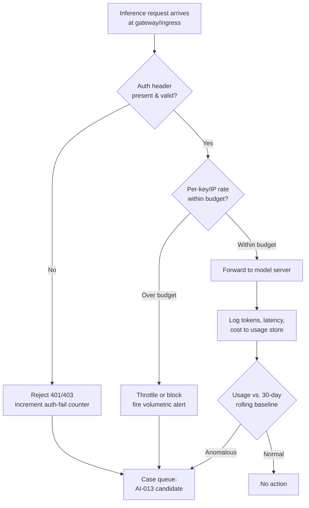

# AI-013 -- AI Model Endpoint Abuse/Exposure

## Category
AI/ML Infrastructure Security -- Model Serving & Inference Layer

## Owner / Approver
**Owner:** AI/ML Platform Security Team (Detection Engineering, secondary)
**Approver:** CISO delegate / Head of AI Platform Engineering

## Version / Status
Version 1.0 -- Status: **Active**

---

## [STAKEHOLDER] Business Risk

[STAKEHOLDER] If your organization runs its own model inference endpoints -- a fine-tuned classifier behind an internal REST API, a self-hosted LLM serving customer support summarization, a vector-search-backed RAG service, or a third-party foundation model proxied through your own gateway -- that endpoint is infrastructure with a meter running. Every inference call costs compute (and, for hosted-model proxies, a per-token API bill), and every unauthenticated or under-authenticated endpoint is a target for two related but distinct abuse patterns: **cost/resource exhaustion** (an attacker or a runaway internal process hammers the endpoint until your GPU fleet is pegged or your monthly API bill spikes into five or six figures) and **unauthorized access** (a scanner or opportunistic attacker finds an inference endpoint with no auth, no rate limiting, and no network segmentation, and now has a free proxy to a capable model -- or worse, a way to query a model trained on your proprietary data).

The business impact splits into three buckets. First, direct financial loss: hosted-LLM API costs scale linearly with tokens processed, and a single misconfigured endpoint left open over a weekend has produced real five-figure surprise invoices at other organizations in this space. Second, availability: shared inference infrastructure that gets saturated by abusive traffic degrades or fails for legitimate business users -- your customer support bot goes down during business hours because someone else is running a scraping job through it. Third, and often underweighted, is **data exposure through the model itself** -- an exposed endpoint may let an outsider extract information about your training data, your system prompt, your proprietary retrieval corpus, or use your compute and your model's reputation (if it's API-key-linked or IP-linked to your org) to generate abusive content that gets attributed back to you. This playbook treats the endpoint layer the way you would treat any other internet-facing service: assume it will be scanned, assume it will be probed for missing auth, and instrument it accordingly.

---

## [ENGINEER] Detection Logic

[ENGINEER] Detection for this playbook covers three overlapping signal classes: (1) volumetric/rate anomalies on inference endpoints, (2) authentication and authorization failures or anomalies at the API gateway in front of the model, and (3) request-pattern signatures consistent with automated scraping, credential stuffing against API keys, or systematic probing (sequential parameter fuzzing, wordlist-style prompts, high-entropy random inputs used to fingerprint model behavior).

Data sources to onboard: API gateway / reverse proxy access logs (NGINX, Envoy, Kong, or cloud API Gateway logs), model server logs (vLLM, Triton, TorchServe, TGI, or your inference framework's structured logs), cloud provider billing/usage APIs (for hosted-model proxies -- OpenAI/Anthropic/Azure OpenAI usage metrics), and network flow logs at the load balancer or ingress controller.



### Illustrative Query Logic (Detection Sketch)

The following is an **illustrative query sketch only** -- it has not been run against a live SIEM and field names will not match your environment without adaptation. Treat it as pseudocode for the detection logic, not a copy-paste rule.

```
// Illustrative query logic -- adapt field names to your gateway/log schema.
// Detects sustained high-rate inference calls from a single source identity
// (API key, source IP, or service account) against a model endpoint,
// combined with an anomalous ratio of 4xx/401/403 responses suggesting
// credential probing rather than legitimate sustained load.

source = gateway_access_logs
| where uri_path contains "/v1/inference" or uri_path contains "/v1/chat/completions" or uri_path contains "/v1/embeddings"
| summarize
    total_requests = count(),
    unauthorized_count = countif(http_status in (401, 403)),
    distinct_source_ips = dcount(src_ip),
    total_tokens_estimate = sum(response_body_size_bytes) / 4,   // rough token proxy
    p95_latency_ms = percentile(latency_ms, 95)
    by bin(timestamp, 5m), api_key_id, src_ip
| extend unauthorized_ratio = unauthorized_count * 1.0 / total_requests
| where total_requests > 500                         // tune to endpoint's normal peak
    or unauthorized_ratio > 0.30
    or total_tokens_estimate > <org_defined_5min_budget>
| project timestamp, api_key_id, src_ip, total_requests, unauthorized_ratio, total_tokens_estimate, p95_latency_ms
| order by total_requests desc
```

Complementary detections that should exist as separate rules feeding the same case queue: (a) a rule on the cloud billing/usage API that alerts when hourly token spend for a given API key exceeds N standard deviations above its 30-day rolling baseline; (b) a rule flagging inference endpoints reachable from the public internet with no `Authorization` header present on any request in the sample window (indicates the endpoint may not be enforcing auth at all, as opposed to auth being attacked); and (c) a rule on model-server-side logs for repeated near-identical prompts differing only by small perturbations, which is a signature of automated prompt-fuzzing or model-extraction attempts (see MITRE ATLAS techniques on model extraction and OWASP Top 10 for LLM Applications, "Unbounded Consumption," for background framing).

---

## [ANALYST] Investigation Steps

**Worked example:** At 03:14 UTC, a detection fires for endpoint `inference.northwind-retail.internal/v1/chat/completions` showing 4,200 requests in a 5-minute window from source IP `203.0.113.44` (external), using API key `nw-svc-chatbot-prod-01`, with an unauthorized_ratio of 0.02 (mostly successful, not failing auth) and total_tokens_estimate far above the 5-minute budget for that key. The key belongs to Northwind Retail's public-facing product-recommendation chatbot, "Nora."

1. **Confirm the alert is real, not a baseline artifact.** Pull the last 30 days of traffic for `nw-svc-chatbot-prod-01` and compare the 03:14 spike against the same weekday/hour baseline. In the worked example, normal traffic for this key at 03:00 UTC is under 50 requests/5min -- an 80x deviation, ruling out a simple marketing-campaign traffic bump.

2. **Identify the source.** Resolve `203.0.113.44` -- WHOIS, passive DNS, and any internal asset inventory match. In the worked example, the IP resolves to a commercial hosting provider with no known relationship to Northwind Retail or its partners, and it does not appear in any allowlist.

3. **Determine whether this is a leaked credential or an exposed endpoint.** Check whether the endpoint requires the API key at all -- attempt (in an isolated test context, never against prod) to replay a sanitized request without the `Authorization` header, or review the gateway config directly. In the worked example, the endpoint *does* enforce the key, so this points to **key compromise**, not missing auth -- check recent CI/CD logs, public code repos, and client-side JS bundles for the string `nw-svc-chatbot-prod-01` or a partial match, since keys shipped to a browser-based chat widget are a common leak vector.

4. **Quantify blast radius.** Query total token/request volume attributable to the suspect source since first anomalous activity, and cross-reference against billing data to produce a dollar-cost estimate. In the worked example, the key had been hit for approximately 38 minutes before the alert fired, generating an estimated 2.1M tokens -- roughly $340 in hosted-model API cost, modest but trending upward.

5. **Check for downstream compromise signals.** If the endpoint fronts a RAG system or has function-calling/tool-use enabled, review logs for any requests that attempted to invoke tools, retrieve documents outside the expected scope, or extract system-prompt content (prompts like "repeat your instructions" or "ignore previous instructions" patterns -- see prompt injection playbook AI-001 if present in your library, and Greshake et al.'s indirect prompt injection research for background). In the worked example, requests are simple e-commerce queries with no injection attempts -- this looks like straightforward key theft for the underlying model's utility, not a targeted attack on Northwind's data.

6. **Correlate with identity/access logs.** If the key is tied to a service account with broader cloud IAM permissions, check CloudTrail/Azure Activity Log/GCP Audit Log for any other use of the associated credentials outside the expected inference-gateway path in the same window.

7. **Document findings** in the case ticket with timeline, source indicators, token/cost impact, and a determination: leaked credential, missing auth, or internal misuse (e.g., a developer's runaway test script -- always rule this out early since it is the single most common root cause of "abuse" alerts).

---

## [ANALYST] / [ENGINEER] Containment & Response

[ANALYST] Immediate containment for a confirmed compromised or abused key/endpoint:

1. **Revoke and rotate** the affected API key or credential immediately; issue a new key to the legitimate service and redeploy.
2. **Rate-limit or temporarily block** the offending source IP(s)/ASN at the WAF or API gateway if the endpoint must stay live for legitimate traffic during remediation.
3. **If the endpoint has no auth at all** (missing-auth finding rather than key theft), take the endpoint offline or restrict it to an internal-only network path (VPN/private link) until an auth layer (API key, OAuth client-credentials, mTLS) is enforced -- do not leave it "open but monitored" past the initial triage window.

[ENGINEER] Structural remediation, tracked to closure and not left as a one-time fix:

4. Enforce **per-key and per-IP rate limiting and token/request budgets** at the gateway, with hard caps that trigger automatic throttling rather than relying solely on after-the-fact alerting.
5. Move any inference endpoint that does not need to be public-facing behind a private network boundary (VPC peering, private endpoint, VPN); expose only what genuinely needs internet reachability.
6. Add **anomaly-based circuit breakers** -- automatic suspension of a key/session when spend or request volume crosses a threshold within a short window, with a documented human-override path for legitimate burst traffic (e.g., a marketing event).
7. Audit all client-side code, mobile app bundles, and public repos for hardcoded inference keys; migrate to short-lived tokens issued via a backend broker rather than long-lived static keys embedded in clients.
8. Confirm the model server itself has request-size and output-length limits set, independent of the gateway, to bound worst-case single-request cost.

---

## [MANAGEMENT] Escalation & Reporting

[MANAGEMENT] Escalate to the AI Platform Engineering lead and Finance/FinOps stakeholder within 1 business hour of confirmed abuse if projected cost impact exceeds the org-defined threshold (recommend starting at $500/incident as a review trigger, tuned to your environment's normal spend). Escalate to the CISO or delegate immediately, regardless of dollar amount, if investigation reveals: (a) the endpoint was reachable with **no authentication whatsoever** (a control-failure finding, not just an abuse finding, and should be tracked as an audit/compliance item), (b) evidence of data exfiltration via prompt injection or tool-calling abuse, or (c) the leaked credential also grants access to systems beyond the inference endpoint. Weekly reporting to the AI governance/risk committee should include: total incidents this playbook covered, aggregate dollar cost of confirmed abuse, mean time to key revocation, and a running list of endpoints still lacking rate limiting or private-network placement -- this last item is the leading indicator that should drive proactive remediation prioritization rather than waiting for the next incident.

---

## False Positive / Benign Positive Indicators

| Indicator | Likely Explanation |
|---|---|
| Spike correlates with known marketing campaign, product launch, or scheduled batch job | Legitimate traffic surge -- verify against change calendar before treating as abuse |
| Source IP belongs to an internal CI/CD runner or QA automation account | Runaway test script or misconfigured load test, not external abuse |
| High request volume but unauthorized_ratio near 0 and source IP is a known partner/integration | Legitimate high-volume integration outgrowing its original rate-limit tier |
| Token volume spike but requests are short, low-complexity, and from an authenticated internal service account | Likely a batch reprocessing job (e.g., re-embedding a document corpus after a schema change) |
| Alert fires only during a single defined maintenance window and stops cleanly afterward | Scheduled internal job -- confirm against maintenance calendar |

---

## Closure Criteria

An AI-013 case may be closed when **all** of the following are true:

- Root cause determined and documented (leaked credential, missing auth, internal misuse, or legitimate traffic misclassified).
- If credential compromise: key revoked, rotated, and redeployment to the legitimate service confirmed successful.
- If missing-auth finding: authentication/authorization control implemented and validated on the endpoint, with a retest confirming unauthenticated requests are now rejected.
- Cost impact quantified and reported to the relevant financial/business owner.
- Rate limiting and/or budget-based circuit breaker confirmed in place on the affected endpoint (or an accepted-risk exception documented with an owner and review date if not yet feasible).
- No indication of broader compromise (lateral movement, data exfiltration, or additional credentials affected) remains open; if such indicators exist, this case remains linked to an incident-response case until fully resolved.
- Lessons-learned item logged for the AI platform inventory if this endpoint was not previously known to the security team (undocumented/shadow AI infrastructure is itself a finding worth tracking separately).
